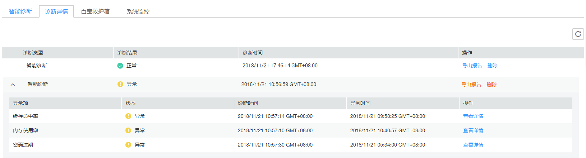

# 查看诊断详情

## 操作场景

智能诊断完成后，云DBA为您提供诊断详情，同时从专业角度对异常项给出处理建议。

## 操作步骤

1.  在“实例管理“页面，选择目标实例，单击实例名称，进入实例的“基本信息“页签。
2.  选择“云DBA  \>  诊断详情“页签，查看诊断结果并进一步处理。

    **图 1**  诊断详情  
    

    -   如果需要查看诊断报告，单击操作列的“导出报告“，导出诊断报告。
    -   对于不再需要的智能诊断，单击操作列的“删除“，删除该次诊断记录。
    -   对于“异常“或“已处理“的诊断项，单击“智能诊断“左侧的，在展开的页面中单击“查看详情“，查看具体问题及处理建议。

