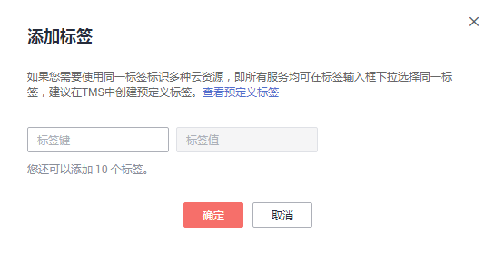

# 标签

## 操作场景

标签管理服务（Tag Management Service，TMS）用于用户在云平台，通过统一的tag标签管理各种资源。TMS服务与各服务共同实现标签管理能力，TMS提供全局标签管理能力，各服务维护自身标签管理 。

-   建议您先在TMS系统中设置预定义标签。
-   标签由“键”和“值”组成，每个标签中的一个“键”只能对应一个“值”。
-   每个实例最多支持10个标签配额。

## 添加

1.  登录管理控制台。
2.  单击管理控制台左上角的，选择区域和项目。

    您可选择自己的专属计算集群（Dedicated Computing Cluster，简称DCC）。

3.  选择“数据库  \>  关系型数据库“，进入关系型数据库信息页面。
4.  在“实例管理“页面，选择指定的实例，单击实例名称，进入实例的“基本信息“页签。
5.  在“标签“页签，单击“添加“，在“添加标签“弹出框中，输入标签的键和值，单击“确定“。

    **图 1**  添加标签  
    

    -   输入标签的键和值时，系统会自动联想当前用户的所有实例（除当前实例外）的所有关联的预定义标签。
    -   标签的键不能为空且必须唯一，长度不超过36位，不能包含=\*<\>\\,|/特殊字符，且首尾字符不能为空格。
    -   标签的值可以为空字符串，长度不超过43位，不能包含=\*<\>\\,|/特殊字符，且首尾字符不能为空格。

6.  添加成功后，您可在当前实例的所有关联的标签集合中，查询并管理自己的标签。

## 编辑

1.  登录管理控制台。
2.  单击管理控制台左上角的，选择区域和项目。

    您可选择自己的专属计算集群（Dedicated Computing Cluster，简称DCC）。

3.  选择“数据库  \>  关系型数据库“，进入关系型数据库信息页面。
4.  在“实例管理”页面，选择指定的实例，单击实例名称。
5.  在“标签“页签，选择需要编辑的标签，单击“编辑“，在“编辑标签“弹出框中修改标签值，单击“确定“。
    -   编辑标签时，不能修改标签的键，只能修改标签的值。
    -   标签的值可以为空字符串，长度不超过43位，只能包含字母、数字、中划线或下划线。
    -   标签的值可以为空字符串，长度不超过43位，不能包含=\*<\>\\,|/特殊字符，且首尾字符不能为空格。

6.  编辑成功后，您可在当前实例的所有关联的标签集合中，查询并管理自己的标签。

## 删除

1.  在“实例管理”页面，选择指定的实例，单击实例名称。
2.  在“标签“页签，选择需要删除的标签，单击“删除“，在“删除标签“弹出框中单击“确定“。
3.  删除成功后，该标签将不再显示在实例的所有关联的标签集合中。

