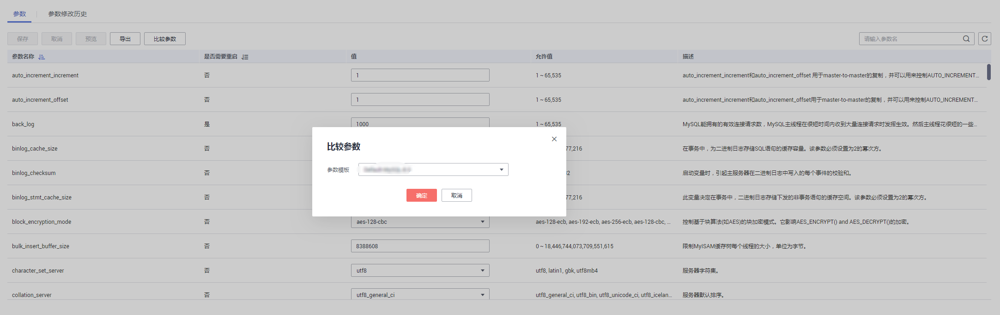
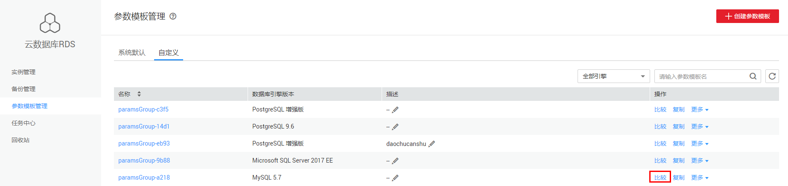
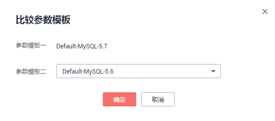
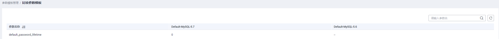

# 比较参数模板

## 操作场景

您可以比较同数据库类型的实例参数模板，以了解当前实例参数的差异项。

您也可以比较同数据库类型的默认参数模板，以了解当前参数模板的配置情况。

> **说明：**   
>金融版的参数模板，仅支持与金融版的参数模板进行比较。  

## 比较当前实例参数模板

1.  登录管理控制台。
2.  单击管理控制台左上角的，选择区域和项目。
3.  选择“数据库  \>  云数据库 RDS“。进入云数据库 RDS信息页面。
4.  在“实例管理“页面，单击实例名称，进入实例的“基本信息“页签。
5.  在左侧导航栏中选择“参数修改“，在“参数”子页签中单击“比较参数“。

    **图 1**  比较当前实例参数  
    

6.  在弹出框中选择当前实例同数据库类型的参数模板，单击“确定”，比较两个参数的差异项。
    -   有差异项，则会显示差异参数的如下信息：参数名称、当前实例参数模板的参数值和被比较参数模板的参数值。
    -   无差异项，则不显示。

## 比较目标参数模板

1.  登录管理控制台。
2.  单击管理控制台左上角的，选择区域和项目。
3.  选择“数据库  \>  云数据库 RDS“。进入云数据库 RDS信息页面。
4.  在“参数模板管理”页面的“自定义”页签，选择一个用户创建的参数模板，单击“比较”。

    **图 2**  比较参数模板  
    

5.  选择同一数据库引擎的不同参数模板，单击“确定”，比较两个参数模板之间的配置参数差异项。

    **图 3**  选择并比较参数模板  
    

    -   有差异项，则会显示差异参数模板的如下信息：参数名称、参数值。
    -   无差异项，则不显示。

        **图 4**  对比参数模板  
        

