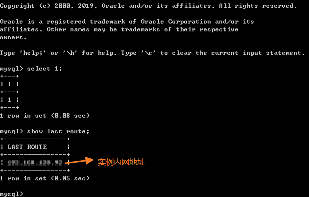

# 测试读写分离效果

通过读写分离地址连接数据库，可实现读写分离功能。您可以使用内部SQL命令对读写分离效果进行验证。

## 操作步骤

1.  通过读写分离地址连接数据库，具体请参考[开通读写分离](开通读写分离.md)。
2.  执行命令查看执行SQL命令的实例。

    可以通过执行**show last route**查询上一条语句的路由结果，如下图所示。

    **图 1**  结果查询  
    

