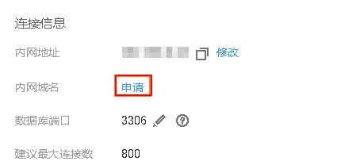

# 申请内网域名

RDS for MySQL支持内网域名，您可以通过内网域名连接RDS。

## 功能限制

-   仅RDS for MySQL支持内网域名。
-   内网域名生成后，修改内网地址将会导致数据库连接中断，请谨慎操作。

> **说明：**   
>使用和申请内网域名需要具有相应的操作权限。您可联系华为云客服人员申请内网域名的操作权限。  

## 操作步骤

1.  登录管理控制台。
2.  单击管理控制台左上角的，选择区域和项目。
3.  选择“数据库  \>  云数据库 RDS“。进入云数据库 RDS信息页面。
4.  在“实例管理“页面，选择目标实例，单击实例名称，进入实例的“基本信息“页面。
5.  在“基本信息”页“连接信息”模块“内网域名”处，单击“申请”。

    您也可以在左侧导航栏，单击“连接管理“，在“内网连接”页面中，在“连接信息”模块“内网域名”处，单击“申请”。

    **图 1**  申请内网域名  
    

6.  在“基本信息”页“连接信息”模块“内网域名”处，查看生成的内网域名。

    您也可以在“任务中心”页面，查看“申请MySQL内网域名”任务的执行进度及结果。

