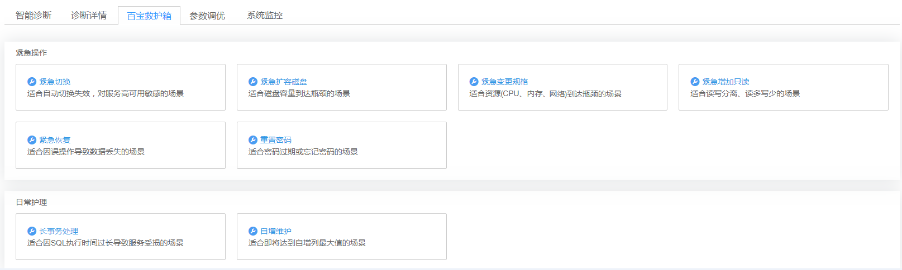

# 百宝救护箱

## 操作场景

当您数据库处理紧急状态而影响业务访问时，云DBA为您提供了紧急操作功能帮助您及时解决故障。同时还提供了日常护理功能，保证您的数据库正常运行。

## 操作步骤

1.  在“实例管理“页面，选择目标实例，单击实例名称，进入实例的“基本信息“页签。
2.  选择“云DBA  \>  百宝救护箱“页签，针对具体的紧急操作或日常护理情况，单击对应场景名称进一步处理。

    例如：当您需要紧急切换实例的主节点和备节点时，单击“紧急切换“，在弹出框中选择单击“确定“，进行主备节点切换。

    **图 1**  百宝救护箱  
    

    **紧急操作**

    -   紧急切换：适合自动切换失效，对服务高可用敏感的场景。
    -   紧急扩容磁盘：适合磁盘容量到达瓶颈的场景。
    -   紧急变更规格：适合资源（CPU、内存、网络）到达瓶颈的场景。
    -   紧急增加只读：适合读写分离、读多写少的场景。
    -   紧急恢复：适合因误操作导致数据丢失的场景。
    -   重置密码：适合密码过期或忘记密码的场景。

    **日常护理**

    -   长事务处理：适合因SQL执行时间过长导致服务受损的场景。
    -   自增ID维护：适合即将达到自增列最大值的场景。

