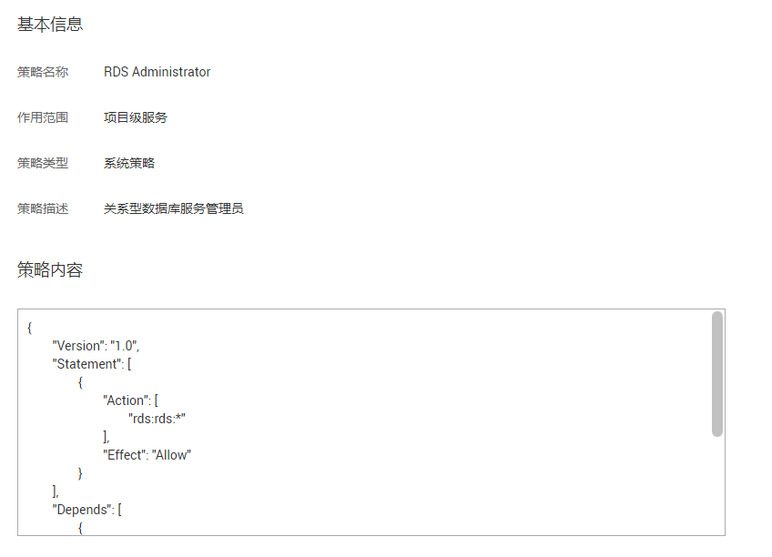

# 策略语法：RBAC<a name="pg_07_0005"></a>

## 策略结构<a name="rds_07_0005_zh-cn_topic_0172661628_section63036484"></a>

策略结构包括：策略版本号（Version）、策略授权语句（Statement）和策略依赖（Depends）。

**图 1**  策略结构<a name="rds_07_0005_zh-cn_topic_0172661628_fig16313497"></a>  


## 策略语法<a name="rds_07_0005_zh-cn_topic_0172661628_section30457452"></a>

如下以RDS的“RDS Administraor”为例，说明RBAC策略语法。

**图 2**  RBAC策略语法<a name="rds_07_0005_fig793143722616"></a>  


```
{
        "Version": "1.0",
        "Statement": [
                {
                        "Action": [
                                "rds:rds:*"
                        ],
                        "Effect": "Allow"
                }
        ],
        "Depends": [
                {
                        "catalog": "BASE",
                        "display_name": "Server Administrator"
                },
                {
                        "catalog": "BASE",
                        "display_name": "Tenant Guest"
                }
        ]
}
```

**表 1**  参数说明

<a name="rds_07_0005_zh-cn_topic_0172661628_table59167590"></a>
<table><thead align="left"><tr id="rds_07_0005_zh-cn_topic_0172661628_row66418347"><th class="cellrowborder" colspan="2" valign="top" id="mcps1.2.5.1.1"><p id="rds_07_0005_zh-cn_topic_0172661628_p11177013"><a name="rds_07_0005_zh-cn_topic_0172661628_p11177013"></a><a name="rds_07_0005_zh-cn_topic_0172661628_p11177013"></a>参数</p>
</th>
<th class="cellrowborder" valign="top" id="mcps1.2.5.1.2"><p id="rds_07_0005_zh-cn_topic_0172661628_p32922880"><a name="rds_07_0005_zh-cn_topic_0172661628_p32922880"></a><a name="rds_07_0005_zh-cn_topic_0172661628_p32922880"></a>含义</p>
</th>
<th class="cellrowborder" valign="top" id="mcps1.2.5.1.3"><p id="rds_07_0005_zh-cn_topic_0172661628_p49507636"><a name="rds_07_0005_zh-cn_topic_0172661628_p49507636"></a><a name="rds_07_0005_zh-cn_topic_0172661628_p49507636"></a>值</p>
</th>
</tr>
</thead>
<tbody><tr id="rds_07_0005_zh-cn_topic_0172661628_row50695543"><td class="cellrowborder" colspan="2" valign="top" headers="mcps1.2.5.1.1 "><p id="rds_07_0005_zh-cn_topic_0172661628_p12698356"><a name="rds_07_0005_zh-cn_topic_0172661628_p12698356"></a><a name="rds_07_0005_zh-cn_topic_0172661628_p12698356"></a>Version</p>
</td>
<td class="cellrowborder" valign="top" headers="mcps1.2.5.1.2 "><p id="rds_07_0005_zh-cn_topic_0172661628_p21933905"><a name="rds_07_0005_zh-cn_topic_0172661628_p21933905"></a><a name="rds_07_0005_zh-cn_topic_0172661628_p21933905"></a>策略的版本</p>
</td>
<td class="cellrowborder" valign="top" headers="mcps1.2.5.1.3 "><p id="rds_07_0005_zh-cn_topic_0172661628_p31815862"><a name="rds_07_0005_zh-cn_topic_0172661628_p31815862"></a><a name="rds_07_0005_zh-cn_topic_0172661628_p31815862"></a>固定为“1.0”</p>
</td>
</tr>
<tr id="rds_07_0005_zh-cn_topic_0172661628_row17907308"><td class="cellrowborder" rowspan="2" valign="top" width="11.13084112149533%" headers="mcps1.2.5.1.1 "><p id="rds_07_0005_zh-cn_topic_0172661628_p41205809"><a name="rds_07_0005_zh-cn_topic_0172661628_p41205809"></a><a name="rds_07_0005_zh-cn_topic_0172661628_p41205809"></a>Statement</p>
</td>
<td class="cellrowborder" valign="top" width="12.626168224299066%" headers="mcps1.2.5.1.1 "><p id="rds_07_0005_zh-cn_topic_0172661628_p49336210"><a name="rds_07_0005_zh-cn_topic_0172661628_p49336210"></a><a name="rds_07_0005_zh-cn_topic_0172661628_p49336210"></a>Action</p>
</td>
<td class="cellrowborder" valign="top" width="36.22429906542057%" headers="mcps1.2.5.1.2 "><p id="rds_07_0005_zh-cn_topic_0172661628_p36810105"><a name="rds_07_0005_zh-cn_topic_0172661628_p36810105"></a><a name="rds_07_0005_zh-cn_topic_0172661628_p36810105"></a>定义对RDS的具体操作。</p>
</td>
<td class="cellrowborder" valign="top" width="40.01869158878505%" headers="mcps1.2.5.1.3 "><p id="rds_07_0005_zh-cn_topic_0172661628_p28828491"><a name="rds_07_0005_zh-cn_topic_0172661628_p28828491"></a><a name="rds_07_0005_zh-cn_topic_0172661628_p28828491"></a>格式为：服务名:资源类型:操作</p>
<p id="rds_07_0005_zh-cn_topic_0172661628_p58129833"><a name="rds_07_0005_zh-cn_topic_0172661628_p58129833"></a><a name="rds_07_0005_zh-cn_topic_0172661628_p58129833"></a>"rds:*:*"，表示对RDS的所有操作，其中RDS为服务名称；“*”为通配符，表示对所有的资源类型可以执行所有操作。</p>
</td>
</tr>
<tr id="rds_07_0005_zh-cn_topic_0172661628_row53406450"><td class="cellrowborder" valign="top" headers="mcps1.2.5.1.1 "><p id="rds_07_0005_zh-cn_topic_0172661628_p30955222"><a name="rds_07_0005_zh-cn_topic_0172661628_p30955222"></a><a name="rds_07_0005_zh-cn_topic_0172661628_p30955222"></a>Effect</p>
</td>
<td class="cellrowborder" valign="top" headers="mcps1.2.5.1.1 "><p id="rds_07_0005_zh-cn_topic_0172661628_p24345054"><a name="rds_07_0005_zh-cn_topic_0172661628_p24345054"></a><a name="rds_07_0005_zh-cn_topic_0172661628_p24345054"></a>定义Action中所包含的具体操作是否允许执行。</p>
</td>
<td class="cellrowborder" valign="top" headers="mcps1.2.5.1.2 "><a name="rds_07_0005_zh-cn_topic_0172661628_ul25792371"></a><a name="rds_07_0005_zh-cn_topic_0172661628_ul25792371"></a><ul id="rds_07_0005_zh-cn_topic_0172661628_ul25792371"><li>Allow：允许执行。</li><li>Deny：不允许执行。</li></ul>
</td>
</tr>
<tr id="rds_07_0005_zh-cn_topic_0172661628_row12156768"><td class="cellrowborder" rowspan="2" valign="top" width="11.13084112149533%" headers="mcps1.2.5.1.1 "><p id="rds_07_0005_zh-cn_topic_0172661628_p45174131"><a name="rds_07_0005_zh-cn_topic_0172661628_p45174131"></a><a name="rds_07_0005_zh-cn_topic_0172661628_p45174131"></a>Depends</p>
</td>
<td class="cellrowborder" valign="top" width="12.626168224299066%" headers="mcps1.2.5.1.1 "><p id="rds_07_0005_zh-cn_topic_0172661628_p35225966"><a name="rds_07_0005_zh-cn_topic_0172661628_p35225966"></a><a name="rds_07_0005_zh-cn_topic_0172661628_p35225966"></a>catalog</p>
</td>
<td class="cellrowborder" valign="top" width="36.22429906542057%" headers="mcps1.2.5.1.2 "><p id="rds_07_0005_zh-cn_topic_0172661628_p34731002"><a name="rds_07_0005_zh-cn_topic_0172661628_p34731002"></a><a name="rds_07_0005_zh-cn_topic_0172661628_p34731002"></a>依赖的策略的所属服务。</p>
</td>
<td class="cellrowborder" valign="top" width="40.01869158878505%" headers="mcps1.2.5.1.3 "><p id="rds_07_0005_zh-cn_topic_0172661628_p61747774"><a name="rds_07_0005_zh-cn_topic_0172661628_p61747774"></a><a name="rds_07_0005_zh-cn_topic_0172661628_p61747774"></a>服务名称</p>
<p id="rds_07_0005_zh-cn_topic_0172661628_p18859061"><a name="rds_07_0005_zh-cn_topic_0172661628_p18859061"></a><a name="rds_07_0005_zh-cn_topic_0172661628_p18859061"></a>例如：BASE</p>
</td>
</tr>
<tr id="rds_07_0005_zh-cn_topic_0172661628_row35513827"><td class="cellrowborder" valign="top" headers="mcps1.2.5.1.1 "><p id="rds_07_0005_zh-cn_topic_0172661628_p58047761"><a name="rds_07_0005_zh-cn_topic_0172661628_p58047761"></a><a name="rds_07_0005_zh-cn_topic_0172661628_p58047761"></a>display_name</p>
</td>
<td class="cellrowborder" valign="top" headers="mcps1.2.5.1.1 "><p id="rds_07_0005_zh-cn_topic_0172661628_p4248175"><a name="rds_07_0005_zh-cn_topic_0172661628_p4248175"></a><a name="rds_07_0005_zh-cn_topic_0172661628_p4248175"></a>依赖的策略的名称。</p>
</td>
<td class="cellrowborder" valign="top" headers="mcps1.2.5.1.2 "><p id="rds_07_0005_zh-cn_topic_0172661628_p8557861"><a name="rds_07_0005_zh-cn_topic_0172661628_p8557861"></a><a name="rds_07_0005_zh-cn_topic_0172661628_p8557861"></a>权限名称</p>
<p id="rds_07_0005_zh-cn_topic_0172661628_p9911889"><a name="rds_07_0005_zh-cn_topic_0172661628_p9911889"></a><a name="rds_07_0005_zh-cn_topic_0172661628_p9911889"></a>例如：Tenant Guest</p>
</td>
</tr>
</tbody>
</table>

