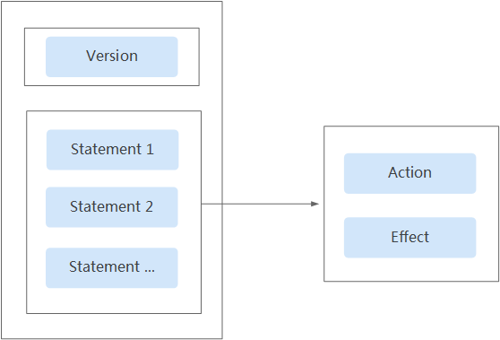
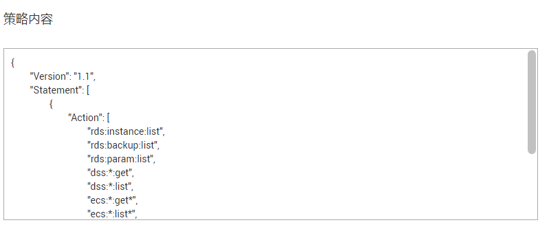
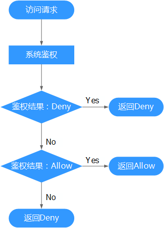

# 策略语法：细粒度策略<a name="rds_pg_07_0004"></a>

## 策略结构<a name="rds_07_0004_zh-cn_topic_0172661627_section58377623"></a>

策略结构包括：Version（策略版本号）和Statement（策略权限语句），其中Statement可以有多个，表示不同的授权项。

**图 1**  策略结构<a name="rds_07_0004_zh-cn_topic_0172661627_fig37302179"></a>  


## 策略语法<a name="rds_07_0004_zh-cn_topic_0172661627_section55636561"></a>

如下以“RDS Viewer策略”为例，说明策略语法组成。

**图 2**  策略语法组成<a name="rds_07_0004_fig374282463012"></a>  


```
{
        "Version": "1.1",
        "Statement": [
                {
                        "Action": [
                                "rds:instance:list",
                                "rds:backup:list",
                                "rds:param:list",
                                "dss:*:get",
                                "dss:*:list",
                                "ecs:*:get*",
                                "ecs:*:list*",
                                "vpc:*:list",
                                "vpc:*:get"
                        ],
                        "Effect": "Allow"
                }
        ]
}
```

-   Version：标识策略的版本号，主要用于区分Role-Based Access Control（RBAC）策略和细粒度策略。
    -   1.0：RBAC策略。RBAC策略是将服务作为一个整体进行授权，授权后，用户可以拥有这个服务的所有权限。
    -   1.1：细粒度策略。相比RBAC策略，细粒度策略基于服务的API接口进行权限拆分，授权更加精细。授权后，用户可以对这个服务执行特定的操作。细粒度策略包括系统预置和用户自定义两种：

-   Statement：策略授权语句，描述策略的详细信息，包含Effect（作用）和Action（授权项）。
    -   Effect（作用）

        作用包含两种：Allow（允许）和Deny（不允许），系统预置策略仅包含允许的授权语句，自定义策略中可以同时包含允许和拒绝的授权语句，当策略中既有允许又有拒绝的授权语句时，遵循Deny优先的原则。

    -   Action（授权项）

        对资源的具体操作权限，格式为：服务名:资源类型:操作，支持单个或多个操作权限，支持通配符号\*，通配符号表示所有。

        示例：


-   "ecs:\*:get\*"，其中ecs为服务名，\*为资源类型，get\*为操作，该授权项表示ecs所有的资源类型的查询权限。
-   "rds:instance:list"，其中rds为服务名，instance为资源类型，list为操作，该授权项表示对RDS实例的查询权限。

## 多个授权项策略<a name="rds_07_0004_zh-cn_topic_0172661627_section30967009"></a>

一个自定义策略中可以包含多个授权项，且除了可以包含本服务的授权项外，还可以包含其他服务的授权项，可以包含的其他服务必须跟本服务同属性，即都是项目级服务或都是全局级服务。多个授权语句策略描述如下：

```
{
        "Version": "1.1",
        "Statement": [
                {
                        "Action": [
                                "rds:instance:list",
                                "rds:backup:list",
                                "rds:param:list",
                                "dss:*:get",
                                "dss:*:list",
                                "ecs:*:get*",
                                "ecs:*:list*",
                                "vpc:*:list",
                                "vpc:*:get"
                        ],
                        "Effect": "Allow"
                }
        ]
}
```

## 拒绝策略<a name="rds_07_0004_zh-cn_topic_0172661627_section10267631"></a>

拒绝策略需要同时配合其他策略使用，否则没有实际作用。用户被授予的策略中，一个授权项的作用如果同时存在Alow和Deny，则遵循Deny优先。

如果您给用户授予RDS Admin的系统策略，但不希望用户拥有RDS Admin中定义的删除RDS实例权限（rds:instance:delete），您可以创建一条相同Action的自定义策略，并将自定义策略的Effect设置为Deny，然后同时将RDS Admin和拒绝策略授予用户，根据Deny优先原则，则用户可以对RDS执行除了_删除RDS实例_外的所有操作。以下策略样例表示：拒绝用户删除RDS实例。

```
{
        "Version": "1.1",
        "Statement": [
                {
                        "Action": [
                                "rds:instance:delete"

                        ],
                        "Effect": "Deny"
                }
        ]
}
```

## 检查规则<a name="rds_07_0004_zh-cn_topic_0172661627_section25299820"></a>

当用户被授予多个策略，或者一个策略中包含多个授权语句，这些策略中既有Allow又有Deny的授权语句时，遵循Deny优先的原则。在用户访问资源时，权限检查逻辑如下：

**图 3**  系统鉴权逻辑图<a name="rds_07_0004_zh-cn_topic_0172661627_fig15035499"></a>  


> **说明：**   
>每条策略做评估时， Action之间是或\(or\)的关系。  

1.  用户访问系统，发起操作请求。
2.  系统评估用户被授予的访问策略，鉴权开始。
3.  在用户被授予的访问策略中，系统将优先寻找显式拒绝指令。如找到一个适用的显式拒绝，系统将返回Deny决定。
4.  如果没有找到显式拒绝指令，系统将寻找适用于请求的任何Allow指令。如果找到一个显式允许指令，系统将返回Allow决定。
5.  如果找不到显式允许，最终决定为Deny，鉴权结束。

## 系统策略<a name="rds_07_0004_section965073752213"></a>

更多RDS支持的系统策略及策略间的对比，请参见：[RDS系统策略](https://support.huaweicloud.com/productdesc-rds/rds_01_0017.html)。

**表 1**  RDS系统策略

<a name="rds_07_0004_table4275130152318"></a>
<table><thead align="left"><tr id="rds_07_0004_zh-cn_topic_0192953666_row1013019506218"><th class="cellrowborder" valign="top" width="21.427857214278568%" id="mcps1.2.5.1.1"><p id="rds_07_0004_zh-cn_topic_0192953666_p1013018509214"><a name="rds_07_0004_zh-cn_topic_0192953666_p1013018509214"></a><a name="rds_07_0004_zh-cn_topic_0192953666_p1013018509214"></a>策略名称</p>
</th>
<th class="cellrowborder" valign="top" width="24.78752124787521%" id="mcps1.2.5.1.2"><p id="rds_07_0004_zh-cn_topic_0192953666_p19130105015215"><a name="rds_07_0004_zh-cn_topic_0192953666_p19130105015215"></a><a name="rds_07_0004_zh-cn_topic_0192953666_p19130105015215"></a>描述</p>
</th>
<th class="cellrowborder" valign="top" width="27.4972502749725%" id="mcps1.2.5.1.3"><p id="rds_07_0004_zh-cn_topic_0192953666_p101301950172111"><a name="rds_07_0004_zh-cn_topic_0192953666_p101301950172111"></a><a name="rds_07_0004_zh-cn_topic_0192953666_p101301950172111"></a>策略类别</p>
</th>
<th class="cellrowborder" valign="top" width="26.28737126287371%" id="mcps1.2.5.1.4"><p id="rds_07_0004_zh-cn_topic_0192953666_p13130165020211"><a name="rds_07_0004_zh-cn_topic_0192953666_p13130165020211"></a><a name="rds_07_0004_zh-cn_topic_0192953666_p13130165020211"></a>依赖关系</p>
</th>
</tr>
</thead>
<tbody><tr id="rds_07_0004_zh-cn_topic_0192953666_row18130155032119"><td class="cellrowborder" valign="top" width="21.427857214278568%" headers="mcps1.2.5.1.1 "><p id="rds_07_0004_zh-cn_topic_0192953666_p11130145019211"><a name="rds_07_0004_zh-cn_topic_0192953666_p11130145019211"></a><a name="rds_07_0004_zh-cn_topic_0192953666_p11130145019211"></a>RDS Admin</p>
</td>
<td class="cellrowborder" valign="top" width="24.78752124787521%" headers="mcps1.2.5.1.2 "><p id="rds_07_0004_zh-cn_topic_0192953666_p813135022116"><a name="rds_07_0004_zh-cn_topic_0192953666_p813135022116"></a><a name="rds_07_0004_zh-cn_topic_0192953666_p813135022116"></a>RDS所有权限。</p>
</td>
<td class="cellrowborder" valign="top" width="27.4972502749725%" headers="mcps1.2.5.1.3 "><p id="rds_07_0004_zh-cn_topic_0192953666_p313110501215"><a name="rds_07_0004_zh-cn_topic_0192953666_p313110501215"></a><a name="rds_07_0004_zh-cn_topic_0192953666_p313110501215"></a>细粒度策略</p>
</td>
<td class="cellrowborder" valign="top" width="26.28737126287371%" headers="mcps1.2.5.1.4 "><p id="rds_07_0004_zh-cn_topic_0192953666_p2013365022115"><a name="rds_07_0004_zh-cn_topic_0192953666_p2013365022115"></a><a name="rds_07_0004_zh-cn_topic_0192953666_p2013365022115"></a>无。</p>
</td>
</tr>
<tr id="rds_07_0004_zh-cn_topic_0192953666_row1513305017211"><td class="cellrowborder" valign="top" width="21.427857214278568%" headers="mcps1.2.5.1.1 "><p id="rds_07_0004_zh-cn_topic_0192953666_p4133105062119"><a name="rds_07_0004_zh-cn_topic_0192953666_p4133105062119"></a><a name="rds_07_0004_zh-cn_topic_0192953666_p4133105062119"></a>RDS Viewer</p>
</td>
<td class="cellrowborder" valign="top" width="24.78752124787521%" headers="mcps1.2.5.1.2 "><p id="rds_07_0004_zh-cn_topic_0192953666_p15133050132115"><a name="rds_07_0004_zh-cn_topic_0192953666_p15133050132115"></a><a name="rds_07_0004_zh-cn_topic_0192953666_p15133050132115"></a>RDS资源只读权限。</p>
</td>
<td class="cellrowborder" valign="top" width="27.4972502749725%" headers="mcps1.2.5.1.3 "><p id="rds_07_0004_zh-cn_topic_0192953666_p101341850102114"><a name="rds_07_0004_zh-cn_topic_0192953666_p101341850102114"></a><a name="rds_07_0004_zh-cn_topic_0192953666_p101341850102114"></a>细粒度策略</p>
</td>
<td class="cellrowborder" valign="top" width="26.28737126287371%" headers="mcps1.2.5.1.4 "><p id="rds_07_0004_zh-cn_topic_0192953666_p11341350142113"><a name="rds_07_0004_zh-cn_topic_0192953666_p11341350142113"></a><a name="rds_07_0004_zh-cn_topic_0192953666_p11341350142113"></a>无。</p>
</td>
</tr>
<tr id="rds_07_0004_zh-cn_topic_0192953666_row9134550192113"><td class="cellrowborder" valign="top" width="21.427857214278568%" headers="mcps1.2.5.1.1 "><p id="rds_07_0004_zh-cn_topic_0192953666_p513414503217"><a name="rds_07_0004_zh-cn_topic_0192953666_p513414503217"></a><a name="rds_07_0004_zh-cn_topic_0192953666_p513414503217"></a>RDS Administrator</p>
</td>
<td class="cellrowborder" valign="top" width="24.78752124787521%" headers="mcps1.2.5.1.2 "><p id="rds_07_0004_zh-cn_topic_0192953666_p1493773835920"><a name="rds_07_0004_zh-cn_topic_0192953666_p1493773835920"></a><a name="rds_07_0004_zh-cn_topic_0192953666_p1493773835920"></a>关系型数据库服务管理员。</p>
</td>
<td class="cellrowborder" valign="top" width="27.4972502749725%" headers="mcps1.2.5.1.3 "><p id="rds_07_0004_zh-cn_topic_0192953666_p1013495072111"><a name="rds_07_0004_zh-cn_topic_0192953666_p1013495072111"></a><a name="rds_07_0004_zh-cn_topic_0192953666_p1013495072111"></a>RBAC策略</p>
</td>
<td class="cellrowborder" valign="top" width="26.28737126287371%" headers="mcps1.2.5.1.4 "><p id="rds_07_0004_zh-cn_topic_0192953666_p13134850122117"><a name="rds_07_0004_zh-cn_topic_0192953666_p13134850122117"></a><a name="rds_07_0004_zh-cn_topic_0192953666_p13134850122117"></a>依赖Tenant Guest和Server Administrator策略，在同项目中勾选依赖的策略。</p>
</td>
</tr>
</tbody>
</table>

**表 2**  常用操作与系统策略的关系

<a name="rds_07_0004_table590166182318"></a>
<table><thead align="left"><tr id="rds_07_0004_zh-cn_topic_0192953666_row6136850182112"><th class="cellrowborder" valign="top" width="21.62%" id="mcps1.2.5.1.1"><p id="rds_07_0004_zh-cn_topic_0192953666_p111373504215"><a name="rds_07_0004_zh-cn_topic_0192953666_p111373504215"></a><a name="rds_07_0004_zh-cn_topic_0192953666_p111373504215"></a>操作</p>
</th>
<th class="cellrowborder" valign="top" width="25.21%" id="mcps1.2.5.1.2"><p id="rds_07_0004_zh-cn_topic_0192953666_p1213785018211"><a name="rds_07_0004_zh-cn_topic_0192953666_p1213785018211"></a><a name="rds_07_0004_zh-cn_topic_0192953666_p1213785018211"></a>RDS Admin</p>
</th>
<th class="cellrowborder" valign="top" width="28.02%" id="mcps1.2.5.1.3"><p id="rds_07_0004_zh-cn_topic_0192953666_p18137850122111"><a name="rds_07_0004_zh-cn_topic_0192953666_p18137850122111"></a><a name="rds_07_0004_zh-cn_topic_0192953666_p18137850122111"></a>RDS Viewer</p>
</th>
<th class="cellrowborder" valign="top" width="25.15%" id="mcps1.2.5.1.4"><p id="rds_07_0004_zh-cn_topic_0192953666_p12137155014219"><a name="rds_07_0004_zh-cn_topic_0192953666_p12137155014219"></a><a name="rds_07_0004_zh-cn_topic_0192953666_p12137155014219"></a>RDS Administrator</p>
</th>
</tr>
</thead>
<tbody><tr id="rds_07_0004_zh-cn_topic_0192953666_row1113716508216"><td class="cellrowborder" valign="top" width="21.62%" headers="mcps1.2.5.1.1 "><p id="rds_07_0004_zh-cn_topic_0192953666_p16137205022111"><a name="rds_07_0004_zh-cn_topic_0192953666_p16137205022111"></a><a name="rds_07_0004_zh-cn_topic_0192953666_p16137205022111"></a>创建RDS实例</p>
</td>
<td class="cellrowborder" valign="top" width="25.21%" headers="mcps1.2.5.1.2 "><p id="rds_07_0004_zh-cn_topic_0192953666_p91371050112111"><a name="rds_07_0004_zh-cn_topic_0192953666_p91371050112111"></a><a name="rds_07_0004_zh-cn_topic_0192953666_p91371050112111"></a>√</p>
</td>
<td class="cellrowborder" valign="top" width="28.02%" headers="mcps1.2.5.1.3 "><p id="rds_07_0004_zh-cn_topic_0192953666_p15138155012216"><a name="rds_07_0004_zh-cn_topic_0192953666_p15138155012216"></a><a name="rds_07_0004_zh-cn_topic_0192953666_p15138155012216"></a>x</p>
</td>
<td class="cellrowborder" valign="top" width="25.15%" headers="mcps1.2.5.1.4 "><p id="rds_07_0004_zh-cn_topic_0192953666_p11138350202115"><a name="rds_07_0004_zh-cn_topic_0192953666_p11138350202115"></a><a name="rds_07_0004_zh-cn_topic_0192953666_p11138350202115"></a>√</p>
</td>
</tr>
<tr id="rds_07_0004_zh-cn_topic_0192953666_row51385505215"><td class="cellrowborder" valign="top" width="21.62%" headers="mcps1.2.5.1.1 "><p id="rds_07_0004_zh-cn_topic_0192953666_p11138950192119"><a name="rds_07_0004_zh-cn_topic_0192953666_p11138950192119"></a><a name="rds_07_0004_zh-cn_topic_0192953666_p11138950192119"></a>删除RDS实例</p>
</td>
<td class="cellrowborder" valign="top" width="25.21%" headers="mcps1.2.5.1.2 "><p id="rds_07_0004_zh-cn_topic_0192953666_p13138145020219"><a name="rds_07_0004_zh-cn_topic_0192953666_p13138145020219"></a><a name="rds_07_0004_zh-cn_topic_0192953666_p13138145020219"></a>√</p>
</td>
<td class="cellrowborder" valign="top" width="28.02%" headers="mcps1.2.5.1.3 "><p id="rds_07_0004_zh-cn_topic_0192953666_p18138185012113"><a name="rds_07_0004_zh-cn_topic_0192953666_p18138185012113"></a><a name="rds_07_0004_zh-cn_topic_0192953666_p18138185012113"></a>x</p>
</td>
<td class="cellrowborder" valign="top" width="25.15%" headers="mcps1.2.5.1.4 "><p id="rds_07_0004_zh-cn_topic_0192953666_p713815015218"><a name="rds_07_0004_zh-cn_topic_0192953666_p713815015218"></a><a name="rds_07_0004_zh-cn_topic_0192953666_p713815015218"></a>√</p>
</td>
</tr>
<tr id="rds_07_0004_zh-cn_topic_0192953666_row20138350162111"><td class="cellrowborder" valign="top" width="21.62%" headers="mcps1.2.5.1.1 "><p id="rds_07_0004_zh-cn_topic_0192953666_p18138165072112"><a name="rds_07_0004_zh-cn_topic_0192953666_p18138165072112"></a><a name="rds_07_0004_zh-cn_topic_0192953666_p18138165072112"></a>查询RDS实例列表</p>
</td>
<td class="cellrowborder" valign="top" width="25.21%" headers="mcps1.2.5.1.2 "><p id="rds_07_0004_zh-cn_topic_0192953666_p9138175013216"><a name="rds_07_0004_zh-cn_topic_0192953666_p9138175013216"></a><a name="rds_07_0004_zh-cn_topic_0192953666_p9138175013216"></a>√</p>
</td>
<td class="cellrowborder" valign="top" width="28.02%" headers="mcps1.2.5.1.3 "><p id="rds_07_0004_zh-cn_topic_0192953666_p51381450142112"><a name="rds_07_0004_zh-cn_topic_0192953666_p51381450142112"></a><a name="rds_07_0004_zh-cn_topic_0192953666_p51381450142112"></a>√</p>
</td>
<td class="cellrowborder" valign="top" width="25.15%" headers="mcps1.2.5.1.4 "><p id="rds_07_0004_zh-cn_topic_0192953666_p1113815018210"><a name="rds_07_0004_zh-cn_topic_0192953666_p1113815018210"></a><a name="rds_07_0004_zh-cn_topic_0192953666_p1113815018210"></a>√</p>
</td>
</tr>
</tbody>
</table>

**表 3**  常用操作与对应授权项

<a name="rds_07_0004_table1570801419237"></a>
<table><thead align="left"><tr id="rds_07_0004_zh-cn_topic_0192953666_row29121017103510"><th class="cellrowborder" valign="top" width="28.48%" id="mcps1.2.4.1.1"><p id="rds_07_0004_zh-cn_topic_0192953666_p391291711355"><a name="rds_07_0004_zh-cn_topic_0192953666_p391291711355"></a><a name="rds_07_0004_zh-cn_topic_0192953666_p391291711355"></a>操作名称</p>
</th>
<th class="cellrowborder" valign="top" width="40.65%" id="mcps1.2.4.1.2"><p id="rds_07_0004_zh-cn_topic_0192953666_p17913111714351"><a name="rds_07_0004_zh-cn_topic_0192953666_p17913111714351"></a><a name="rds_07_0004_zh-cn_topic_0192953666_p17913111714351"></a>授权项</p>
</th>
<th class="cellrowborder" valign="top" width="30.869999999999997%" id="mcps1.2.4.1.3"><p id="rds_07_0004_zh-cn_topic_0192953666_p04214318372"><a name="rds_07_0004_zh-cn_topic_0192953666_p04214318372"></a><a name="rds_07_0004_zh-cn_topic_0192953666_p04214318372"></a>备注</p>
</th>
</tr>
</thead>
<tbody><tr id="rds_07_0004_zh-cn_topic_0192953666_row1913141703519"><td class="cellrowborder" valign="top" width="28.48%" headers="mcps1.2.4.1.1 "><p id="rds_07_0004_zh-cn_topic_0192953666_p11913817163519"><a name="rds_07_0004_zh-cn_topic_0192953666_p11913817163519"></a><a name="rds_07_0004_zh-cn_topic_0192953666_p11913817163519"></a>创建数据库实例</p>
</td>
<td class="cellrowborder" valign="top" width="40.65%" headers="mcps1.2.4.1.2 "><p id="rds_07_0004_zh-cn_topic_0192953666_p12573205345917"><a name="rds_07_0004_zh-cn_topic_0192953666_p12573205345917"></a><a name="rds_07_0004_zh-cn_topic_0192953666_p12573205345917"></a>rds:instance:create</p>
<p id="rds_07_0004_zh-cn_topic_0192953666_p589920814206"><a name="rds_07_0004_zh-cn_topic_0192953666_p589920814206"></a><a name="rds_07_0004_zh-cn_topic_0192953666_p589920814206"></a>rds:param:list</p>
<p id="rds_07_0004_zh-cn_topic_0192953666_p49200322413"><a name="rds_07_0004_zh-cn_topic_0192953666_p49200322413"></a><a name="rds_07_0004_zh-cn_topic_0192953666_p49200322413"></a>vpc:vpcs:list</p>
<p id="rds_07_0004_zh-cn_topic_0192953666_p2573953135918"><a name="rds_07_0004_zh-cn_topic_0192953666_p2573953135918"></a><a name="rds_07_0004_zh-cn_topic_0192953666_p2573953135918"></a>vpc:vpcs:get</p>
<p id="rds_07_0004_zh-cn_topic_0192953666_p35731532595"><a name="rds_07_0004_zh-cn_topic_0192953666_p35731532595"></a><a name="rds_07_0004_zh-cn_topic_0192953666_p35731532595"></a>vpc:subnets:get</p>
<p id="rds_07_0004_zh-cn_topic_0192953666_p75734535595"><a name="rds_07_0004_zh-cn_topic_0192953666_p75734535595"></a><a name="rds_07_0004_zh-cn_topic_0192953666_p75734535595"></a>vpc:securityGroups:get</p>
<p id="rds_07_0004_zh-cn_topic_0192953666_p2573105355914"><a name="rds_07_0004_zh-cn_topic_0192953666_p2573105355914"></a><a name="rds_07_0004_zh-cn_topic_0192953666_p2573105355914"></a>vpc:ports:get</p>
<p id="rds_07_0004_zh-cn_topic_0192953666_p18573155311597"><a name="rds_07_0004_zh-cn_topic_0192953666_p18573155311597"></a><a name="rds_07_0004_zh-cn_topic_0192953666_p18573155311597"></a>vpc:ports:create</p>
<p id="rds_07_0004_zh-cn_topic_0192953666_p20573195317591"><a name="rds_07_0004_zh-cn_topic_0192953666_p20573195317591"></a><a name="rds_07_0004_zh-cn_topic_0192953666_p20573195317591"></a>vpc:ports:update</p>
</td>
<td class="cellrowborder" valign="top" width="30.869999999999997%" headers="mcps1.2.4.1.3 "><p id="rds_07_0004_zh-cn_topic_0192953666_p11421335372"><a name="rds_07_0004_zh-cn_topic_0192953666_p11421335372"></a><a name="rds_07_0004_zh-cn_topic_0192953666_p11421335372"></a>界面使用默认VPC、子网、安全组，需对应配置vpc:*:create权限。</p>
<p id="rds_07_0004_zh-cn_topic_0192953666_p019513535373"><a name="rds_07_0004_zh-cn_topic_0192953666_p019513535373"></a><a name="rds_07_0004_zh-cn_topic_0192953666_p019513535373"></a>创建加密实例需要在项目上配置KMS Administrator权限。</p>
</td>
</tr>
<tr id="rds_07_0004_zh-cn_topic_0192953666_row119131172358"><td class="cellrowborder" valign="top" width="28.48%" headers="mcps1.2.4.1.1 "><p id="rds_07_0004_zh-cn_topic_0192953666_p119136177357"><a name="rds_07_0004_zh-cn_topic_0192953666_p119136177357"></a><a name="rds_07_0004_zh-cn_topic_0192953666_p119136177357"></a>变更数据库实例的规格</p>
</td>
<td class="cellrowborder" valign="top" width="40.65%" headers="mcps1.2.4.1.2 "><p id="rds_07_0004_zh-cn_topic_0192953666_p1274127504"><a name="rds_07_0004_zh-cn_topic_0192953666_p1274127504"></a><a name="rds_07_0004_zh-cn_topic_0192953666_p1274127504"></a>rds:instance:modifySpec</p>
<p id="rds_07_0004_zh-cn_topic_0192953666_p642725912103"><a name="rds_07_0004_zh-cn_topic_0192953666_p642725912103"></a><a name="rds_07_0004_zh-cn_topic_0192953666_p642725912103"></a>vpc:vpcs:list</p>
<p id="rds_07_0004_zh-cn_topic_0192953666_p72743720020"><a name="rds_07_0004_zh-cn_topic_0192953666_p72743720020"></a><a name="rds_07_0004_zh-cn_topic_0192953666_p72743720020"></a>vpc:vpcs:get</p>
<p id="rds_07_0004_zh-cn_topic_0192953666_p17274971205"><a name="rds_07_0004_zh-cn_topic_0192953666_p17274971205"></a><a name="rds_07_0004_zh-cn_topic_0192953666_p17274971205"></a>vpc:subnets:get</p>
<p id="rds_07_0004_zh-cn_topic_0192953666_p1727410711014"><a name="rds_07_0004_zh-cn_topic_0192953666_p1727410711014"></a><a name="rds_07_0004_zh-cn_topic_0192953666_p1727410711014"></a>vpc:securityGroups:get</p>
<p id="rds_07_0004_zh-cn_topic_0192953666_p14274177013"><a name="rds_07_0004_zh-cn_topic_0192953666_p14274177013"></a><a name="rds_07_0004_zh-cn_topic_0192953666_p14274177013"></a>vpc:ports:get</p>
<p id="rds_07_0004_zh-cn_topic_0192953666_p32741273017"><a name="rds_07_0004_zh-cn_topic_0192953666_p32741273017"></a><a name="rds_07_0004_zh-cn_topic_0192953666_p32741273017"></a>vpc:ports:create</p>
<p id="rds_07_0004_zh-cn_topic_0192953666_p227420720017"><a name="rds_07_0004_zh-cn_topic_0192953666_p227420720017"></a><a name="rds_07_0004_zh-cn_topic_0192953666_p227420720017"></a>vpc:ports:update</p>
<p id="rds_07_0004_zh-cn_topic_0192953666_p122743717010"><a name="rds_07_0004_zh-cn_topic_0192953666_p122743717010"></a><a name="rds_07_0004_zh-cn_topic_0192953666_p122743717010"></a>vpc:ports:delete</p>
</td>
<td class="cellrowborder" valign="top" width="30.869999999999997%" headers="mcps1.2.4.1.3 "><p id="rds_07_0004_zh-cn_topic_0192953666_p1842173203717"><a name="rds_07_0004_zh-cn_topic_0192953666_p1842173203717"></a><a name="rds_07_0004_zh-cn_topic_0192953666_p1842173203717"></a>无。</p>
</td>
</tr>
<tr id="rds_07_0004_zh-cn_topic_0192953666_row16913717173510"><td class="cellrowborder" valign="top" width="28.48%" headers="mcps1.2.4.1.1 "><p id="rds_07_0004_zh-cn_topic_0192953666_p149131417103517"><a name="rds_07_0004_zh-cn_topic_0192953666_p149131417103517"></a><a name="rds_07_0004_zh-cn_topic_0192953666_p149131417103517"></a>扩容数据库实例的磁盘空间</p>
</td>
<td class="cellrowborder" valign="top" width="40.65%" headers="mcps1.2.4.1.2 "><p id="rds_07_0004_zh-cn_topic_0192953666_p1491316176351"><a name="rds_07_0004_zh-cn_topic_0192953666_p1491316176351"></a><a name="rds_07_0004_zh-cn_topic_0192953666_p1491316176351"></a>rds:instance:extendSpace</p>
</td>
<td class="cellrowborder" valign="top" width="30.869999999999997%" headers="mcps1.2.4.1.3 "><p id="rds_07_0004_zh-cn_topic_0192953666_p942193123715"><a name="rds_07_0004_zh-cn_topic_0192953666_p942193123715"></a><a name="rds_07_0004_zh-cn_topic_0192953666_p942193123715"></a>无。</p>
</td>
</tr>
<tr id="rds_07_0004_zh-cn_topic_0192953666_row191351753515"><td class="cellrowborder" valign="top" width="28.48%" headers="mcps1.2.4.1.1 "><p id="rds_07_0004_zh-cn_topic_0192953666_p7913617183513"><a name="rds_07_0004_zh-cn_topic_0192953666_p7913617183513"></a><a name="rds_07_0004_zh-cn_topic_0192953666_p7913617183513"></a>单机转主备实例</p>
</td>
<td class="cellrowborder" valign="top" width="40.65%" headers="mcps1.2.4.1.2 "><p id="rds_07_0004_zh-cn_topic_0192953666_p199318201605"><a name="rds_07_0004_zh-cn_topic_0192953666_p199318201605"></a><a name="rds_07_0004_zh-cn_topic_0192953666_p199318201605"></a>rds:instance:singleToHa</p>
<p id="rds_07_0004_zh-cn_topic_0192953666_p1697854423715"><a name="rds_07_0004_zh-cn_topic_0192953666_p1697854423715"></a><a name="rds_07_0004_zh-cn_topic_0192953666_p1697854423715"></a>vpc:vpcs:list</p>
<p id="rds_07_0004_zh-cn_topic_0192953666_p1593110206018"><a name="rds_07_0004_zh-cn_topic_0192953666_p1593110206018"></a><a name="rds_07_0004_zh-cn_topic_0192953666_p1593110206018"></a>vpc:vpcs:get</p>
<p id="rds_07_0004_zh-cn_topic_0192953666_p1793114201706"><a name="rds_07_0004_zh-cn_topic_0192953666_p1793114201706"></a><a name="rds_07_0004_zh-cn_topic_0192953666_p1793114201706"></a>vpc:subnets:get</p>
<p id="rds_07_0004_zh-cn_topic_0192953666_p693112017016"><a name="rds_07_0004_zh-cn_topic_0192953666_p693112017016"></a><a name="rds_07_0004_zh-cn_topic_0192953666_p693112017016"></a>vpc:securityGroups:get</p>
<p id="rds_07_0004_zh-cn_topic_0192953666_p1093214209015"><a name="rds_07_0004_zh-cn_topic_0192953666_p1093214209015"></a><a name="rds_07_0004_zh-cn_topic_0192953666_p1093214209015"></a>vpc:ports:get</p>
<p id="rds_07_0004_zh-cn_topic_0192953666_p1193262011019"><a name="rds_07_0004_zh-cn_topic_0192953666_p1193262011019"></a><a name="rds_07_0004_zh-cn_topic_0192953666_p1193262011019"></a>vpc:ports:create</p>
<p id="rds_07_0004_zh-cn_topic_0192953666_p1093217201300"><a name="rds_07_0004_zh-cn_topic_0192953666_p1093217201300"></a><a name="rds_07_0004_zh-cn_topic_0192953666_p1093217201300"></a>vpc:ports:update</p>
</td>
<td class="cellrowborder" valign="top" width="30.869999999999997%" headers="mcps1.2.4.1.3 "><p id="rds_07_0004_zh-cn_topic_0192953666_p114333123718"><a name="rds_07_0004_zh-cn_topic_0192953666_p114333123718"></a><a name="rds_07_0004_zh-cn_topic_0192953666_p114333123718"></a>若原单实例为加密实例，需要在项目上配置KMS Administrator权限。</p>
</td>
</tr>
<tr id="rds_07_0004_zh-cn_topic_0192953666_row1191310170354"><td class="cellrowborder" valign="top" width="28.48%" headers="mcps1.2.4.1.1 "><p id="rds_07_0004_zh-cn_topic_0192953666_p3913317173510"><a name="rds_07_0004_zh-cn_topic_0192953666_p3913317173510"></a><a name="rds_07_0004_zh-cn_topic_0192953666_p3913317173510"></a>重启数据库实例</p>
</td>
<td class="cellrowborder" valign="top" width="40.65%" headers="mcps1.2.4.1.2 "><p id="rds_07_0004_zh-cn_topic_0192953666_p191315178351"><a name="rds_07_0004_zh-cn_topic_0192953666_p191315178351"></a><a name="rds_07_0004_zh-cn_topic_0192953666_p191315178351"></a>rds:instance:restart</p>
</td>
<td class="cellrowborder" valign="top" width="30.869999999999997%" headers="mcps1.2.4.1.3 "><p id="rds_07_0004_zh-cn_topic_0192953666_p443163153718"><a name="rds_07_0004_zh-cn_topic_0192953666_p443163153718"></a><a name="rds_07_0004_zh-cn_topic_0192953666_p443163153718"></a>无。</p>
</td>
</tr>
<tr id="rds_07_0004_zh-cn_topic_0192953666_row5913151713517"><td class="cellrowborder" valign="top" width="28.48%" headers="mcps1.2.4.1.1 "><p id="rds_07_0004_zh-cn_topic_0192953666_p20913917203512"><a name="rds_07_0004_zh-cn_topic_0192953666_p20913917203512"></a><a name="rds_07_0004_zh-cn_topic_0192953666_p20913917203512"></a>删除数据库实例</p>
</td>
<td class="cellrowborder" valign="top" width="40.65%" headers="mcps1.2.4.1.2 "><p id="rds_07_0004_zh-cn_topic_0192953666_p1584317471016"><a name="rds_07_0004_zh-cn_topic_0192953666_p1584317471016"></a><a name="rds_07_0004_zh-cn_topic_0192953666_p1584317471016"></a>rds:instance:delete</p>
<p id="rds_07_0004_zh-cn_topic_0192953666_p13843147609"><a name="rds_07_0004_zh-cn_topic_0192953666_p13843147609"></a><a name="rds_07_0004_zh-cn_topic_0192953666_p13843147609"></a>vpc:ports:delete</p>
</td>
<td class="cellrowborder" valign="top" width="30.869999999999997%" headers="mcps1.2.4.1.3 "><p id="rds_07_0004_zh-cn_topic_0192953666_p14353193718"><a name="rds_07_0004_zh-cn_topic_0192953666_p14353193718"></a><a name="rds_07_0004_zh-cn_topic_0192953666_p14353193718"></a>删除实例需要同时拥有vpc:ports:delete权限删除私有ip和内网地址。</p>
</td>
</tr>
<tr id="rds_07_0004_zh-cn_topic_0192953666_row20913191713511"><td class="cellrowborder" valign="top" width="28.48%" headers="mcps1.2.4.1.1 "><p id="rds_07_0004_zh-cn_topic_0192953666_p69132017133517"><a name="rds_07_0004_zh-cn_topic_0192953666_p69132017133517"></a><a name="rds_07_0004_zh-cn_topic_0192953666_p69132017133517"></a>查询数据库实例列表</p>
</td>
<td class="cellrowborder" valign="top" width="40.65%" headers="mcps1.2.4.1.2 "><p id="rds_07_0004_zh-cn_topic_0192953666_p1491315179353"><a name="rds_07_0004_zh-cn_topic_0192953666_p1491315179353"></a><a name="rds_07_0004_zh-cn_topic_0192953666_p1491315179353"></a>rds:instance:list</p>
</td>
<td class="cellrowborder" valign="top" width="30.869999999999997%" headers="mcps1.2.4.1.3 "><p id="rds_07_0004_zh-cn_topic_0192953666_p18436313376"><a name="rds_07_0004_zh-cn_topic_0192953666_p18436313376"></a><a name="rds_07_0004_zh-cn_topic_0192953666_p18436313376"></a>无。</p>
</td>
</tr>
<tr id="rds_07_0004_zh-cn_topic_0192953666_row13458853164918"><td class="cellrowborder" valign="top" width="28.48%" headers="mcps1.2.4.1.1 "><p id="rds_07_0004_zh-cn_topic_0192953666_p6459175319499"><a name="rds_07_0004_zh-cn_topic_0192953666_p6459175319499"></a><a name="rds_07_0004_zh-cn_topic_0192953666_p6459175319499"></a>实例详情</p>
</td>
<td class="cellrowborder" valign="top" width="40.65%" headers="mcps1.2.4.1.2 "><p id="rds_07_0004_zh-cn_topic_0192953666_p1145985310499"><a name="rds_07_0004_zh-cn_topic_0192953666_p1145985310499"></a><a name="rds_07_0004_zh-cn_topic_0192953666_p1145985310499"></a>rds:instance:list</p>
</td>
<td class="cellrowborder" valign="top" width="30.869999999999997%" headers="mcps1.2.4.1.3 "><p id="rds_07_0004_zh-cn_topic_0192953666_p91514143511"><a name="rds_07_0004_zh-cn_topic_0192953666_p91514143511"></a><a name="rds_07_0004_zh-cn_topic_0192953666_p91514143511"></a>实例详情界面展示VPC、子网、安全组，需要对应配置vpc:*:get和vpc:*:list。</p>
</td>
</tr>
<tr id="rds_07_0004_zh-cn_topic_0192953666_row36573104918"><td class="cellrowborder" valign="top" width="28.48%" headers="mcps1.2.4.1.1 "><p id="rds_07_0004_zh-cn_topic_0192953666_p66563184910"><a name="rds_07_0004_zh-cn_topic_0192953666_p66563184910"></a><a name="rds_07_0004_zh-cn_topic_0192953666_p66563184910"></a>修改数据库实例密码</p>
</td>
<td class="cellrowborder" valign="top" width="40.65%" headers="mcps1.2.4.1.2 "><p id="rds_07_0004_zh-cn_topic_0192953666_p1665123134911"><a name="rds_07_0004_zh-cn_topic_0192953666_p1665123134911"></a><a name="rds_07_0004_zh-cn_topic_0192953666_p1665123134911"></a>rds:password:update</p>
</td>
<td class="cellrowborder" valign="top" width="30.869999999999997%" headers="mcps1.2.4.1.3 "><p id="rds_07_0004_zh-cn_topic_0192953666_p865239493"><a name="rds_07_0004_zh-cn_topic_0192953666_p865239493"></a><a name="rds_07_0004_zh-cn_topic_0192953666_p865239493"></a>无。</p>
</td>
</tr>
<tr id="rds_07_0004_zh-cn_topic_0192953666_row2417173335814"><td class="cellrowborder" valign="top" width="28.48%" headers="mcps1.2.4.1.1 "><p id="rds_07_0004_zh-cn_topic_0192953666_p04173335587"><a name="rds_07_0004_zh-cn_topic_0192953666_p04173335587"></a><a name="rds_07_0004_zh-cn_topic_0192953666_p04173335587"></a>修改端口</p>
</td>
<td class="cellrowborder" valign="top" width="40.65%" headers="mcps1.2.4.1.2 "><p id="rds_07_0004_zh-cn_topic_0192953666_p87951851195815"><a name="rds_07_0004_zh-cn_topic_0192953666_p87951851195815"></a><a name="rds_07_0004_zh-cn_topic_0192953666_p87951851195815"></a>rds:instance:modifyPort</p>
</td>
<td class="cellrowborder" valign="top" width="30.869999999999997%" headers="mcps1.2.4.1.3 "><p id="rds_07_0004_zh-cn_topic_0192953666_p541710334582"><a name="rds_07_0004_zh-cn_topic_0192953666_p541710334582"></a><a name="rds_07_0004_zh-cn_topic_0192953666_p541710334582"></a>无。</p>
</td>
</tr>
<tr id="rds_07_0004_zh-cn_topic_0192953666_row6426130184914"><td class="cellrowborder" valign="top" width="28.48%" headers="mcps1.2.4.1.1 "><p id="rds_07_0004_zh-cn_topic_0192953666_p18427406491"><a name="rds_07_0004_zh-cn_topic_0192953666_p18427406491"></a><a name="rds_07_0004_zh-cn_topic_0192953666_p18427406491"></a>修改内网IP</p>
</td>
<td class="cellrowborder" valign="top" width="40.65%" headers="mcps1.2.4.1.2 "><p id="rds_07_0004_zh-cn_topic_0192953666_p15428160104912"><a name="rds_07_0004_zh-cn_topic_0192953666_p15428160104912"></a><a name="rds_07_0004_zh-cn_topic_0192953666_p15428160104912"></a>rds:instance:modifyIp</p>
<p id="rds_07_0004_zh-cn_topic_0192953666_p6922078417"><a name="rds_07_0004_zh-cn_topic_0192953666_p6922078417"></a><a name="rds_07_0004_zh-cn_topic_0192953666_p6922078417"></a>vpc:subnets:get</p>
<p id="rds_07_0004_zh-cn_topic_0192953666_p25343710216"><a name="rds_07_0004_zh-cn_topic_0192953666_p25343710216"></a><a name="rds_07_0004_zh-cn_topic_0192953666_p25343710216"></a>vpc:ports:get</p>
<p id="rds_07_0004_zh-cn_topic_0192953666_p7537379218"><a name="rds_07_0004_zh-cn_topic_0192953666_p7537379218"></a><a name="rds_07_0004_zh-cn_topic_0192953666_p7537379218"></a>vpc:ports:create</p>
<p id="rds_07_0004_zh-cn_topic_0192953666_p14532037328"><a name="rds_07_0004_zh-cn_topic_0192953666_p14532037328"></a><a name="rds_07_0004_zh-cn_topic_0192953666_p14532037328"></a>vpc:ports:update</p>
<p id="rds_07_0004_zh-cn_topic_0192953666_p1397144317210"><a name="rds_07_0004_zh-cn_topic_0192953666_p1397144317210"></a><a name="rds_07_0004_zh-cn_topic_0192953666_p1397144317210"></a>vpc:ports:delete</p>
</td>
<td class="cellrowborder" valign="top" width="30.869999999999997%" headers="mcps1.2.4.1.3 "><p id="rds_07_0004_zh-cn_topic_0192953666_p7428505495"><a name="rds_07_0004_zh-cn_topic_0192953666_p7428505495"></a><a name="rds_07_0004_zh-cn_topic_0192953666_p7428505495"></a>无。</p>
</td>
</tr>
<tr id="rds_07_0004_zh-cn_topic_0192953666_row19213131213218"><td class="cellrowborder" valign="top" width="28.48%" headers="mcps1.2.4.1.1 "><p id="rds_07_0004_zh-cn_topic_0192953666_p2021312121529"><a name="rds_07_0004_zh-cn_topic_0192953666_p2021312121529"></a><a name="rds_07_0004_zh-cn_topic_0192953666_p2021312121529"></a>修改实例名称</p>
</td>
<td class="cellrowborder" valign="top" width="40.65%" headers="mcps1.2.4.1.2 "><p id="rds_07_0004_zh-cn_topic_0192953666_p1721351219213"><a name="rds_07_0004_zh-cn_topic_0192953666_p1721351219213"></a><a name="rds_07_0004_zh-cn_topic_0192953666_p1721351219213"></a>rds:instance:modify</p>
</td>
<td class="cellrowborder" valign="top" width="30.869999999999997%" headers="mcps1.2.4.1.3 "><p id="rds_07_0004_zh-cn_topic_0192953666_p72132121210"><a name="rds_07_0004_zh-cn_topic_0192953666_p72132121210"></a><a name="rds_07_0004_zh-cn_topic_0192953666_p72132121210"></a>无。</p>
</td>
</tr>
<tr id="rds_07_0004_zh-cn_topic_0192953666_row12342810729"><td class="cellrowborder" valign="top" width="28.48%" headers="mcps1.2.4.1.1 "><p id="rds_07_0004_zh-cn_topic_0192953666_p73431510929"><a name="rds_07_0004_zh-cn_topic_0192953666_p73431510929"></a><a name="rds_07_0004_zh-cn_topic_0192953666_p73431510929"></a>修改运维时间窗</p>
</td>
<td class="cellrowborder" valign="top" width="40.65%" headers="mcps1.2.4.1.2 "><p id="rds_07_0004_zh-cn_topic_0192953666_p03431101626"><a name="rds_07_0004_zh-cn_topic_0192953666_p03431101626"></a><a name="rds_07_0004_zh-cn_topic_0192953666_p03431101626"></a>rds:instance:modify</p>
</td>
<td class="cellrowborder" valign="top" width="30.869999999999997%" headers="mcps1.2.4.1.3 "><p id="rds_07_0004_zh-cn_topic_0192953666_p103431510827"><a name="rds_07_0004_zh-cn_topic_0192953666_p103431510827"></a><a name="rds_07_0004_zh-cn_topic_0192953666_p103431510827"></a>无。</p>
</td>
</tr>
<tr id="rds_07_0004_zh-cn_topic_0192953666_row635116554919"><td class="cellrowborder" valign="top" width="28.48%" headers="mcps1.2.4.1.1 "><p id="rds_07_0004_zh-cn_topic_0192953666_p33521255699"><a name="rds_07_0004_zh-cn_topic_0192953666_p33521255699"></a><a name="rds_07_0004_zh-cn_topic_0192953666_p33521255699"></a>手动主备倒换</p>
</td>
<td class="cellrowborder" valign="top" width="40.65%" headers="mcps1.2.4.1.2 "><p id="rds_07_0004_zh-cn_topic_0192953666_p3352195518915"><a name="rds_07_0004_zh-cn_topic_0192953666_p3352195518915"></a><a name="rds_07_0004_zh-cn_topic_0192953666_p3352195518915"></a>rds:instance:switchover</p>
</td>
<td class="cellrowborder" valign="top" width="30.869999999999997%" headers="mcps1.2.4.1.3 "><p id="rds_07_0004_zh-cn_topic_0192953666_p5352855997"><a name="rds_07_0004_zh-cn_topic_0192953666_p5352855997"></a><a name="rds_07_0004_zh-cn_topic_0192953666_p5352855997"></a>无。</p>
</td>
</tr>
<tr id="rds_07_0004_zh-cn_topic_0192953666_row2019253799"><td class="cellrowborder" valign="top" width="28.48%" headers="mcps1.2.4.1.1 "><p id="rds_07_0004_zh-cn_topic_0192953666_p5198531194"><a name="rds_07_0004_zh-cn_topic_0192953666_p5198531194"></a><a name="rds_07_0004_zh-cn_topic_0192953666_p5198531194"></a>修改同步模式</p>
</td>
<td class="cellrowborder" valign="top" width="40.65%" headers="mcps1.2.4.1.2 "><p id="rds_07_0004_zh-cn_topic_0192953666_p13193531791"><a name="rds_07_0004_zh-cn_topic_0192953666_p13193531791"></a><a name="rds_07_0004_zh-cn_topic_0192953666_p13193531791"></a>rds:instance:modifySynchronizeModel</p>
</td>
<td class="cellrowborder" valign="top" width="30.869999999999997%" headers="mcps1.2.4.1.3 "><p id="rds_07_0004_zh-cn_topic_0192953666_p13197531291"><a name="rds_07_0004_zh-cn_topic_0192953666_p13197531291"></a><a name="rds_07_0004_zh-cn_topic_0192953666_p13197531291"></a>无。</p>
</td>
</tr>
<tr id="rds_07_0004_zh-cn_topic_0192953666_row10358158115317"><td class="cellrowborder" valign="top" width="28.48%" headers="mcps1.2.4.1.1 "><p id="rds_07_0004_zh-cn_topic_0192953666_p435955814532"><a name="rds_07_0004_zh-cn_topic_0192953666_p435955814532"></a><a name="rds_07_0004_zh-cn_topic_0192953666_p435955814532"></a>切换策略</p>
</td>
<td class="cellrowborder" valign="top" width="40.65%" headers="mcps1.2.4.1.2 "><p id="rds_07_0004_zh-cn_topic_0192953666_p635935819530"><a name="rds_07_0004_zh-cn_topic_0192953666_p635935819530"></a><a name="rds_07_0004_zh-cn_topic_0192953666_p635935819530"></a>rds:instance:modifyStrategy</p>
</td>
<td class="cellrowborder" valign="top" width="30.869999999999997%" headers="mcps1.2.4.1.3 "><p id="rds_07_0004_zh-cn_topic_0192953666_p43593588538"><a name="rds_07_0004_zh-cn_topic_0192953666_p43593588538"></a><a name="rds_07_0004_zh-cn_topic_0192953666_p43593588538"></a>无。</p>
</td>
</tr>
<tr id="rds_07_0004_zh-cn_topic_0192953666_row1639653918258"><td class="cellrowborder" valign="top" width="28.48%" headers="mcps1.2.4.1.1 "><p id="rds_07_0004_zh-cn_topic_0192953666_p1739663932510"><a name="rds_07_0004_zh-cn_topic_0192953666_p1739663932510"></a><a name="rds_07_0004_zh-cn_topic_0192953666_p1739663932510"></a>修改实例安全组</p>
</td>
<td class="cellrowborder" valign="top" width="40.65%" headers="mcps1.2.4.1.2 "><p id="rds_07_0004_zh-cn_topic_0192953666_p103967398256"><a name="rds_07_0004_zh-cn_topic_0192953666_p103967398256"></a><a name="rds_07_0004_zh-cn_topic_0192953666_p103967398256"></a>rds:instance:modifySecurityGroup</p>
<p id="rds_07_0004_zh-cn_topic_0192953666_p2025311184264"><a name="rds_07_0004_zh-cn_topic_0192953666_p2025311184264"></a><a name="rds_07_0004_zh-cn_topic_0192953666_p2025311184264"></a>vpc:ports:update</p>
</td>
<td class="cellrowborder" valign="top" width="30.869999999999997%" headers="mcps1.2.4.1.3 "><p id="rds_07_0004_zh-cn_topic_0192953666_p123961539102512"><a name="rds_07_0004_zh-cn_topic_0192953666_p123961539102512"></a><a name="rds_07_0004_zh-cn_topic_0192953666_p123961539102512"></a>无。</p>
</td>
</tr>
<tr id="rds_07_0004_zh-cn_topic_0192953666_row1827315019259"><td class="cellrowborder" valign="top" width="28.48%" headers="mcps1.2.4.1.1 "><p id="rds_07_0004_zh-cn_topic_0192953666_p7273450162510"><a name="rds_07_0004_zh-cn_topic_0192953666_p7273450162510"></a><a name="rds_07_0004_zh-cn_topic_0192953666_p7273450162510"></a>绑定/解绑公网IP</p>
</td>
<td class="cellrowborder" valign="top" width="40.65%" headers="mcps1.2.4.1.2 "><p id="rds_07_0004_zh-cn_topic_0192953666_p2273125013252"><a name="rds_07_0004_zh-cn_topic_0192953666_p2273125013252"></a><a name="rds_07_0004_zh-cn_topic_0192953666_p2273125013252"></a>rds:instance:modifyPublicAccess</p>
<p id="rds_07_0004_zh-cn_topic_0192953666_p72916451584"><a name="rds_07_0004_zh-cn_topic_0192953666_p72916451584"></a><a name="rds_07_0004_zh-cn_topic_0192953666_p72916451584"></a>vpc:publicIps:get</p>
<p id="rds_07_0004_zh-cn_topic_0192953666_p1473611814015"><a name="rds_07_0004_zh-cn_topic_0192953666_p1473611814015"></a><a name="rds_07_0004_zh-cn_topic_0192953666_p1473611814015"></a>vpc:publicIps:list</p>
<p id="rds_07_0004_zh-cn_topic_0192953666_p1012918464019"><a name="rds_07_0004_zh-cn_topic_0192953666_p1012918464019"></a><a name="rds_07_0004_zh-cn_topic_0192953666_p1012918464019"></a>vpc:publicIps:update</p>
</td>
<td class="cellrowborder" valign="top" width="30.869999999999997%" headers="mcps1.2.4.1.3 "><p id="rds_07_0004_zh-cn_topic_0192953666_p7621136104215"><a name="rds_07_0004_zh-cn_topic_0192953666_p7621136104215"></a><a name="rds_07_0004_zh-cn_topic_0192953666_p7621136104215"></a>无</p>
</td>
</tr>
<tr id="rds_07_0004_zh-cn_topic_0192953666_row1924054816252"><td class="cellrowborder" valign="top" width="28.48%" headers="mcps1.2.4.1.1 "><p id="rds_07_0004_zh-cn_topic_0192953666_p207917343566"><a name="rds_07_0004_zh-cn_topic_0192953666_p207917343566"></a><a name="rds_07_0004_zh-cn_topic_0192953666_p207917343566"></a>设置回收站策略</p>
</td>
<td class="cellrowborder" valign="top" width="40.65%" headers="mcps1.2.4.1.2 "><p id="rds_07_0004_zh-cn_topic_0192953666_p17789163415611"><a name="rds_07_0004_zh-cn_topic_0192953666_p17789163415611"></a><a name="rds_07_0004_zh-cn_topic_0192953666_p17789163415611"></a>rds:instance:setRecycleBin</p>
</td>
<td class="cellrowborder" valign="top" width="30.869999999999997%" headers="mcps1.2.4.1.3 "><p id="rds_07_0004_zh-cn_topic_0192953666_p10240748122519"><a name="rds_07_0004_zh-cn_topic_0192953666_p10240748122519"></a><a name="rds_07_0004_zh-cn_topic_0192953666_p10240748122519"></a>无。</p>
</td>
</tr>
<tr id="rds_07_0004_zh-cn_topic_0192953666_row63963710255"><td class="cellrowborder" valign="top" width="28.48%" headers="mcps1.2.4.1.1 "><p id="rds_07_0004_zh-cn_topic_0192953666_p1939163710255"><a name="rds_07_0004_zh-cn_topic_0192953666_p1939163710255"></a><a name="rds_07_0004_zh-cn_topic_0192953666_p1939163710255"></a>查询回收站</p>
</td>
<td class="cellrowborder" valign="top" width="40.65%" headers="mcps1.2.4.1.2 "><p id="rds_07_0004_zh-cn_topic_0192953666_p6735124320217"><a name="rds_07_0004_zh-cn_topic_0192953666_p6735124320217"></a><a name="rds_07_0004_zh-cn_topic_0192953666_p6735124320217"></a>rds:instance:list</p>
</td>
<td class="cellrowborder" valign="top" width="30.869999999999997%" headers="mcps1.2.4.1.3 "><p id="rds_07_0004_zh-cn_topic_0192953666_p940153712515"><a name="rds_07_0004_zh-cn_topic_0192953666_p940153712515"></a><a name="rds_07_0004_zh-cn_topic_0192953666_p940153712515"></a>无。</p>
</td>
</tr>
<tr id="rds_07_0004_zh-cn_topic_0192953666_row12723194111010"><td class="cellrowborder" valign="top" width="28.48%" headers="mcps1.2.4.1.1 "><p id="rds_07_0004_zh-cn_topic_0192953666_p8725164161012"><a name="rds_07_0004_zh-cn_topic_0192953666_p8725164161012"></a><a name="rds_07_0004_zh-cn_topic_0192953666_p8725164161012"></a>开启、关闭SSL</p>
</td>
<td class="cellrowborder" valign="top" width="40.65%" headers="mcps1.2.4.1.2 "><p id="rds_07_0004_zh-cn_topic_0192953666_p8725184112103"><a name="rds_07_0004_zh-cn_topic_0192953666_p8725184112103"></a><a name="rds_07_0004_zh-cn_topic_0192953666_p8725184112103"></a>rds:instance:modifySSL</p>
</td>
<td class="cellrowborder" valign="top" width="30.869999999999997%" headers="mcps1.2.4.1.3 "><p id="rds_07_0004_zh-cn_topic_0192953666_p1172544119109"><a name="rds_07_0004_zh-cn_topic_0192953666_p1172544119109"></a><a name="rds_07_0004_zh-cn_topic_0192953666_p1172544119109"></a>无。</p>
</td>
</tr>
<tr id="rds_07_0004_zh-cn_topic_0192953666_row162403191180"><td class="cellrowborder" valign="top" width="28.48%" headers="mcps1.2.4.1.1 "><p id="rds_07_0004_zh-cn_topic_0192953666_p42408191188"><a name="rds_07_0004_zh-cn_topic_0192953666_p42408191188"></a><a name="rds_07_0004_zh-cn_topic_0192953666_p42408191188"></a>开启、关闭事件定时器</p>
</td>
<td class="cellrowborder" valign="top" width="40.65%" headers="mcps1.2.4.1.2 "><p id="rds_07_0004_zh-cn_topic_0192953666_p462404751819"><a name="rds_07_0004_zh-cn_topic_0192953666_p462404751819"></a><a name="rds_07_0004_zh-cn_topic_0192953666_p462404751819"></a>rds:instance:modifyEvent</p>
</td>
<td class="cellrowborder" valign="top" width="30.869999999999997%" headers="mcps1.2.4.1.3 "><p id="rds_07_0004_zh-cn_topic_0192953666_p2240219181810"><a name="rds_07_0004_zh-cn_topic_0192953666_p2240219181810"></a><a name="rds_07_0004_zh-cn_topic_0192953666_p2240219181810"></a>无。</p>
</td>
</tr>
<tr id="rds_07_0004_zh-cn_topic_0192953666_row370461591818"><td class="cellrowborder" valign="top" width="28.48%" headers="mcps1.2.4.1.1 "><p id="rds_07_0004_zh-cn_topic_0192953666_p117041115151812"><a name="rds_07_0004_zh-cn_topic_0192953666_p117041115151812"></a><a name="rds_07_0004_zh-cn_topic_0192953666_p117041115151812"></a>读写分离操作</p>
</td>
<td class="cellrowborder" valign="top" width="40.65%" headers="mcps1.2.4.1.2 "><p id="rds_07_0004_zh-cn_topic_0192953666_p770511152183"><a name="rds_07_0004_zh-cn_topic_0192953666_p770511152183"></a><a name="rds_07_0004_zh-cn_topic_0192953666_p770511152183"></a>rds:instance:modifyProxy</p>
<p id="rds_07_0004_zh-cn_topic_0192953666_p45671232141819"><a name="rds_07_0004_zh-cn_topic_0192953666_p45671232141819"></a><a name="rds_07_0004_zh-cn_topic_0192953666_p45671232141819"></a>vpc:vpcs:list</p>
<p id="rds_07_0004_zh-cn_topic_0192953666_p1156713212189"><a name="rds_07_0004_zh-cn_topic_0192953666_p1156713212189"></a><a name="rds_07_0004_zh-cn_topic_0192953666_p1156713212189"></a>vpc:vpcs:get</p>
<p id="rds_07_0004_zh-cn_topic_0192953666_p11567143218183"><a name="rds_07_0004_zh-cn_topic_0192953666_p11567143218183"></a><a name="rds_07_0004_zh-cn_topic_0192953666_p11567143218183"></a>vpc:subnets:get</p>
<p id="rds_07_0004_zh-cn_topic_0192953666_p13567932141819"><a name="rds_07_0004_zh-cn_topic_0192953666_p13567932141819"></a><a name="rds_07_0004_zh-cn_topic_0192953666_p13567932141819"></a>vpc:securityGroups:get</p>
<p id="rds_07_0004_zh-cn_topic_0192953666_p056720322181"><a name="rds_07_0004_zh-cn_topic_0192953666_p056720322181"></a><a name="rds_07_0004_zh-cn_topic_0192953666_p056720322181"></a>vpc:ports:get</p>
<p id="rds_07_0004_zh-cn_topic_0192953666_p16567163215187"><a name="rds_07_0004_zh-cn_topic_0192953666_p16567163215187"></a><a name="rds_07_0004_zh-cn_topic_0192953666_p16567163215187"></a>vpc:ports:create</p>
<p id="rds_07_0004_zh-cn_topic_0192953666_p175671432141811"><a name="rds_07_0004_zh-cn_topic_0192953666_p175671432141811"></a><a name="rds_07_0004_zh-cn_topic_0192953666_p175671432141811"></a>vpc:ports:update</p>
<p id="rds_07_0004_zh-cn_topic_0192953666_p456783201815"><a name="rds_07_0004_zh-cn_topic_0192953666_p456783201815"></a><a name="rds_07_0004_zh-cn_topic_0192953666_p456783201815"></a>vpc:ports:delete</p>
</td>
<td class="cellrowborder" valign="top" width="30.869999999999997%" headers="mcps1.2.4.1.3 "><p id="rds_07_0004_zh-cn_topic_0192953666_p570561531816"><a name="rds_07_0004_zh-cn_topic_0192953666_p570561531816"></a><a name="rds_07_0004_zh-cn_topic_0192953666_p570561531816"></a>无。</p>
</td>
</tr>
<tr id="rds_07_0004_zh-cn_topic_0192953666_row18424311123718"><td class="cellrowborder" valign="top" width="28.48%" headers="mcps1.2.4.1.1 "><p id="rds_07_0004_zh-cn_topic_0192953666_p1542414116377"><a name="rds_07_0004_zh-cn_topic_0192953666_p1542414116377"></a><a name="rds_07_0004_zh-cn_topic_0192953666_p1542414116377"></a>申请内网域名</p>
</td>
<td class="cellrowborder" valign="top" width="40.65%" headers="mcps1.2.4.1.2 "><p id="rds_07_0004_zh-cn_topic_0192953666_p12424121112375"><a name="rds_07_0004_zh-cn_topic_0192953666_p12424121112375"></a><a name="rds_07_0004_zh-cn_topic_0192953666_p12424121112375"></a>rds:instance:createDns</p>
</td>
<td class="cellrowborder" valign="top" width="30.869999999999997%" headers="mcps1.2.4.1.3 "><p id="rds_07_0004_zh-cn_topic_0192953666_p1942411143718"><a name="rds_07_0004_zh-cn_topic_0192953666_p1942411143718"></a><a name="rds_07_0004_zh-cn_topic_0192953666_p1942411143718"></a>无。</p>
</td>
</tr>
<tr id="rds_07_0004_zh-cn_topic_0192953666_row160181417372"><td class="cellrowborder" valign="top" width="28.48%" headers="mcps1.2.4.1.1 "><p id="rds_07_0004_zh-cn_topic_0192953666_p26011714153710"><a name="rds_07_0004_zh-cn_topic_0192953666_p26011714153710"></a><a name="rds_07_0004_zh-cn_topic_0192953666_p26011714153710"></a>备机可用区迁移</p>
</td>
<td class="cellrowborder" valign="top" width="40.65%" headers="mcps1.2.4.1.2 "><p id="rds_07_0004_zh-cn_topic_0192953666_p1643095215213"><a name="rds_07_0004_zh-cn_topic_0192953666_p1643095215213"></a><a name="rds_07_0004_zh-cn_topic_0192953666_p1643095215213"></a>rds:instance:create</p>
<p id="rds_07_0004_zh-cn_topic_0192953666_p1262192931111"><a name="rds_07_0004_zh-cn_topic_0192953666_p1262192931111"></a><a name="rds_07_0004_zh-cn_topic_0192953666_p1262192931111"></a>vpc:vpcs:list</p>
<p id="rds_07_0004_zh-cn_topic_0192953666_p15430352165218"><a name="rds_07_0004_zh-cn_topic_0192953666_p15430352165218"></a><a name="rds_07_0004_zh-cn_topic_0192953666_p15430352165218"></a>vpc:vpcs:get</p>
<p id="rds_07_0004_zh-cn_topic_0192953666_p143075235212"><a name="rds_07_0004_zh-cn_topic_0192953666_p143075235212"></a><a name="rds_07_0004_zh-cn_topic_0192953666_p143075235212"></a>vpc:subnets:get</p>
<p id="rds_07_0004_zh-cn_topic_0192953666_p64303522522"><a name="rds_07_0004_zh-cn_topic_0192953666_p64303522522"></a><a name="rds_07_0004_zh-cn_topic_0192953666_p64303522522"></a>vpc:securityGroups:get</p>
<p id="rds_07_0004_zh-cn_topic_0192953666_p1943045218524"><a name="rds_07_0004_zh-cn_topic_0192953666_p1943045218524"></a><a name="rds_07_0004_zh-cn_topic_0192953666_p1943045218524"></a>vpc:ports:get</p>
<p id="rds_07_0004_zh-cn_topic_0192953666_p843010527524"><a name="rds_07_0004_zh-cn_topic_0192953666_p843010527524"></a><a name="rds_07_0004_zh-cn_topic_0192953666_p843010527524"></a>vpc:ports:create</p>
<p id="rds_07_0004_zh-cn_topic_0192953666_p1430115245216"><a name="rds_07_0004_zh-cn_topic_0192953666_p1430115245216"></a><a name="rds_07_0004_zh-cn_topic_0192953666_p1430115245216"></a>vpc:ports:update</p>
<p id="rds_07_0004_zh-cn_topic_0192953666_p14430552195215"><a name="rds_07_0004_zh-cn_topic_0192953666_p14430552195215"></a><a name="rds_07_0004_zh-cn_topic_0192953666_p14430552195215"></a>vpc:ports:delete</p>
</td>
<td class="cellrowborder" valign="top" width="30.869999999999997%" headers="mcps1.2.4.1.3 "><p id="rds_07_0004_zh-cn_topic_0192953666_p126011814163711"><a name="rds_07_0004_zh-cn_topic_0192953666_p126011814163711"></a><a name="rds_07_0004_zh-cn_topic_0192953666_p126011814163711"></a>备机迁移涉及租户子网下的IP操作，若为加密实例，需要在项目上配置KMS Administrator权限。</p>
</td>
</tr>
<tr id="rds_07_0004_zh-cn_topic_0192953666_row16885172617527"><td class="cellrowborder" valign="top" width="28.48%" headers="mcps1.2.4.1.1 "><p id="rds_07_0004_zh-cn_topic_0192953666_p288752613525"><a name="rds_07_0004_zh-cn_topic_0192953666_p288752613525"></a><a name="rds_07_0004_zh-cn_topic_0192953666_p288752613525"></a>表级时间点恢复</p>
</td>
<td class="cellrowborder" valign="top" width="40.65%" headers="mcps1.2.4.1.2 "><p id="rds_07_0004_zh-cn_topic_0192953666_p14887162620524"><a name="rds_07_0004_zh-cn_topic_0192953666_p14887162620524"></a><a name="rds_07_0004_zh-cn_topic_0192953666_p14887162620524"></a>rds:instance:tableRestore</p>
<p id="rds_07_0004_zh-cn_topic_0192953666_p82671230124610"><a name="rds_07_0004_zh-cn_topic_0192953666_p82671230124610"></a><a name="rds_07_0004_zh-cn_topic_0192953666_p82671230124610"></a>rds:backup:list</p>
<p id="rds_07_0004_zh-cn_topic_0192953666_p76026358241"><a name="rds_07_0004_zh-cn_topic_0192953666_p76026358241"></a><a name="rds_07_0004_zh-cn_topic_0192953666_p76026358241"></a>vpc:vpcs:list</p>
<p id="rds_07_0004_zh-cn_topic_0192953666_p196021935182411"><a name="rds_07_0004_zh-cn_topic_0192953666_p196021935182411"></a><a name="rds_07_0004_zh-cn_topic_0192953666_p196021935182411"></a>vpc:vpcs:get</p>
<p id="rds_07_0004_zh-cn_topic_0192953666_p15602153532412"><a name="rds_07_0004_zh-cn_topic_0192953666_p15602153532412"></a><a name="rds_07_0004_zh-cn_topic_0192953666_p15602153532412"></a>vpc:subnets:get</p>
<p id="rds_07_0004_zh-cn_topic_0192953666_p136031035202414"><a name="rds_07_0004_zh-cn_topic_0192953666_p136031035202414"></a><a name="rds_07_0004_zh-cn_topic_0192953666_p136031035202414"></a>vpc:securityGroups:get</p>
<p id="rds_07_0004_zh-cn_topic_0192953666_p36033351242"><a name="rds_07_0004_zh-cn_topic_0192953666_p36033351242"></a><a name="rds_07_0004_zh-cn_topic_0192953666_p36033351242"></a>vpc:ports:get</p>
<p id="rds_07_0004_zh-cn_topic_0192953666_p1360353512413"><a name="rds_07_0004_zh-cn_topic_0192953666_p1360353512413"></a><a name="rds_07_0004_zh-cn_topic_0192953666_p1360353512413"></a>vpc:ports:create</p>
<p id="rds_07_0004_zh-cn_topic_0192953666_p1860303511249"><a name="rds_07_0004_zh-cn_topic_0192953666_p1860303511249"></a><a name="rds_07_0004_zh-cn_topic_0192953666_p1860303511249"></a>vpc:ports:update</p>
<p id="rds_07_0004_zh-cn_topic_0192953666_p1603153514242"><a name="rds_07_0004_zh-cn_topic_0192953666_p1603153514242"></a><a name="rds_07_0004_zh-cn_topic_0192953666_p1603153514242"></a>vpc:ports:delete</p>
</td>
<td class="cellrowborder" valign="top" width="30.869999999999997%" headers="mcps1.2.4.1.3 "><p id="rds_07_0004_zh-cn_topic_0192953666_p148871526185212"><a name="rds_07_0004_zh-cn_topic_0192953666_p148871526185212"></a><a name="rds_07_0004_zh-cn_topic_0192953666_p148871526185212"></a>无。</p>
</td>
</tr>
<tr id="rds_07_0004_zh-cn_topic_0192953666_row2434151815309"><td class="cellrowborder" valign="top" width="28.48%" headers="mcps1.2.4.1.1 "><p id="rds_07_0004_zh-cn_topic_0192953666_p0435418193018"><a name="rds_07_0004_zh-cn_topic_0192953666_p0435418193018"></a><a name="rds_07_0004_zh-cn_topic_0192953666_p0435418193018"></a>透明数据加密（Transparent Data Encryption，TDE）权限</p>
</td>
<td class="cellrowborder" valign="top" width="40.65%" headers="mcps1.2.4.1.2 "><p id="rds_07_0004_zh-cn_topic_0192953666_p943531815309"><a name="rds_07_0004_zh-cn_topic_0192953666_p943531815309"></a><a name="rds_07_0004_zh-cn_topic_0192953666_p943531815309"></a>rds:instance:tde</p>
</td>
<td class="cellrowborder" valign="top" width="30.869999999999997%" headers="mcps1.2.4.1.3 "><p id="rds_07_0004_zh-cn_topic_0192953666_p24351418163013"><a name="rds_07_0004_zh-cn_topic_0192953666_p24351418163013"></a><a name="rds_07_0004_zh-cn_topic_0192953666_p24351418163013"></a>仅用于SQL Server数据库实例。</p>
</td>
</tr>
<tr id="rds_07_0004_zh-cn_topic_0192953666_row1573103282316"><td class="cellrowborder" valign="top" width="28.48%" headers="mcps1.2.4.1.1 "><p id="rds_07_0004_zh-cn_topic_0192953666_p574183252313"><a name="rds_07_0004_zh-cn_topic_0192953666_p574183252313"></a><a name="rds_07_0004_zh-cn_topic_0192953666_p574183252313"></a>修改主机权限</p>
</td>
<td class="cellrowborder" valign="top" width="40.65%" headers="mcps1.2.4.1.2 "><p id="rds_07_0004_zh-cn_topic_0192953666_p1474232102313"><a name="rds_07_0004_zh-cn_topic_0192953666_p1474232102313"></a><a name="rds_07_0004_zh-cn_topic_0192953666_p1474232102313"></a>rds:instance:modifyHost</p>
</td>
<td class="cellrowborder" valign="top" width="30.869999999999997%" headers="mcps1.2.4.1.3 "><p id="rds_07_0004_zh-cn_topic_0192953666_p574203282320"><a name="rds_07_0004_zh-cn_topic_0192953666_p574203282320"></a><a name="rds_07_0004_zh-cn_topic_0192953666_p574203282320"></a>无。</p>
</td>
</tr>
<tr id="rds_07_0004_zh-cn_topic_0192953666_row119981109264"><td class="cellrowborder" valign="top" width="28.48%" headers="mcps1.2.4.1.1 "><p id="rds_07_0004_zh-cn_topic_0192953666_p1199970132610"><a name="rds_07_0004_zh-cn_topic_0192953666_p1199970132610"></a><a name="rds_07_0004_zh-cn_topic_0192953666_p1199970132610"></a>查询对应账号下的主机</p>
</td>
<td class="cellrowborder" valign="top" width="40.65%" headers="mcps1.2.4.1.2 "><p id="rds_07_0004_zh-cn_topic_0192953666_p159991806269"><a name="rds_07_0004_zh-cn_topic_0192953666_p159991806269"></a><a name="rds_07_0004_zh-cn_topic_0192953666_p159991806269"></a>rds:instance:list</p>
</td>
<td class="cellrowborder" valign="top" width="30.869999999999997%" headers="mcps1.2.4.1.3 "><p id="rds_07_0004_zh-cn_topic_0192953666_p169992072610"><a name="rds_07_0004_zh-cn_topic_0192953666_p169992072610"></a><a name="rds_07_0004_zh-cn_topic_0192953666_p169992072610"></a>无。</p>
</td>
</tr>
<tr id="rds_07_0004_zh-cn_topic_0192953666_row10968141225013"><td class="cellrowborder" valign="top" width="28.48%" headers="mcps1.2.4.1.1 "><p id="rds_07_0004_zh-cn_topic_0192953666_p1696871214502"><a name="rds_07_0004_zh-cn_topic_0192953666_p1696871214502"></a><a name="rds_07_0004_zh-cn_topic_0192953666_p1696871214502"></a>获取参数模板列表</p>
</td>
<td class="cellrowborder" valign="top" width="40.65%" headers="mcps1.2.4.1.2 "><p id="rds_07_0004_zh-cn_topic_0192953666_p1396814123508"><a name="rds_07_0004_zh-cn_topic_0192953666_p1396814123508"></a><a name="rds_07_0004_zh-cn_topic_0192953666_p1396814123508"></a>rds:param:list</p>
</td>
<td class="cellrowborder" valign="top" width="30.869999999999997%" headers="mcps1.2.4.1.3 "><p id="rds_07_0004_zh-cn_topic_0192953666_p179685123505"><a name="rds_07_0004_zh-cn_topic_0192953666_p179685123505"></a><a name="rds_07_0004_zh-cn_topic_0192953666_p179685123505"></a>无。</p>
</td>
</tr>
<tr id="rds_07_0004_zh-cn_topic_0192953666_row111271085017"><td class="cellrowborder" valign="top" width="28.48%" headers="mcps1.2.4.1.1 "><p id="rds_07_0004_zh-cn_topic_0192953666_p1512181011504"><a name="rds_07_0004_zh-cn_topic_0192953666_p1512181011504"></a><a name="rds_07_0004_zh-cn_topic_0192953666_p1512181011504"></a>创建参数模板</p>
</td>
<td class="cellrowborder" valign="top" width="40.65%" headers="mcps1.2.4.1.2 "><p id="rds_07_0004_zh-cn_topic_0192953666_p121211005011"><a name="rds_07_0004_zh-cn_topic_0192953666_p121211005011"></a><a name="rds_07_0004_zh-cn_topic_0192953666_p121211005011"></a>rds:param:create</p>
</td>
<td class="cellrowborder" valign="top" width="30.869999999999997%" headers="mcps1.2.4.1.3 "><p id="rds_07_0004_zh-cn_topic_0192953666_p012141085015"><a name="rds_07_0004_zh-cn_topic_0192953666_p012141085015"></a><a name="rds_07_0004_zh-cn_topic_0192953666_p012141085015"></a>无。</p>
</td>
</tr>
<tr id="rds_07_0004_zh-cn_topic_0192953666_row202091285505"><td class="cellrowborder" valign="top" width="28.48%" headers="mcps1.2.4.1.1 "><p id="rds_07_0004_zh-cn_topic_0192953666_p1820917817504"><a name="rds_07_0004_zh-cn_topic_0192953666_p1820917817504"></a><a name="rds_07_0004_zh-cn_topic_0192953666_p1820917817504"></a>修改参数模板参数</p>
</td>
<td class="cellrowborder" valign="top" width="40.65%" headers="mcps1.2.4.1.2 "><p id="rds_07_0004_zh-cn_topic_0192953666_p15209388505"><a name="rds_07_0004_zh-cn_topic_0192953666_p15209388505"></a><a name="rds_07_0004_zh-cn_topic_0192953666_p15209388505"></a>rds:param:modify</p>
</td>
<td class="cellrowborder" valign="top" width="30.869999999999997%" headers="mcps1.2.4.1.3 "><p id="rds_07_0004_zh-cn_topic_0192953666_p620912825013"><a name="rds_07_0004_zh-cn_topic_0192953666_p620912825013"></a><a name="rds_07_0004_zh-cn_topic_0192953666_p620912825013"></a>无。</p>
</td>
</tr>
<tr id="rds_07_0004_zh-cn_topic_0192953666_row1413336175018"><td class="cellrowborder" valign="top" width="28.48%" headers="mcps1.2.4.1.1 "><p id="rds_07_0004_zh-cn_topic_0192953666_p2013316175017"><a name="rds_07_0004_zh-cn_topic_0192953666_p2013316175017"></a><a name="rds_07_0004_zh-cn_topic_0192953666_p2013316175017"></a>应用参数模板</p>
</td>
<td class="cellrowborder" valign="top" width="40.65%" headers="mcps1.2.4.1.2 "><p id="rds_07_0004_zh-cn_topic_0192953666_p713316620502"><a name="rds_07_0004_zh-cn_topic_0192953666_p713316620502"></a><a name="rds_07_0004_zh-cn_topic_0192953666_p713316620502"></a>rds:param:apply</p>
</td>
<td class="cellrowborder" valign="top" width="30.869999999999997%" headers="mcps1.2.4.1.3 "><p id="rds_07_0004_zh-cn_topic_0192953666_p01331662501"><a name="rds_07_0004_zh-cn_topic_0192953666_p01331662501"></a><a name="rds_07_0004_zh-cn_topic_0192953666_p01331662501"></a>无。</p>
</td>
</tr>
<tr id="rds_07_0004_zh-cn_topic_0192953666_row8243942509"><td class="cellrowborder" valign="top" width="28.48%" headers="mcps1.2.4.1.1 "><p id="rds_07_0004_zh-cn_topic_0192953666_p182444416503"><a name="rds_07_0004_zh-cn_topic_0192953666_p182444416503"></a><a name="rds_07_0004_zh-cn_topic_0192953666_p182444416503"></a>修改指定实例的参数</p>
</td>
<td class="cellrowborder" valign="top" width="40.65%" headers="mcps1.2.4.1.2 "><p id="rds_07_0004_zh-cn_topic_0192953666_p7244204125013"><a name="rds_07_0004_zh-cn_topic_0192953666_p7244204125013"></a><a name="rds_07_0004_zh-cn_topic_0192953666_p7244204125013"></a>rds:param:modify</p>
</td>
<td class="cellrowborder" valign="top" width="30.869999999999997%" headers="mcps1.2.4.1.3 "><p id="rds_07_0004_zh-cn_topic_0192953666_p1224419485014"><a name="rds_07_0004_zh-cn_topic_0192953666_p1224419485014"></a><a name="rds_07_0004_zh-cn_topic_0192953666_p1224419485014"></a>无。</p>
</td>
</tr>
<tr id="rds_07_0004_zh-cn_topic_0192953666_row12781193715510"><td class="cellrowborder" valign="top" width="28.48%" headers="mcps1.2.4.1.1 "><p id="rds_07_0004_zh-cn_topic_0192953666_p15781637165513"><a name="rds_07_0004_zh-cn_topic_0192953666_p15781637165513"></a><a name="rds_07_0004_zh-cn_topic_0192953666_p15781637165513"></a>获取指定实例的参数模板</p>
</td>
<td class="cellrowborder" valign="top" width="40.65%" headers="mcps1.2.4.1.2 "><p id="rds_07_0004_zh-cn_topic_0192953666_p278113725515"><a name="rds_07_0004_zh-cn_topic_0192953666_p278113725515"></a><a name="rds_07_0004_zh-cn_topic_0192953666_p278113725515"></a>rds:param:list</p>
</td>
<td class="cellrowborder" valign="top" width="30.869999999999997%" headers="mcps1.2.4.1.3 "><p id="rds_07_0004_zh-cn_topic_0192953666_p7781153735514"><a name="rds_07_0004_zh-cn_topic_0192953666_p7781153735514"></a><a name="rds_07_0004_zh-cn_topic_0192953666_p7781153735514"></a>无。</p>
</td>
</tr>
<tr id="rds_07_0004_zh-cn_topic_0192953666_row27101842115519"><td class="cellrowborder" valign="top" width="28.48%" headers="mcps1.2.4.1.1 "><p id="rds_07_0004_zh-cn_topic_0192953666_p13710134265518"><a name="rds_07_0004_zh-cn_topic_0192953666_p13710134265518"></a><a name="rds_07_0004_zh-cn_topic_0192953666_p13710134265518"></a>获取指定参数模板的参数</p>
</td>
<td class="cellrowborder" valign="top" width="40.65%" headers="mcps1.2.4.1.2 "><p id="rds_07_0004_zh-cn_topic_0192953666_p171034215554"><a name="rds_07_0004_zh-cn_topic_0192953666_p171034215554"></a><a name="rds_07_0004_zh-cn_topic_0192953666_p171034215554"></a>rds:param:list</p>
</td>
<td class="cellrowborder" valign="top" width="30.869999999999997%" headers="mcps1.2.4.1.3 "><p id="rds_07_0004_zh-cn_topic_0192953666_p197101424558"><a name="rds_07_0004_zh-cn_topic_0192953666_p197101424558"></a><a name="rds_07_0004_zh-cn_topic_0192953666_p197101424558"></a>无。</p>
</td>
</tr>
<tr id="rds_07_0004_zh-cn_topic_0192953666_row1819084616553"><td class="cellrowborder" valign="top" width="28.48%" headers="mcps1.2.4.1.1 "><p id="rds_07_0004_zh-cn_topic_0192953666_p171902046165510"><a name="rds_07_0004_zh-cn_topic_0192953666_p171902046165510"></a><a name="rds_07_0004_zh-cn_topic_0192953666_p171902046165510"></a>删除参数模板</p>
</td>
<td class="cellrowborder" valign="top" width="40.65%" headers="mcps1.2.4.1.2 "><p id="rds_07_0004_zh-cn_topic_0192953666_p51901046115511"><a name="rds_07_0004_zh-cn_topic_0192953666_p51901046115511"></a><a name="rds_07_0004_zh-cn_topic_0192953666_p51901046115511"></a>rds:param:delete</p>
</td>
<td class="cellrowborder" valign="top" width="30.869999999999997%" headers="mcps1.2.4.1.3 "><p id="rds_07_0004_zh-cn_topic_0192953666_p1419014675511"><a name="rds_07_0004_zh-cn_topic_0192953666_p1419014675511"></a><a name="rds_07_0004_zh-cn_topic_0192953666_p1419014675511"></a>无。</p>
</td>
</tr>
<tr id="rds_07_0004_zh-cn_topic_0192953666_row3678144919556"><td class="cellrowborder" valign="top" width="28.48%" headers="mcps1.2.4.1.1 "><p id="rds_07_0004_zh-cn_topic_0192953666_p17678164965510"><a name="rds_07_0004_zh-cn_topic_0192953666_p17678164965510"></a><a name="rds_07_0004_zh-cn_topic_0192953666_p17678164965510"></a>重置参数模板</p>
</td>
<td class="cellrowborder" valign="top" width="40.65%" headers="mcps1.2.4.1.2 "><p id="rds_07_0004_zh-cn_topic_0192953666_p1467854911555"><a name="rds_07_0004_zh-cn_topic_0192953666_p1467854911555"></a><a name="rds_07_0004_zh-cn_topic_0192953666_p1467854911555"></a>rds:param:reset</p>
</td>
<td class="cellrowborder" valign="top" width="30.869999999999997%" headers="mcps1.2.4.1.3 "><p id="rds_07_0004_zh-cn_topic_0192953666_p16678449185513"><a name="rds_07_0004_zh-cn_topic_0192953666_p16678449185513"></a><a name="rds_07_0004_zh-cn_topic_0192953666_p16678449185513"></a>无。</p>
</td>
</tr>
<tr id="rds_07_0004_zh-cn_topic_0192953666_row107411181475"><td class="cellrowborder" valign="top" width="28.48%" headers="mcps1.2.4.1.1 "><p id="rds_07_0004_zh-cn_topic_0192953666_p9741148144714"><a name="rds_07_0004_zh-cn_topic_0192953666_p9741148144714"></a><a name="rds_07_0004_zh-cn_topic_0192953666_p9741148144714"></a>对比参数模板</p>
</td>
<td class="cellrowborder" valign="top" width="40.65%" headers="mcps1.2.4.1.2 "><p id="rds_07_0004_zh-cn_topic_0192953666_p8741108204719"><a name="rds_07_0004_zh-cn_topic_0192953666_p8741108204719"></a><a name="rds_07_0004_zh-cn_topic_0192953666_p8741108204719"></a>rds:param:list</p>
</td>
<td class="cellrowborder" valign="top" width="30.869999999999997%" headers="mcps1.2.4.1.3 "><p id="rds_07_0004_zh-cn_topic_0192953666_p474111812478"><a name="rds_07_0004_zh-cn_topic_0192953666_p474111812478"></a><a name="rds_07_0004_zh-cn_topic_0192953666_p474111812478"></a>无。</p>
</td>
</tr>
<tr id="rds_07_0004_zh-cn_topic_0192953666_row379146154710"><td class="cellrowborder" valign="top" width="28.48%" headers="mcps1.2.4.1.1 "><p id="rds_07_0004_zh-cn_topic_0192953666_p15795694720"><a name="rds_07_0004_zh-cn_topic_0192953666_p15795694720"></a><a name="rds_07_0004_zh-cn_topic_0192953666_p15795694720"></a>保存参数模板</p>
</td>
<td class="cellrowborder" valign="top" width="40.65%" headers="mcps1.2.4.1.2 "><p id="rds_07_0004_zh-cn_topic_0192953666_p279146114718"><a name="rds_07_0004_zh-cn_topic_0192953666_p279146114718"></a><a name="rds_07_0004_zh-cn_topic_0192953666_p279146114718"></a>rds:param:save</p>
</td>
<td class="cellrowborder" valign="top" width="30.869999999999997%" headers="mcps1.2.4.1.3 "><p id="rds_07_0004_zh-cn_topic_0192953666_p9790619477"><a name="rds_07_0004_zh-cn_topic_0192953666_p9790619477"></a><a name="rds_07_0004_zh-cn_topic_0192953666_p9790619477"></a>无。</p>
</td>
</tr>
<tr id="rds_07_0004_zh-cn_topic_0192953666_row24911417472"><td class="cellrowborder" valign="top" width="28.48%" headers="mcps1.2.4.1.1 "><p id="rds_07_0004_zh-cn_topic_0192953666_p16506444714"><a name="rds_07_0004_zh-cn_topic_0192953666_p16506444714"></a><a name="rds_07_0004_zh-cn_topic_0192953666_p16506444714"></a>查询参数模板类型</p>
</td>
<td class="cellrowborder" valign="top" width="40.65%" headers="mcps1.2.4.1.2 "><p id="rds_07_0004_zh-cn_topic_0192953666_p1225402115506"><a name="rds_07_0004_zh-cn_topic_0192953666_p1225402115506"></a><a name="rds_07_0004_zh-cn_topic_0192953666_p1225402115506"></a>rds:param:list</p>
</td>
<td class="cellrowborder" valign="top" width="30.869999999999997%" headers="mcps1.2.4.1.3 "><p id="rds_07_0004_zh-cn_topic_0192953666_p1450124194715"><a name="rds_07_0004_zh-cn_topic_0192953666_p1450124194715"></a><a name="rds_07_0004_zh-cn_topic_0192953666_p1450124194715"></a>无。</p>
</td>
</tr>
<tr id="rds_07_0004_zh-cn_topic_0192953666_row178531347145510"><td class="cellrowborder" valign="top" width="28.48%" headers="mcps1.2.4.1.1 "><p id="rds_07_0004_zh-cn_topic_0192953666_p16853547155516"><a name="rds_07_0004_zh-cn_topic_0192953666_p16853547155516"></a><a name="rds_07_0004_zh-cn_topic_0192953666_p16853547155516"></a>设置自动备份策略</p>
</td>
<td class="cellrowborder" valign="top" width="40.65%" headers="mcps1.2.4.1.2 "><p id="rds_07_0004_zh-cn_topic_0192953666_p17853847125514"><a name="rds_07_0004_zh-cn_topic_0192953666_p17853847125514"></a><a name="rds_07_0004_zh-cn_topic_0192953666_p17853847125514"></a>rds:instance:modifyBackupPolicy</p>
</td>
<td class="cellrowborder" valign="top" width="30.869999999999997%" headers="mcps1.2.4.1.3 "><p id="rds_07_0004_zh-cn_topic_0192953666_p14853154719558"><a name="rds_07_0004_zh-cn_topic_0192953666_p14853154719558"></a><a name="rds_07_0004_zh-cn_topic_0192953666_p14853154719558"></a>无。</p>
</td>
</tr>
<tr id="rds_07_0004_zh-cn_topic_0192953666_row115265225512"><td class="cellrowborder" valign="top" width="28.48%" headers="mcps1.2.4.1.1 "><p id="rds_07_0004_zh-cn_topic_0192953666_p11152145219556"><a name="rds_07_0004_zh-cn_topic_0192953666_p11152145219556"></a><a name="rds_07_0004_zh-cn_topic_0192953666_p11152145219556"></a>查询自动备份策略</p>
</td>
<td class="cellrowborder" valign="top" width="40.65%" headers="mcps1.2.4.1.2 "><p id="rds_07_0004_zh-cn_topic_0192953666_p10152105216558"><a name="rds_07_0004_zh-cn_topic_0192953666_p10152105216558"></a><a name="rds_07_0004_zh-cn_topic_0192953666_p10152105216558"></a>rds:instance:list</p>
</td>
<td class="cellrowborder" valign="top" width="30.869999999999997%" headers="mcps1.2.4.1.3 "><p id="rds_07_0004_zh-cn_topic_0192953666_p615285217550"><a name="rds_07_0004_zh-cn_topic_0192953666_p615285217550"></a><a name="rds_07_0004_zh-cn_topic_0192953666_p615285217550"></a>无。</p>
</td>
</tr>
<tr id="rds_07_0004_zh-cn_topic_0192953666_row74401944195513"><td class="cellrowborder" valign="top" width="28.48%" headers="mcps1.2.4.1.1 "><p id="rds_07_0004_zh-cn_topic_0192953666_p8440164475517"><a name="rds_07_0004_zh-cn_topic_0192953666_p8440164475517"></a><a name="rds_07_0004_zh-cn_topic_0192953666_p8440164475517"></a>创建手动备份</p>
</td>
<td class="cellrowborder" valign="top" width="40.65%" headers="mcps1.2.4.1.2 "><p id="rds_07_0004_zh-cn_topic_0192953666_p144401744105517"><a name="rds_07_0004_zh-cn_topic_0192953666_p144401744105517"></a><a name="rds_07_0004_zh-cn_topic_0192953666_p144401744105517"></a>rds:backup:create</p>
</td>
<td class="cellrowborder" valign="top" width="30.869999999999997%" headers="mcps1.2.4.1.3 "><p id="rds_07_0004_zh-cn_topic_0192953666_p174401344115515"><a name="rds_07_0004_zh-cn_topic_0192953666_p174401344115515"></a><a name="rds_07_0004_zh-cn_topic_0192953666_p174401344115515"></a>无。</p>
</td>
</tr>
<tr id="rds_07_0004_zh-cn_topic_0192953666_row31061122105712"><td class="cellrowborder" valign="top" width="28.48%" headers="mcps1.2.4.1.1 "><p id="rds_07_0004_zh-cn_topic_0192953666_p710612265718"><a name="rds_07_0004_zh-cn_topic_0192953666_p710612265718"></a><a name="rds_07_0004_zh-cn_topic_0192953666_p710612265718"></a>获取备份列表</p>
</td>
<td class="cellrowborder" valign="top" width="40.65%" headers="mcps1.2.4.1.2 "><p id="rds_07_0004_zh-cn_topic_0192953666_p3106132213575"><a name="rds_07_0004_zh-cn_topic_0192953666_p3106132213575"></a><a name="rds_07_0004_zh-cn_topic_0192953666_p3106132213575"></a>rds:backup:list</p>
</td>
<td class="cellrowborder" valign="top" width="30.869999999999997%" headers="mcps1.2.4.1.3 "><p id="rds_07_0004_zh-cn_topic_0192953666_p910612217574"><a name="rds_07_0004_zh-cn_topic_0192953666_p910612217574"></a><a name="rds_07_0004_zh-cn_topic_0192953666_p910612217574"></a>无。</p>
</td>
</tr>
<tr id="rds_07_0004_zh-cn_topic_0192953666_row8612132919577"><td class="cellrowborder" valign="top" width="28.48%" headers="mcps1.2.4.1.1 "><p id="rds_07_0004_zh-cn_topic_0192953666_p176129295577"><a name="rds_07_0004_zh-cn_topic_0192953666_p176129295577"></a><a name="rds_07_0004_zh-cn_topic_0192953666_p176129295577"></a>获取备份下载链接</p>
</td>
<td class="cellrowborder" valign="top" width="40.65%" headers="mcps1.2.4.1.2 "><p id="rds_07_0004_zh-cn_topic_0192953666_p86121329125710"><a name="rds_07_0004_zh-cn_topic_0192953666_p86121329125710"></a><a name="rds_07_0004_zh-cn_topic_0192953666_p86121329125710"></a>rds:backup:download</p>
</td>
<td class="cellrowborder" valign="top" width="30.869999999999997%" headers="mcps1.2.4.1.3 "><p id="rds_07_0004_zh-cn_topic_0192953666_p76122029165717"><a name="rds_07_0004_zh-cn_topic_0192953666_p76122029165717"></a><a name="rds_07_0004_zh-cn_topic_0192953666_p76122029165717"></a>无。</p>
</td>
</tr>
<tr id="rds_07_0004_zh-cn_topic_0192953666_row1859602705719"><td class="cellrowborder" valign="top" width="28.48%" headers="mcps1.2.4.1.1 "><p id="rds_07_0004_zh-cn_topic_0192953666_p125961427185710"><a name="rds_07_0004_zh-cn_topic_0192953666_p125961427185710"></a><a name="rds_07_0004_zh-cn_topic_0192953666_p125961427185710"></a>删除手动备份</p>
</td>
<td class="cellrowborder" valign="top" width="40.65%" headers="mcps1.2.4.1.2 "><p id="rds_07_0004_zh-cn_topic_0192953666_p25964278578"><a name="rds_07_0004_zh-cn_topic_0192953666_p25964278578"></a><a name="rds_07_0004_zh-cn_topic_0192953666_p25964278578"></a>rds:backup:delete</p>
</td>
<td class="cellrowborder" valign="top" width="30.869999999999997%" headers="mcps1.2.4.1.3 "><p id="rds_07_0004_zh-cn_topic_0192953666_p4596182720573"><a name="rds_07_0004_zh-cn_topic_0192953666_p4596182720573"></a><a name="rds_07_0004_zh-cn_topic_0192953666_p4596182720573"></a>无。</p>
</td>
</tr>
<tr id="rds_07_0004_zh-cn_topic_0192953666_row84561253152812"><td class="cellrowborder" valign="top" width="28.48%" headers="mcps1.2.4.1.1 "><p id="rds_07_0004_zh-cn_topic_0192953666_p5457105362819"><a name="rds_07_0004_zh-cn_topic_0192953666_p5457105362819"></a><a name="rds_07_0004_zh-cn_topic_0192953666_p5457105362819"></a>复制备份</p>
</td>
<td class="cellrowborder" valign="top" width="40.65%" headers="mcps1.2.4.1.2 "><p id="rds_07_0004_zh-cn_topic_0192953666_p1245710538286"><a name="rds_07_0004_zh-cn_topic_0192953666_p1245710538286"></a><a name="rds_07_0004_zh-cn_topic_0192953666_p1245710538286"></a>rds:backup:create</p>
</td>
<td class="cellrowborder" valign="top" width="30.869999999999997%" headers="mcps1.2.4.1.3 "><p id="rds_07_0004_zh-cn_topic_0192953666_p17457155320286"><a name="rds_07_0004_zh-cn_topic_0192953666_p17457155320286"></a><a name="rds_07_0004_zh-cn_topic_0192953666_p17457155320286"></a>无。</p>
</td>
</tr>
<tr id="rds_07_0004_zh-cn_topic_0192953666_row3659323125713"><td class="cellrowborder" valign="top" width="28.48%" headers="mcps1.2.4.1.1 "><p id="rds_07_0004_zh-cn_topic_0192953666_p265922375713"><a name="rds_07_0004_zh-cn_topic_0192953666_p265922375713"></a><a name="rds_07_0004_zh-cn_topic_0192953666_p265922375713"></a>查询可恢复时间段</p>
</td>
<td class="cellrowborder" valign="top" width="40.65%" headers="mcps1.2.4.1.2 "><p id="rds_07_0004_zh-cn_topic_0192953666_p16591823195711"><a name="rds_07_0004_zh-cn_topic_0192953666_p16591823195711"></a><a name="rds_07_0004_zh-cn_topic_0192953666_p16591823195711"></a>rds:instance:list</p>
</td>
<td class="cellrowborder" valign="top" width="30.869999999999997%" headers="mcps1.2.4.1.3 "><p id="rds_07_0004_zh-cn_topic_0192953666_p9659122385711"><a name="rds_07_0004_zh-cn_topic_0192953666_p9659122385711"></a><a name="rds_07_0004_zh-cn_topic_0192953666_p9659122385711"></a>无。</p>
</td>
</tr>
<tr id="rds_07_0004_zh-cn_topic_0192953666_row15475425135714"><td class="cellrowborder" valign="top" width="28.48%" headers="mcps1.2.4.1.1 "><p id="rds_07_0004_zh-cn_topic_0192953666_p5475142525720"><a name="rds_07_0004_zh-cn_topic_0192953666_p5475142525720"></a><a name="rds_07_0004_zh-cn_topic_0192953666_p5475142525720"></a>恢复到新实例</p>
</td>
<td class="cellrowborder" valign="top" width="40.65%" headers="mcps1.2.4.1.2 "><p id="rds_07_0004_zh-cn_topic_0192953666_p55120065917"><a name="rds_07_0004_zh-cn_topic_0192953666_p55120065917"></a><a name="rds_07_0004_zh-cn_topic_0192953666_p55120065917"></a>rds:instance:create</p>
<p id="rds_07_0004_zh-cn_topic_0192953666_p0715184011110"><a name="rds_07_0004_zh-cn_topic_0192953666_p0715184011110"></a><a name="rds_07_0004_zh-cn_topic_0192953666_p0715184011110"></a>vpc:vpcs:list</p>
<p id="rds_07_0004_zh-cn_topic_0192953666_p12514020595"><a name="rds_07_0004_zh-cn_topic_0192953666_p12514020595"></a><a name="rds_07_0004_zh-cn_topic_0192953666_p12514020595"></a>vpc:vpcs:get</p>
<p id="rds_07_0004_zh-cn_topic_0192953666_p351190165915"><a name="rds_07_0004_zh-cn_topic_0192953666_p351190165915"></a><a name="rds_07_0004_zh-cn_topic_0192953666_p351190165915"></a>vpc:subnets:get</p>
<p id="rds_07_0004_zh-cn_topic_0192953666_p55150165917"><a name="rds_07_0004_zh-cn_topic_0192953666_p55150165917"></a><a name="rds_07_0004_zh-cn_topic_0192953666_p55150165917"></a>vpc:securityGroups:get</p>
<p id="rds_07_0004_zh-cn_topic_0192953666_p12511405597"><a name="rds_07_0004_zh-cn_topic_0192953666_p12511405597"></a><a name="rds_07_0004_zh-cn_topic_0192953666_p12511405597"></a>vpc:ports:get</p>
<p id="rds_07_0004_zh-cn_topic_0192953666_p6517017595"><a name="rds_07_0004_zh-cn_topic_0192953666_p6517017595"></a><a name="rds_07_0004_zh-cn_topic_0192953666_p6517017595"></a>vpc:ports:create</p>
<p id="rds_07_0004_zh-cn_topic_0192953666_p8511035910"><a name="rds_07_0004_zh-cn_topic_0192953666_p8511035910"></a><a name="rds_07_0004_zh-cn_topic_0192953666_p8511035910"></a>vpc:ports:update</p>
</td>
<td class="cellrowborder" valign="top" width="30.869999999999997%" headers="mcps1.2.4.1.3 "><p id="rds_07_0004_zh-cn_topic_0192953666_p1247502512576"><a name="rds_07_0004_zh-cn_topic_0192953666_p1247502512576"></a><a name="rds_07_0004_zh-cn_topic_0192953666_p1247502512576"></a>加密实例需要在项目上配置KMS Administrator权限。</p>
</td>
</tr>
<tr id="rds_07_0004_zh-cn_topic_0192953666_row17145112013579"><td class="cellrowborder" valign="top" width="28.48%" headers="mcps1.2.4.1.1 "><p id="rds_07_0004_zh-cn_topic_0192953666_p121465202577"><a name="rds_07_0004_zh-cn_topic_0192953666_p121465202577"></a><a name="rds_07_0004_zh-cn_topic_0192953666_p121465202577"></a>恢复到已有或当前实例</p>
</td>
<td class="cellrowborder" valign="top" width="40.65%" headers="mcps1.2.4.1.2 "><p id="rds_07_0004_zh-cn_topic_0192953666_p214642017573"><a name="rds_07_0004_zh-cn_topic_0192953666_p214642017573"></a><a name="rds_07_0004_zh-cn_topic_0192953666_p214642017573"></a>rds:instance:restoreInPlace</p>
</td>
<td class="cellrowborder" valign="top" width="30.869999999999997%" headers="mcps1.2.4.1.3 "><p id="rds_07_0004_zh-cn_topic_0192953666_p9146820155715"><a name="rds_07_0004_zh-cn_topic_0192953666_p9146820155715"></a><a name="rds_07_0004_zh-cn_topic_0192953666_p9146820155715"></a>无。</p>
</td>
</tr>
<tr id="rds_07_0004_zh-cn_topic_0192953666_row185457521464"><td class="cellrowborder" valign="top" width="28.48%" headers="mcps1.2.4.1.1 "><p id="rds_07_0004_zh-cn_topic_0192953666_p205464529461"><a name="rds_07_0004_zh-cn_topic_0192953666_p205464529461"></a><a name="rds_07_0004_zh-cn_topic_0192953666_p205464529461"></a>获取实例binlog清理策略</p>
</td>
<td class="cellrowborder" valign="top" width="40.65%" headers="mcps1.2.4.1.2 "><p id="rds_07_0004_zh-cn_topic_0192953666_p054618525467"><a name="rds_07_0004_zh-cn_topic_0192953666_p054618525467"></a><a name="rds_07_0004_zh-cn_topic_0192953666_p054618525467"></a>rds:binlog:get</p>
</td>
<td class="cellrowborder" valign="top" width="30.869999999999997%" headers="mcps1.2.4.1.3 "><p id="rds_07_0004_zh-cn_topic_0192953666_p14546175214618"><a name="rds_07_0004_zh-cn_topic_0192953666_p14546175214618"></a><a name="rds_07_0004_zh-cn_topic_0192953666_p14546175214618"></a>无。</p>
</td>
</tr>
<tr id="rds_07_0004_zh-cn_topic_0192953666_row458593125714"><td class="cellrowborder" valign="top" width="28.48%" headers="mcps1.2.4.1.1 "><p id="rds_07_0004_zh-cn_topic_0192953666_p858512316572"><a name="rds_07_0004_zh-cn_topic_0192953666_p858512316572"></a><a name="rds_07_0004_zh-cn_topic_0192953666_p858512316572"></a>合并binlog文件</p>
</td>
<td class="cellrowborder" valign="top" width="40.65%" headers="mcps1.2.4.1.2 "><p id="rds_07_0004_zh-cn_topic_0192953666_p105858310578"><a name="rds_07_0004_zh-cn_topic_0192953666_p105858310578"></a><a name="rds_07_0004_zh-cn_topic_0192953666_p105858310578"></a>rds:binlog:merge</p>
</td>
<td class="cellrowborder" valign="top" width="30.869999999999997%" headers="mcps1.2.4.1.3 "><p id="rds_07_0004_zh-cn_topic_0192953666_p458512355712"><a name="rds_07_0004_zh-cn_topic_0192953666_p458512355712"></a><a name="rds_07_0004_zh-cn_topic_0192953666_p458512355712"></a>无。</p>
</td>
</tr>
<tr id="rds_07_0004_zh-cn_topic_0192953666_row79862525557"><td class="cellrowborder" valign="top" width="28.48%" headers="mcps1.2.4.1.1 "><p id="rds_07_0004_zh-cn_topic_0192953666_p9988135245512"><a name="rds_07_0004_zh-cn_topic_0192953666_p9988135245512"></a><a name="rds_07_0004_zh-cn_topic_0192953666_p9988135245512"></a>下载binlog文件</p>
</td>
<td class="cellrowborder" valign="top" width="40.65%" headers="mcps1.2.4.1.2 "><p id="rds_07_0004_zh-cn_topic_0192953666_p6988105245510"><a name="rds_07_0004_zh-cn_topic_0192953666_p6988105245510"></a><a name="rds_07_0004_zh-cn_topic_0192953666_p6988105245510"></a>rds:binlog:download</p>
</td>
<td class="cellrowborder" valign="top" width="30.869999999999997%" headers="mcps1.2.4.1.3 "><p id="rds_07_0004_zh-cn_topic_0192953666_p1198819520558"><a name="rds_07_0004_zh-cn_topic_0192953666_p1198819520558"></a><a name="rds_07_0004_zh-cn_topic_0192953666_p1198819520558"></a>无。</p>
</td>
</tr>
<tr id="rds_07_0004_zh-cn_topic_0192953666_row8336132817560"><td class="cellrowborder" valign="top" width="28.48%" headers="mcps1.2.4.1.1 "><p id="rds_07_0004_zh-cn_topic_0192953666_p16337628145617"><a name="rds_07_0004_zh-cn_topic_0192953666_p16337628145617"></a><a name="rds_07_0004_zh-cn_topic_0192953666_p16337628145617"></a>删除binlog文件</p>
</td>
<td class="cellrowborder" valign="top" width="40.65%" headers="mcps1.2.4.1.2 "><p id="rds_07_0004_zh-cn_topic_0192953666_p123371128125616"><a name="rds_07_0004_zh-cn_topic_0192953666_p123371128125616"></a><a name="rds_07_0004_zh-cn_topic_0192953666_p123371128125616"></a>rds:binlog:delete</p>
</td>
<td class="cellrowborder" valign="top" width="30.869999999999997%" headers="mcps1.2.4.1.3 "><p id="rds_07_0004_zh-cn_topic_0192953666_p163378287561"><a name="rds_07_0004_zh-cn_topic_0192953666_p163378287561"></a><a name="rds_07_0004_zh-cn_topic_0192953666_p163378287561"></a>无。</p>
</td>
</tr>
<tr id="rds_07_0004_zh-cn_topic_0192953666_row5190194204118"><td class="cellrowborder" valign="top" width="28.48%" headers="mcps1.2.4.1.1 "><p id="rds_07_0004_zh-cn_topic_0192953666_p6191134294116"><a name="rds_07_0004_zh-cn_topic_0192953666_p6191134294116"></a><a name="rds_07_0004_zh-cn_topic_0192953666_p6191134294116"></a>设置binlog清理策略</p>
</td>
<td class="cellrowborder" valign="top" width="40.65%" headers="mcps1.2.4.1.2 "><p id="rds_07_0004_zh-cn_topic_0192953666_p819174212414"><a name="rds_07_0004_zh-cn_topic_0192953666_p819174212414"></a><a name="rds_07_0004_zh-cn_topic_0192953666_p819174212414"></a>rds:binlog:setPolicy</p>
</td>
<td class="cellrowborder" valign="top" width="30.869999999999997%" headers="mcps1.2.4.1.3 "><p id="rds_07_0004_zh-cn_topic_0192953666_p61915420417"><a name="rds_07_0004_zh-cn_topic_0192953666_p61915420417"></a><a name="rds_07_0004_zh-cn_topic_0192953666_p61915420417"></a>无。</p>
</td>
</tr>
<tr id="rds_07_0004_zh-cn_topic_0192953666_row1781422310417"><td class="cellrowborder" valign="top" width="28.48%" headers="mcps1.2.4.1.1 "><p id="rds_07_0004_zh-cn_topic_0192953666_p88150231847"><a name="rds_07_0004_zh-cn_topic_0192953666_p88150231847"></a><a name="rds_07_0004_zh-cn_topic_0192953666_p88150231847"></a>获取备份文件数据库列表</p>
</td>
<td class="cellrowborder" valign="top" width="40.65%" headers="mcps1.2.4.1.2 "><p id="rds_07_0004_zh-cn_topic_0192953666_p1781512231413"><a name="rds_07_0004_zh-cn_topic_0192953666_p1781512231413"></a><a name="rds_07_0004_zh-cn_topic_0192953666_p1781512231413"></a>rds:backup:list</p>
</td>
<td class="cellrowborder" valign="top" width="30.869999999999997%" headers="mcps1.2.4.1.3 "><p id="rds_07_0004_zh-cn_topic_0192953666_p681512231740"><a name="rds_07_0004_zh-cn_topic_0192953666_p681512231740"></a><a name="rds_07_0004_zh-cn_topic_0192953666_p681512231740"></a>无。</p>
</td>
</tr>
<tr id="rds_07_0004_zh-cn_topic_0192953666_row13435617115313"><td class="cellrowborder" valign="top" width="28.48%" headers="mcps1.2.4.1.1 "><p id="rds_07_0004_zh-cn_topic_0192953666_p154358171538"><a name="rds_07_0004_zh-cn_topic_0192953666_p154358171538"></a><a name="rds_07_0004_zh-cn_topic_0192953666_p154358171538"></a>获取历史数据库列表</p>
</td>
<td class="cellrowborder" valign="top" width="40.65%" headers="mcps1.2.4.1.2 "><p id="rds_07_0004_zh-cn_topic_0192953666_p943551725320"><a name="rds_07_0004_zh-cn_topic_0192953666_p943551725320"></a><a name="rds_07_0004_zh-cn_topic_0192953666_p943551725320"></a>rds:backup:list</p>
</td>
<td class="cellrowborder" valign="top" width="30.869999999999997%" headers="mcps1.2.4.1.3 "><p id="rds_07_0004_zh-cn_topic_0192953666_p8435151725313"><a name="rds_07_0004_zh-cn_topic_0192953666_p8435151725313"></a><a name="rds_07_0004_zh-cn_topic_0192953666_p8435151725313"></a>无。</p>
</td>
</tr>
<tr id="rds_07_0004_zh-cn_topic_0192953666_row1984214343416"><td class="cellrowborder" valign="top" width="28.48%" headers="mcps1.2.4.1.1 "><p id="rds_07_0004_zh-cn_topic_0192953666_p18842143419418"><a name="rds_07_0004_zh-cn_topic_0192953666_p18842143419418"></a><a name="rds_07_0004_zh-cn_topic_0192953666_p18842143419418"></a>查询数据库错误日志</p>
</td>
<td class="cellrowborder" valign="top" width="40.65%" headers="mcps1.2.4.1.2 "><p id="rds_07_0004_zh-cn_topic_0192953666_p1784216349413"><a name="rds_07_0004_zh-cn_topic_0192953666_p1784216349413"></a><a name="rds_07_0004_zh-cn_topic_0192953666_p1784216349413"></a>rds:log:list</p>
</td>
<td class="cellrowborder" valign="top" width="30.869999999999997%" headers="mcps1.2.4.1.3 "><p id="rds_07_0004_zh-cn_topic_0192953666_p1784213346417"><a name="rds_07_0004_zh-cn_topic_0192953666_p1784213346417"></a><a name="rds_07_0004_zh-cn_topic_0192953666_p1784213346417"></a>无。</p>
</td>
</tr>
<tr id="rds_07_0004_zh-cn_topic_0192953666_row196785361542"><td class="cellrowborder" valign="top" width="28.48%" headers="mcps1.2.4.1.1 "><p id="rds_07_0004_zh-cn_topic_0192953666_p12678103610413"><a name="rds_07_0004_zh-cn_topic_0192953666_p12678103610413"></a><a name="rds_07_0004_zh-cn_topic_0192953666_p12678103610413"></a>查询数据库慢日志</p>
</td>
<td class="cellrowborder" valign="top" width="40.65%" headers="mcps1.2.4.1.2 "><p id="rds_07_0004_zh-cn_topic_0192953666_p56782036747"><a name="rds_07_0004_zh-cn_topic_0192953666_p56782036747"></a><a name="rds_07_0004_zh-cn_topic_0192953666_p56782036747"></a>rds:log:list</p>
</td>
<td class="cellrowborder" valign="top" width="30.869999999999997%" headers="mcps1.2.4.1.3 "><p id="rds_07_0004_zh-cn_topic_0192953666_p567823614417"><a name="rds_07_0004_zh-cn_topic_0192953666_p567823614417"></a><a name="rds_07_0004_zh-cn_topic_0192953666_p567823614417"></a>无。</p>
</td>
</tr>
<tr id="rds_07_0004_zh-cn_topic_0192953666_row315792510470"><td class="cellrowborder" valign="top" width="28.48%" headers="mcps1.2.4.1.1 "><p id="rds_07_0004_zh-cn_topic_0192953666_p131587254472"><a name="rds_07_0004_zh-cn_topic_0192953666_p131587254472"></a><a name="rds_07_0004_zh-cn_topic_0192953666_p131587254472"></a>下载数据库错误日志</p>
</td>
<td class="cellrowborder" valign="top" width="40.65%" headers="mcps1.2.4.1.2 "><p id="rds_07_0004_zh-cn_topic_0192953666_p5158325134715"><a name="rds_07_0004_zh-cn_topic_0192953666_p5158325134715"></a><a name="rds_07_0004_zh-cn_topic_0192953666_p5158325134715"></a>rds:log:download</p>
</td>
<td class="cellrowborder" valign="top" width="30.869999999999997%" headers="mcps1.2.4.1.3 "><p id="rds_07_0004_zh-cn_topic_0192953666_p815882554716"><a name="rds_07_0004_zh-cn_topic_0192953666_p815882554716"></a><a name="rds_07_0004_zh-cn_topic_0192953666_p815882554716"></a>无</p>
</td>
</tr>
<tr id="rds_07_0004_zh-cn_topic_0192953666_row92151628154715"><td class="cellrowborder" valign="top" width="28.48%" headers="mcps1.2.4.1.1 "><p id="rds_07_0004_zh-cn_topic_0192953666_p02161828124714"><a name="rds_07_0004_zh-cn_topic_0192953666_p02161828124714"></a><a name="rds_07_0004_zh-cn_topic_0192953666_p02161828124714"></a>下载数据库慢日志</p>
</td>
<td class="cellrowborder" valign="top" width="40.65%" headers="mcps1.2.4.1.2 "><p id="rds_07_0004_zh-cn_topic_0192953666_p1821622810473"><a name="rds_07_0004_zh-cn_topic_0192953666_p1821622810473"></a><a name="rds_07_0004_zh-cn_topic_0192953666_p1821622810473"></a>rds:log:download</p>
</td>
<td class="cellrowborder" valign="top" width="30.869999999999997%" headers="mcps1.2.4.1.3 "><p id="rds_07_0004_zh-cn_topic_0192953666_p6216928164717"><a name="rds_07_0004_zh-cn_topic_0192953666_p6216928164717"></a><a name="rds_07_0004_zh-cn_topic_0192953666_p6216928164717"></a>无</p>
</td>
</tr>
<tr id="rds_07_0004_zh-cn_topic_0192953666_row152621633340"><td class="cellrowborder" valign="top" width="28.48%" headers="mcps1.2.4.1.1 "><p id="rds_07_0004_zh-cn_topic_0192953666_p112401248172520"><a name="rds_07_0004_zh-cn_topic_0192953666_p112401248172520"></a><a name="rds_07_0004_zh-cn_topic_0192953666_p112401248172520"></a>开启、关闭审计日志</p>
</td>
<td class="cellrowborder" valign="top" width="40.65%" headers="mcps1.2.4.1.2 "><p id="rds_07_0004_zh-cn_topic_0192953666_p92401848132514"><a name="rds_07_0004_zh-cn_topic_0192953666_p92401848132514"></a><a name="rds_07_0004_zh-cn_topic_0192953666_p92401848132514"></a>rds:auditlog:operate</p>
</td>
<td class="cellrowborder" valign="top" width="30.869999999999997%" headers="mcps1.2.4.1.3 "><p id="rds_07_0004_zh-cn_topic_0192953666_p32621336419"><a name="rds_07_0004_zh-cn_topic_0192953666_p32621336419"></a><a name="rds_07_0004_zh-cn_topic_0192953666_p32621336419"></a>无。</p>
</td>
</tr>
<tr id="rds_07_0004_zh-cn_topic_0192953666_row523694518563"><td class="cellrowborder" valign="top" width="28.48%" headers="mcps1.2.4.1.1 "><p id="rds_07_0004_zh-cn_topic_0192953666_p1523684519567"><a name="rds_07_0004_zh-cn_topic_0192953666_p1523684519567"></a><a name="rds_07_0004_zh-cn_topic_0192953666_p1523684519567"></a>获取审计日志列表</p>
</td>
<td class="cellrowborder" valign="top" width="40.65%" headers="mcps1.2.4.1.2 "><p id="rds_07_0004_zh-cn_topic_0192953666_p1233155195720"><a name="rds_07_0004_zh-cn_topic_0192953666_p1233155195720"></a><a name="rds_07_0004_zh-cn_topic_0192953666_p1233155195720"></a>rds:auditlog:list</p>
</td>
<td class="cellrowborder" valign="top" width="30.869999999999997%" headers="mcps1.2.4.1.3 "><p id="rds_07_0004_zh-cn_topic_0192953666_p223612459564"><a name="rds_07_0004_zh-cn_topic_0192953666_p223612459564"></a><a name="rds_07_0004_zh-cn_topic_0192953666_p223612459564"></a>无。</p>
</td>
</tr>
<tr id="rds_07_0004_zh-cn_topic_0192953666_row6494134395618"><td class="cellrowborder" valign="top" width="28.48%" headers="mcps1.2.4.1.1 "><p id="rds_07_0004_zh-cn_topic_0192953666_p11494174318566"><a name="rds_07_0004_zh-cn_topic_0192953666_p11494174318566"></a><a name="rds_07_0004_zh-cn_topic_0192953666_p11494174318566"></a>查询审计日志策略</p>
</td>
<td class="cellrowborder" valign="top" width="40.65%" headers="mcps1.2.4.1.2 "><p id="rds_07_0004_zh-cn_topic_0192953666_p249417436561"><a name="rds_07_0004_zh-cn_topic_0192953666_p249417436561"></a><a name="rds_07_0004_zh-cn_topic_0192953666_p249417436561"></a>rds:auditlog:list</p>
</td>
<td class="cellrowborder" valign="top" width="30.869999999999997%" headers="mcps1.2.4.1.3 "><p id="rds_07_0004_zh-cn_topic_0192953666_p749464311561"><a name="rds_07_0004_zh-cn_topic_0192953666_p749464311561"></a><a name="rds_07_0004_zh-cn_topic_0192953666_p749464311561"></a>无。</p>
</td>
</tr>
<tr id="rds_07_0004_zh-cn_topic_0192953666_row9931101175717"><td class="cellrowborder" valign="top" width="28.48%" headers="mcps1.2.4.1.1 "><p id="rds_07_0004_zh-cn_topic_0192953666_p69319117576"><a name="rds_07_0004_zh-cn_topic_0192953666_p69319117576"></a><a name="rds_07_0004_zh-cn_topic_0192953666_p69319117576"></a>生成审计日志下载链接</p>
</td>
<td class="cellrowborder" valign="top" width="40.65%" headers="mcps1.2.4.1.2 "><p id="rds_07_0004_zh-cn_topic_0192953666_p1293181155717"><a name="rds_07_0004_zh-cn_topic_0192953666_p1293181155717"></a><a name="rds_07_0004_zh-cn_topic_0192953666_p1293181155717"></a>rds:auditlog:download</p>
</td>
<td class="cellrowborder" valign="top" width="30.869999999999997%" headers="mcps1.2.4.1.3 "><p id="rds_07_0004_zh-cn_topic_0192953666_p6931211175716"><a name="rds_07_0004_zh-cn_topic_0192953666_p6931211175716"></a><a name="rds_07_0004_zh-cn_topic_0192953666_p6931211175716"></a>无。</p>
</td>
</tr>
<tr id="rds_07_0004_zh-cn_topic_0192953666_row1655389105712"><td class="cellrowborder" valign="top" width="28.48%" headers="mcps1.2.4.1.1 "><p id="rds_07_0004_zh-cn_topic_0192953666_p25531591578"><a name="rds_07_0004_zh-cn_topic_0192953666_p25531591578"></a><a name="rds_07_0004_zh-cn_topic_0192953666_p25531591578"></a>获取主备切换日志</p>
</td>
<td class="cellrowborder" valign="top" width="40.65%" headers="mcps1.2.4.1.2 "><p id="rds_07_0004_zh-cn_topic_0192953666_p155531994579"><a name="rds_07_0004_zh-cn_topic_0192953666_p155531994579"></a><a name="rds_07_0004_zh-cn_topic_0192953666_p155531994579"></a>rds:log:list</p>
</td>
<td class="cellrowborder" valign="top" width="30.869999999999997%" headers="mcps1.2.4.1.3 "><p id="rds_07_0004_zh-cn_topic_0192953666_p255313919578"><a name="rds_07_0004_zh-cn_topic_0192953666_p255313919578"></a><a name="rds_07_0004_zh-cn_topic_0192953666_p255313919578"></a>无。</p>
</td>
</tr>
<tr id="rds_07_0004_zh-cn_topic_0192953666_row3529163118416"><td class="cellrowborder" valign="top" width="28.48%" headers="mcps1.2.4.1.1 "><p id="rds_07_0004_zh-cn_topic_0192953666_p1652963113416"><a name="rds_07_0004_zh-cn_topic_0192953666_p1652963113416"></a><a name="rds_07_0004_zh-cn_topic_0192953666_p1652963113416"></a>创建数据库</p>
</td>
<td class="cellrowborder" valign="top" width="40.65%" headers="mcps1.2.4.1.2 "><p id="rds_07_0004_zh-cn_topic_0192953666_p1252943110413"><a name="rds_07_0004_zh-cn_topic_0192953666_p1252943110413"></a><a name="rds_07_0004_zh-cn_topic_0192953666_p1252943110413"></a>rds:database:create</p>
</td>
<td class="cellrowborder" valign="top" width="30.869999999999997%" headers="mcps1.2.4.1.3 "><p id="rds_07_0004_zh-cn_topic_0192953666_p352910311741"><a name="rds_07_0004_zh-cn_topic_0192953666_p352910311741"></a><a name="rds_07_0004_zh-cn_topic_0192953666_p352910311741"></a>无。</p>
</td>
</tr>
<tr id="rds_07_0004_zh-cn_topic_0192953666_row12740122812411"><td class="cellrowborder" valign="top" width="28.48%" headers="mcps1.2.4.1.1 "><p id="rds_07_0004_zh-cn_topic_0192953666_p674014284418"><a name="rds_07_0004_zh-cn_topic_0192953666_p674014284418"></a><a name="rds_07_0004_zh-cn_topic_0192953666_p674014284418"></a>查询数据库列表</p>
</td>
<td class="cellrowborder" valign="top" width="40.65%" headers="mcps1.2.4.1.2 "><p id="rds_07_0004_zh-cn_topic_0192953666_p774042811411"><a name="rds_07_0004_zh-cn_topic_0192953666_p774042811411"></a><a name="rds_07_0004_zh-cn_topic_0192953666_p774042811411"></a>rds:database:list</p>
</td>
<td class="cellrowborder" valign="top" width="30.869999999999997%" headers="mcps1.2.4.1.3 "><p id="rds_07_0004_zh-cn_topic_0192953666_p14740192815419"><a name="rds_07_0004_zh-cn_topic_0192953666_p14740192815419"></a><a name="rds_07_0004_zh-cn_topic_0192953666_p14740192815419"></a>无。</p>
</td>
</tr>
<tr id="rds_07_0004_zh-cn_topic_0192953666_row106354361254"><td class="cellrowborder" valign="top" width="28.48%" headers="mcps1.2.4.1.1 "><p id="rds_07_0004_zh-cn_topic_0192953666_p146351536257"><a name="rds_07_0004_zh-cn_topic_0192953666_p146351536257"></a><a name="rds_07_0004_zh-cn_topic_0192953666_p146351536257"></a>查询指定用户的已授权数据库</p>
</td>
<td class="cellrowborder" valign="top" width="40.65%" headers="mcps1.2.4.1.2 "><p id="rds_07_0004_zh-cn_topic_0192953666_p13635143610516"><a name="rds_07_0004_zh-cn_topic_0192953666_p13635143610516"></a><a name="rds_07_0004_zh-cn_topic_0192953666_p13635143610516"></a>rds:database:list</p>
</td>
<td class="cellrowborder" valign="top" width="30.869999999999997%" headers="mcps1.2.4.1.3 "><p id="rds_07_0004_zh-cn_topic_0192953666_p116359367515"><a name="rds_07_0004_zh-cn_topic_0192953666_p116359367515"></a><a name="rds_07_0004_zh-cn_topic_0192953666_p116359367515"></a>无。</p>
</td>
</tr>
<tr id="rds_07_0004_zh-cn_topic_0192953666_row4666346553"><td class="cellrowborder" valign="top" width="28.48%" headers="mcps1.2.4.1.1 "><p id="rds_07_0004_zh-cn_topic_0192953666_p866615465512"><a name="rds_07_0004_zh-cn_topic_0192953666_p866615465512"></a><a name="rds_07_0004_zh-cn_topic_0192953666_p866615465512"></a>删除数据库</p>
</td>
<td class="cellrowborder" valign="top" width="40.65%" headers="mcps1.2.4.1.2 "><p id="rds_07_0004_zh-cn_topic_0192953666_p14666646859"><a name="rds_07_0004_zh-cn_topic_0192953666_p14666646859"></a><a name="rds_07_0004_zh-cn_topic_0192953666_p14666646859"></a>rds:database:drop</p>
</td>
<td class="cellrowborder" valign="top" width="30.869999999999997%" headers="mcps1.2.4.1.3 "><p id="rds_07_0004_zh-cn_topic_0192953666_p20666446759"><a name="rds_07_0004_zh-cn_topic_0192953666_p20666446759"></a><a name="rds_07_0004_zh-cn_topic_0192953666_p20666446759"></a>无。</p>
</td>
</tr>
<tr id="rds_07_0004_zh-cn_topic_0192953666_row1727074811519"><td class="cellrowborder" valign="top" width="28.48%" headers="mcps1.2.4.1.1 "><p id="rds_07_0004_zh-cn_topic_0192953666_p17270154813516"><a name="rds_07_0004_zh-cn_topic_0192953666_p17270154813516"></a><a name="rds_07_0004_zh-cn_topic_0192953666_p17270154813516"></a>创建数据库帐户</p>
</td>
<td class="cellrowborder" valign="top" width="40.65%" headers="mcps1.2.4.1.2 "><p id="rds_07_0004_zh-cn_topic_0192953666_p227014481956"><a name="rds_07_0004_zh-cn_topic_0192953666_p227014481956"></a><a name="rds_07_0004_zh-cn_topic_0192953666_p227014481956"></a>rds:databaseUser:create</p>
</td>
<td class="cellrowborder" valign="top" width="30.869999999999997%" headers="mcps1.2.4.1.3 "><p id="rds_07_0004_zh-cn_topic_0192953666_p32701748257"><a name="rds_07_0004_zh-cn_topic_0192953666_p32701748257"></a><a name="rds_07_0004_zh-cn_topic_0192953666_p32701748257"></a>无。</p>
</td>
</tr>
<tr id="rds_07_0004_zh-cn_topic_0192953666_row167674441555"><td class="cellrowborder" valign="top" width="28.48%" headers="mcps1.2.4.1.1 "><p id="rds_07_0004_zh-cn_topic_0192953666_p117674445519"><a name="rds_07_0004_zh-cn_topic_0192953666_p117674445519"></a><a name="rds_07_0004_zh-cn_topic_0192953666_p117674445519"></a>查询数据库帐户列表</p>
</td>
<td class="cellrowborder" valign="top" width="40.65%" headers="mcps1.2.4.1.2 "><p id="rds_07_0004_zh-cn_topic_0192953666_p107677446519"><a name="rds_07_0004_zh-cn_topic_0192953666_p107677446519"></a><a name="rds_07_0004_zh-cn_topic_0192953666_p107677446519"></a>rds:databaseUser:list</p>
</td>
<td class="cellrowborder" valign="top" width="30.869999999999997%" headers="mcps1.2.4.1.3 "><p id="rds_07_0004_zh-cn_topic_0192953666_p7767104411516"><a name="rds_07_0004_zh-cn_topic_0192953666_p7767104411516"></a><a name="rds_07_0004_zh-cn_topic_0192953666_p7767104411516"></a>无。</p>
</td>
</tr>
<tr id="rds_07_0004_zh-cn_topic_0192953666_row16702133410515"><td class="cellrowborder" valign="top" width="28.48%" headers="mcps1.2.4.1.1 "><p id="rds_07_0004_zh-cn_topic_0192953666_p6703133411515"><a name="rds_07_0004_zh-cn_topic_0192953666_p6703133411515"></a><a name="rds_07_0004_zh-cn_topic_0192953666_p6703133411515"></a>查询指定数据库的已授权帐户</p>
</td>
<td class="cellrowborder" valign="top" width="40.65%" headers="mcps1.2.4.1.2 "><p id="rds_07_0004_zh-cn_topic_0192953666_p197031134352"><a name="rds_07_0004_zh-cn_topic_0192953666_p197031134352"></a><a name="rds_07_0004_zh-cn_topic_0192953666_p197031134352"></a>rds:databaseUser:list</p>
</td>
<td class="cellrowborder" valign="top" width="30.869999999999997%" headers="mcps1.2.4.1.3 "><p id="rds_07_0004_zh-cn_topic_0192953666_p147033341150"><a name="rds_07_0004_zh-cn_topic_0192953666_p147033341150"></a><a name="rds_07_0004_zh-cn_topic_0192953666_p147033341150"></a>无。</p>
</td>
</tr>
<tr id="rds_07_0004_zh-cn_topic_0192953666_row385912324514"><td class="cellrowborder" valign="top" width="28.48%" headers="mcps1.2.4.1.1 "><p id="rds_07_0004_zh-cn_topic_0192953666_p88592032559"><a name="rds_07_0004_zh-cn_topic_0192953666_p88592032559"></a><a name="rds_07_0004_zh-cn_topic_0192953666_p88592032559"></a>删除数据库帐户</p>
</td>
<td class="cellrowborder" valign="top" width="40.65%" headers="mcps1.2.4.1.2 "><p id="rds_07_0004_zh-cn_topic_0192953666_p4859133214511"><a name="rds_07_0004_zh-cn_topic_0192953666_p4859133214511"></a><a name="rds_07_0004_zh-cn_topic_0192953666_p4859133214511"></a>rds:databaseUser:drop</p>
</td>
<td class="cellrowborder" valign="top" width="30.869999999999997%" headers="mcps1.2.4.1.3 "><p id="rds_07_0004_zh-cn_topic_0192953666_p1285911326517"><a name="rds_07_0004_zh-cn_topic_0192953666_p1285911326517"></a><a name="rds_07_0004_zh-cn_topic_0192953666_p1285911326517"></a>无。</p>
</td>
</tr>
<tr id="rds_07_0004_zh-cn_topic_0192953666_row107871529758"><td class="cellrowborder" valign="top" width="28.48%" headers="mcps1.2.4.1.1 "><p id="rds_07_0004_zh-cn_topic_0192953666_p978782912518"><a name="rds_07_0004_zh-cn_topic_0192953666_p978782912518"></a><a name="rds_07_0004_zh-cn_topic_0192953666_p978782912518"></a>授权数据库帐户</p>
</td>
<td class="cellrowborder" valign="top" width="40.65%" headers="mcps1.2.4.1.2 "><p id="rds_07_0004_zh-cn_topic_0192953666_p197870292510"><a name="rds_07_0004_zh-cn_topic_0192953666_p197870292510"></a><a name="rds_07_0004_zh-cn_topic_0192953666_p197870292510"></a>rds:databasePrivilege:grant</p>
</td>
<td class="cellrowborder" valign="top" width="30.869999999999997%" headers="mcps1.2.4.1.3 "><p id="rds_07_0004_zh-cn_topic_0192953666_p97875291750"><a name="rds_07_0004_zh-cn_topic_0192953666_p97875291750"></a><a name="rds_07_0004_zh-cn_topic_0192953666_p97875291750"></a>无。</p>
</td>
</tr>
<tr id="rds_07_0004_zh-cn_topic_0192953666_row152962613416"><td class="cellrowborder" valign="top" width="28.48%" headers="mcps1.2.4.1.1 "><p id="rds_07_0004_zh-cn_topic_0192953666_p8530192615419"><a name="rds_07_0004_zh-cn_topic_0192953666_p8530192615419"></a><a name="rds_07_0004_zh-cn_topic_0192953666_p8530192615419"></a>解除数据库帐户权限</p>
</td>
<td class="cellrowborder" valign="top" width="40.65%" headers="mcps1.2.4.1.2 "><p id="rds_07_0004_zh-cn_topic_0192953666_p1753016268413"><a name="rds_07_0004_zh-cn_topic_0192953666_p1753016268413"></a><a name="rds_07_0004_zh-cn_topic_0192953666_p1753016268413"></a>rds:databasePrivilege:revoke</p>
</td>
<td class="cellrowborder" valign="top" width="30.869999999999997%" headers="mcps1.2.4.1.3 "><p id="rds_07_0004_zh-cn_topic_0192953666_p1753020261541"><a name="rds_07_0004_zh-cn_topic_0192953666_p1753020261541"></a><a name="rds_07_0004_zh-cn_topic_0192953666_p1753020261541"></a>无。</p>
</td>
</tr>
<tr id="rds_07_0004_zh-cn_topic_0192953666_row143451739482"><td class="cellrowborder" valign="top" width="28.48%" headers="mcps1.2.4.1.1 "><p id="rds_07_0004_zh-cn_topic_0192953666_p19346163917810"><a name="rds_07_0004_zh-cn_topic_0192953666_p19346163917810"></a><a name="rds_07_0004_zh-cn_topic_0192953666_p19346163917810"></a>任务中心列表</p>
</td>
<td class="cellrowborder" valign="top" width="40.65%" headers="mcps1.2.4.1.2 "><p id="rds_07_0004_zh-cn_topic_0192953666_p11347239988"><a name="rds_07_0004_zh-cn_topic_0192953666_p11347239988"></a><a name="rds_07_0004_zh-cn_topic_0192953666_p11347239988"></a>rds:task:list</p>
</td>
<td class="cellrowborder" valign="top" width="30.869999999999997%" headers="mcps1.2.4.1.3 "><p id="rds_07_0004_zh-cn_topic_0192953666_p17347163918818"><a name="rds_07_0004_zh-cn_topic_0192953666_p17347163918818"></a><a name="rds_07_0004_zh-cn_topic_0192953666_p17347163918818"></a>无。</p>
</td>
</tr>
<tr id="rds_07_0004_zh-cn_topic_0192953666_row72084314814"><td class="cellrowborder" valign="top" width="28.48%" headers="mcps1.2.4.1.1 "><p id="rds_07_0004_zh-cn_topic_0192953666_p42018431386"><a name="rds_07_0004_zh-cn_topic_0192953666_p42018431386"></a><a name="rds_07_0004_zh-cn_topic_0192953666_p42018431386"></a>删除任务中心任务</p>
</td>
<td class="cellrowborder" valign="top" width="40.65%" headers="mcps1.2.4.1.2 "><p id="rds_07_0004_zh-cn_topic_0192953666_p14206431984"><a name="rds_07_0004_zh-cn_topic_0192953666_p14206431984"></a><a name="rds_07_0004_zh-cn_topic_0192953666_p14206431984"></a>rds:task:delete</p>
</td>
<td class="cellrowborder" valign="top" width="30.869999999999997%" headers="mcps1.2.4.1.3 "><p id="rds_07_0004_zh-cn_topic_0192953666_p132014439812"><a name="rds_07_0004_zh-cn_topic_0192953666_p132014439812"></a><a name="rds_07_0004_zh-cn_topic_0192953666_p132014439812"></a>无。</p>
</td>
</tr>
<tr id="rds_07_0004_zh-cn_topic_0192953666_row3779270304"><td class="cellrowborder" valign="top" width="28.48%" headers="mcps1.2.4.1.1 "><p id="rds_07_0004_zh-cn_topic_0192953666_p177803714304"><a name="rds_07_0004_zh-cn_topic_0192953666_p177803714304"></a><a name="rds_07_0004_zh-cn_topic_0192953666_p177803714304"></a>包周期下单</p>
</td>
<td class="cellrowborder" valign="top" width="40.65%" headers="mcps1.2.4.1.2 "><p id="rds_07_0004_zh-cn_topic_0192953666_p578012714300"><a name="rds_07_0004_zh-cn_topic_0192953666_p578012714300"></a><a name="rds_07_0004_zh-cn_topic_0192953666_p578012714300"></a>bss:order:update</p>
</td>
<td class="cellrowborder" valign="top" width="30.869999999999997%" headers="mcps1.2.4.1.3 "><p id="rds_07_0004_zh-cn_topic_0192953666_p147801711306"><a name="rds_07_0004_zh-cn_topic_0192953666_p147801711306"></a><a name="rds_07_0004_zh-cn_topic_0192953666_p147801711306"></a>无。</p>
</td>
</tr>
<tr id="rds_07_0004_zh-cn_topic_0192953666_row3340339122819"><td class="cellrowborder" valign="top" width="28.48%" headers="mcps1.2.4.1.1 "><p id="rds_07_0004_zh-cn_topic_0192953666_p1034033915283"><a name="rds_07_0004_zh-cn_topic_0192953666_p1034033915283"></a><a name="rds_07_0004_zh-cn_topic_0192953666_p1034033915283"></a>用户标签操作</p>
</td>
<td class="cellrowborder" valign="top" width="40.65%" headers="mcps1.2.4.1.2 "><p id="rds_07_0004_zh-cn_topic_0192953666_p6341183972819"><a name="rds_07_0004_zh-cn_topic_0192953666_p6341183972819"></a><a name="rds_07_0004_zh-cn_topic_0192953666_p6341183972819"></a>rds:instance:modify</p>
</td>
<td class="cellrowborder" valign="top" width="30.869999999999997%" headers="mcps1.2.4.1.3 "><p id="rds_07_0004_zh-cn_topic_0192953666_p5341153972813"><a name="rds_07_0004_zh-cn_topic_0192953666_p5341153972813"></a><a name="rds_07_0004_zh-cn_topic_0192953666_p5341153972813"></a>无</p>
</td>
</tr>
</tbody>
</table>

