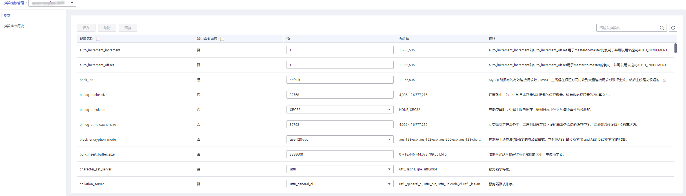

# 编辑参数模板

为确保华为云关系型数据库服务发挥出最优性能，用户可根据业务需求对用户创建的参数模板里边的参数进行调整。

您可以修改用户创建的数据库参数模板中的参数值，但不能更改默认数据库参数模板中的参数值。

以下是您在使用数据库参数模板中的参数时应了解的几个要点：

-   如果您单击实例名称，在“参数修改“页面修改当前实例的参数模板，更改动态参数并保存数据库参数模板时，系统将立即应用更改，而不管“应用”设置如何。当您更改静态参数并保存数据库参数模板时，参数更改将在您手动重启该数据库实例后生效。
-   当您在“参数模板管理”页面，批量修改参数模板时，需执行“应用”操作，才会对实例生效。当您更改静态参数并保存数据库参数模板时，参数更改将在您应用到实例后，手动重启与数据库参数模板关联的数据库实例后生效。应用参数模板到数据库实例，请参见[应用参数模板](应用参数模板.md)。

如果您更改一个参数值，则所做更改的应用时间将由该参数的类型决定。

华为云关系型数据库服务的管理控制台显示与数据库参数模板关联的数据库实例状态。例如，如果数据库实例未使用对其关联的数据库参数模板所做的最新更改，则华为云关系型数据库服务的管理控制台将显示状态为“等待重启“的数据库实例。您将需要手动重启数据库实例，以使最新的参数更改对该数据库实例生效。

> **说明：**   
>系统提供的默认参数模板不允许修改，只可单击参数模板名进行查看。当用户参数设置不合理导致数据库无法启动时，可参考默认参数模板重新配置。  

## 批量修改参数

1.  登录管理控制台。
2.  单击管理控制台左上角的，选择区域和项目。
3.  选择“数据库  \>  云数据库 RDS“。进入云数据库 RDS信息页面。
4.  在“参数模板管理”页面的“自定义”页签，选择目标参数模板，单击参数模板名称。
5.  根据需要修改相关参数值。

    **参数相关说明，请参见[MySQL参数修改注意事项](MySQL参数修改注意事项.md)。**

    **可进行的操作如下：**

    **图 1**  编辑参数模板  
    

    -   单击“保存”，在弹出框中单击“是”，保存修改。
    -   单击“取消”，放弃本次设置。
    -   单击“预览”，可对比参数修改前和修改后的值。

        **图 2**  预览修改参数  
        

6.  参数修改完成后，您可在“参数模板管理”页面单击目标参数模板名称，然后在左侧导航栏中，单击“参数修改历史“查看参数的修改详情。

    > **须知：**   
    >参数模板修改后，不会立即应用到当前使用的实例，您需要进行应用操作才可生效，具体操作请参见[应用参数模板](应用参数模板.md)。  

    有关参数模板状态，请参见[状态](https://support.huaweicloud.com/productdesc-rds/rds_01_0023.html)中的参数模板状态内容。

    -   修改主实例的某些参数（如果是主备实例，备实例的参数也会被同步修改），需重启主实例使之生效。
    -   修改只读实例的某些参数，需要重启该只读实例使之生效。

## 修改当前实例的参数模板

1.  登录管理控制台。
2.  单击管理控制台左上角的，选择区域和项目。
3.  选择“数据库  \>  云数据库 RDS“。进入云数据库 RDS信息页面。
4.  在“实例管理“页面，选择指定的实例，单击实例名称，进入实例的基本信息页面。
5.  在左侧导航栏中选择“参数修改“，在“参数”页签修改相应参数。

    可进行的操作如下：

    > **须知：**   
    >参数模板修改后，会立即应用到当前实例。  
    >有关参数模板状态，请参见[状态](https://support.huaweicloud.com/productdesc-rds/rds_01_0023.html)中的参数模板状态内容。  
    >根据参数列表中“是否需要重启“提示，进行相应操作：  
    >-   是：在实例列表中，查看“运行状态“，如果显示参数模板变更，等待重启，则需重启实例使之生效。  
    >-   否：无需重启，立即生效。  

    -   单击“保存”，在弹出框中单击“是”，保存修改。
    -   单击“取消”，放弃本次设置。
    -   单击“预览”，可对比参数修改前和修改后的值。

    参数修改完成后，您可在“参数修改“页面，选择“参数修改历史“页签查看参数的修改详情。

