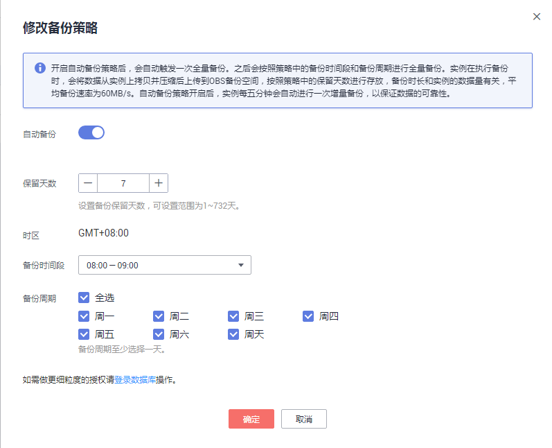
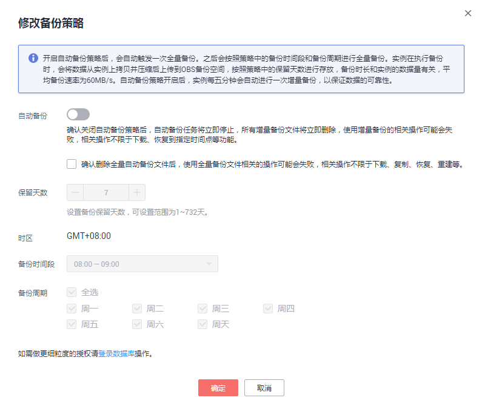

# 自动备份策略

## 操作场景

创建华为云关系型数据库实例时，系统默认开启自动备份策略，用户也可以关闭备份，但是对于生产环境，强烈推荐开启备份，因为恢复功能依赖备份的打开。实例创建成功后，您可根据业务需要设置自动备份策略。华为云关系型数据库服务按照用户设置的自动备份策略对数据库进行备份。对于超高性能型规格的实例，不允许关闭自动备份策略。

华为云关系型数据库服务的备份操作是实例级的，而不是数据库级的。当数据库故障或数据损坏时，可以通过备份恢复数据库，从而保证数据可靠性。备份以压缩包的形式存储在对象存储服务上，以保证用户数据的机密性和持久性。由于开启备份会损耗数据库读写性能，建议您选择业务低峰时间段启动自动备份。

华为云关系型数据库默认开启的自动备份策略设置如下：

-   保留天数：默认为7天。
-   备份时间段：默认为24小时中，间隔一小时的随机的一个时间段 ，例如01:00～02:00，12:00～13:00等。
-   备份周期：默认为一周内的每一天。

## 开启或修改自动备份策略

1.  登录管理控制台。
2.  单击管理控制台左上角的，选择区域和项目。

    您可选择自己的专属计算集群（Dedicated Computing Cluster，简称DCC）。

3.  选择“数据库  \>  关系型数据库“，进入关系型数据库信息页面。
4.  在“实例管理“页面，选择指定的实例，单击实例名称。
5.  在“备份恢复“页签，单击“修改备份策略“，如需开启自动备份策略，单击。如[图1](#fig823433633919)所示进行修改备份策略。

    **图 1**  修改备份策略  
    

    保留天数是指自动备份可保留的时间，增加保留天数可提升数据可靠性，请根据需要设置。

    减少保留天数的情况下，该备份策略对已有备份文件同时生效，即超出备份保留天数的已有备份文件会被删除。

    保留天数范围为1～732天，备份时间段为间隔1小时，建议根据业务情况，选择业务低峰时段，备份周期默认全选，可修改，且至少选择一周中的1天。

    若实例的备份策略被开启，则会立即触发一个全量的自动备份，增量备份\(binlog\)不需要用户设置，RDS系统会自动每隔5分钟进行一次，无论是全量备份还是增量备份，都存储在对象存储服务上的。

6.  单击“确定”，确认修改。

## 关闭自动备份策略

> **注意：**   
>-   当您关闭自动备份策略后，系统不会对您的数据进行备份，且恢复到指定时间点功能会不可用。重新开启自动备份后，恢复到指定时间点的备份时间段会从开启自动备份的时间点开始重新计算，请谨慎操作。  
>-   恢复实例中，如果您选择删除指定时间段内的自动备份，可能会导致正在进行的恢复任务失败，且删除操作无法恢复，请谨慎操作。  

1.  在“实例管理“页面，选择指定的实例，单击实例名称。
2.  在“备份恢复“页签，单击“修改备份策略“，单击，关闭自动备份策略。如[图2](#fig7385114574114)所示关闭备份策略。

    **图 2**  关闭备份策略  
    

    Microsoft SQL Server的主备实例，备份策略不可被关闭。

    选择是否删除指定时间段内的自动备份文件：

    -   不勾选，永久保存当前还在保留天数内的自动备份文件。
    -   勾选，删除当前还在保留天数内的自动备份文件。

3.  单击“确定”，确认关闭。

