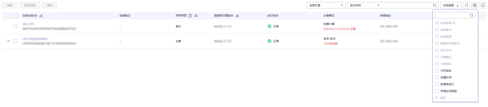

# 自定义列表项

## 操作场景

您可以根据自身业务需要，自定义设置实例信息列表项。

## 具体操作

在“实例管理”页面，单击，选择自定义列表项。

**图 1**  自定义列表项  

-   系统默认展示以下列表项：实例名称/ID、实例类型、数据库引擎、运行状态、计费模式、内网地址、操作。

    默认实例信息列表项不可更改。

-   单project情况下，您最多可选择10个列表项：实例名称/ID、实例类型、数据库引擎、运行状态、计费模式、内网地址、创建时间、数据库端口、存储空间类型、操作。
-   多project情况下，需要同时开通项目管理服务权限，您最多可选择11个列表项：实例名称/ID、实例类型、数据库引擎、运行状态、计费模式、内网地址、创建时间、数据库端口、存储空间类型、操作、所属项目。

