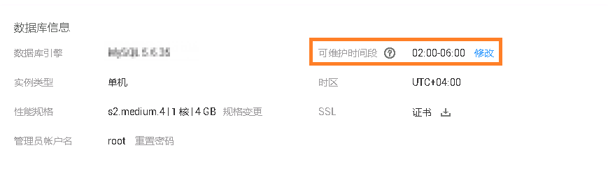

# 设置可维护时间段

## 操作场景

默认可维护时间段为02:00\~06:00，您可以根据业务需求，设置可维护时间段。建议将可维护时间段设置在业务低峰期，避免业务在维护过程中异常中断。

## 操作步骤

1.  登录管理控制台。
2.  单击管理控制台左上角的，选择区域和项目。
3.  选择“数据库  \>  云数据库 RDS“。进入云数据库 RDS信息页面。
4.  在“实例管理”页面，单击目标实例名称，进入“基本信息”页面，在“数据库信息“模块的“可维护时间段“处，单击“修改”。

    **图 1**  设置可维护时间段  
    

5.  在“修改可维护时间段”弹框中，选择一个可维护时间段，单击“确定”。

    > **说明：**   
    >修改可维护时间段，不影响原有可维护时间段内定时任务的执行时间。  

