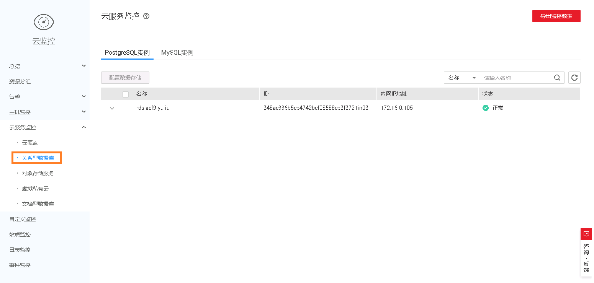
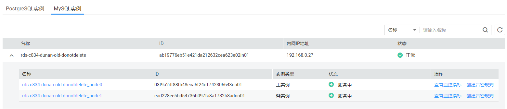
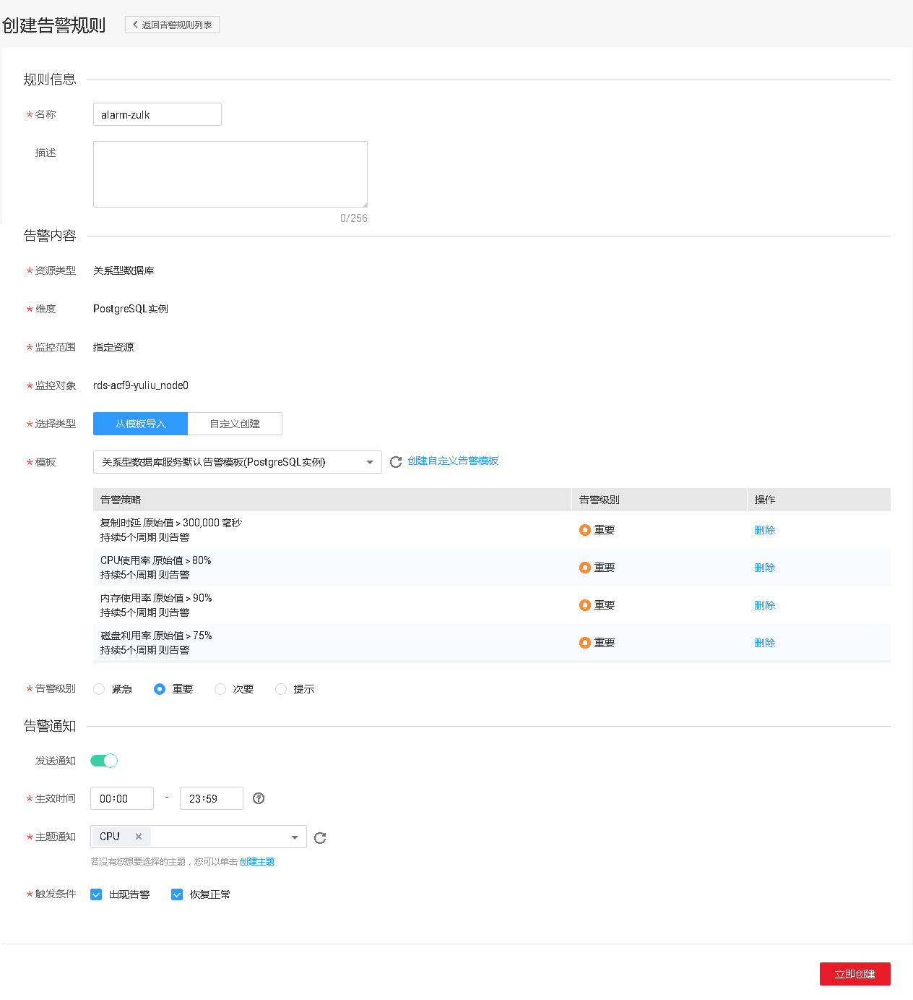

# 设置告警规则

## 操作场景

通过设置关系型数据库告警规则，用户可自定义监控目标与通知策略，及时了解关系型数据库运行状况，从而起到预警作用。

设置关系型数据库的告警规则包括设置告警规则名称、服务、维度、监控对象、监控指标、告警阈值、监控周期和是否发送通知等参数。

## 操作步骤

1.  登录管理控制台。
2.  在“所有服务“或“服务列表“中选择“管理与部署 \> 云监控”，进入“云监控“服务信息页面。
3.  在左侧导航栏选择“云服务监控 \> 关系型数据库”。

    **图 1**  选择监控对象  
    

4.  选择需要添加告警规则的实例，单击操作列的“创建告警规则“。

    **图 2**  创建告警规则  
    

5.  在“创建告警规则“页面，填选相关信息。

    **图 3**  填选告警规则信息  
    

    -   输入告警“名称“和“描述“。
    -   “选择类型“建议“从模板导入“，模板中，已经包含CPU使用率、内存使用率、磁盘利用率三个常用告警指标。
    -   单击-17.png)开启“发送通知“，生效时间默认为全天，若没有您想要选择的主题，可以单击下一行的“创建主题“进行添加，“触发条件“勾选“出现告警“和“恢复正常“。

        > **说明：**   
        >该告警规则仅在生效时间段内发送通知消息。  

6.  单击“立即创建“，告警规则创建完成。

    关于告警参数的配置，请参见《[云监控用户指南](https://support.huaweicloud.com/usermanual-ces/zh-cn_topic_0084572213.html)》。

