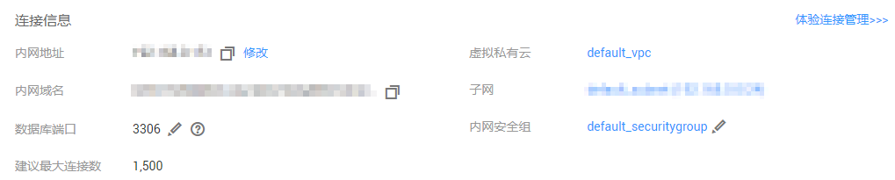
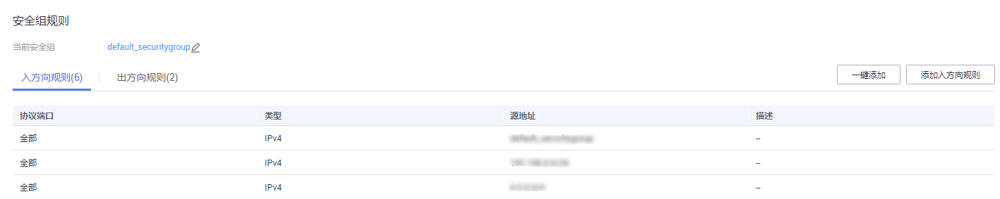
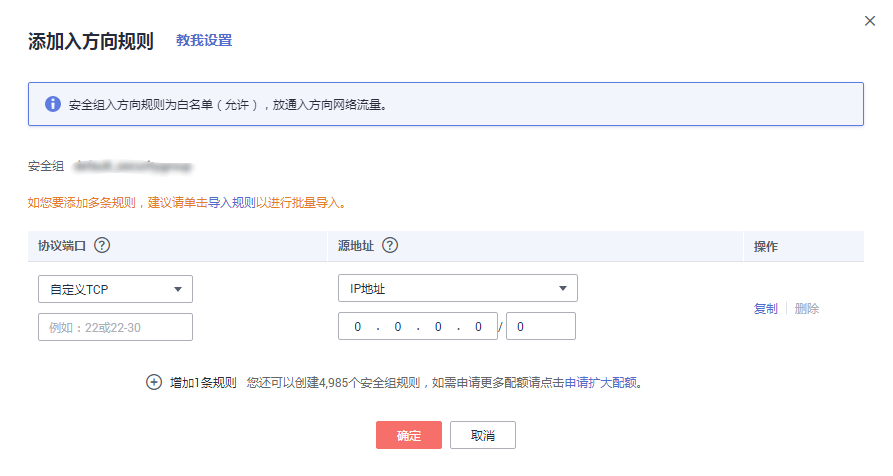

# 设置安全组规则

## 操作场景

安全组是一个逻辑上的分组，为同一个虚拟私有云内具有相同安全保护需求，并相互信任的弹性云服务器和华为云关系型数据库实例提供访问策略。

为了保障数据库的安全性和稳定性，在使用华为云关系型数据库实例之前，您需要设置安全组，开通需访问数据库的IP地址和端口。

-   通过弹性公网IP连接RDS实例时，需要为RDS所在安全组配置相应的**入方向规则**。
-   通过内网连接RDS实例时，设置安全组分为以下两种情况：
    -   ECS与RDS实例在相同安全组时，默认ECS与RDS实例互通，无需设置安全组规则。
    -   ECS与RDS实例在不同安全组时，需要为RDS和ECS分别设置安全组规则。
        -   设置RDS安全组规则：为RDS所在安全组配置相应的**入方向规则**。
        -   设置ECS安全组规则：安全组默认规则为出方向上数据报文全部放行，此时，无需对ECS配置安全组规则。当在ECS所在安全组为非默认安全组且出方向规则**非全放通**时，需要为ECS所在安全组配置相应的**出方向**规则。

本节主要介绍如何为RDS实例设置相应的入方向规则。

关于添加安全组规则的详细要求，可参考《虚拟私有云用户指南》的“[添加安全组规则](https://support.huaweicloud.com/usermanual-vpc/zh-cn_topic_0030969470.html)”章节。

## 注意事项

因为安全组的默认规则是在出方向上的数据报文全部放行，同一个安全组内的弹性云服务器和华为云关系型数据库实例可互相访问。安全组创建后，您可以在安全组中定义各种访问规则，当华为云关系型数据库实例加入该安全组后，即受到这些访问规则的保护。

-   默认情况下，一个租户可以创建500条安全组规则。
-   为一个安全组设置过多的安全组规则会增加首包延时，因此，建议一个安全组内的安全组规则不超过50条。
-   当需要从安全组外访问安全组内的华为云关系型数据库实例时，需要为安全组添加相应的**入方向规则**。

> **说明：**   
>为了保证数据及实例安全，请合理使用权限。建议使用最小权限访问，并及时修改数据库默认端口号（3306），同时将可访问IP地址设置为远程主机地址或远程主机所在的最小子网地址，限制远程主机的访问范围。  
>源地址默认的IP地址0.0.0.0/0是指允许所有IP地址访问安全组内的华为云关系型数据库实例。  

关于添加安全组规则的详细要求，可参考《虚拟私有云用户指南》的“[添加安全组规则](https://support.huaweicloud.com/usermanual-vpc/zh-cn_topic_0030969470.html)”章节。

## 操作步骤

1.  登录管理控制台。
2.  单击管理控制台左上角的，选择区域和项目。
3.  选择“数据库  \>  云数据库 RDS“。进入云数据库 RDS信息页面。
4.  在“实例管理“页面，选择目标实例，单击实例名称，进入实例的“基本信息“页面。
5.  设置安全组规则。
    -   在“基本信息“页面中，在“连接信息“模块的“内网安全组“处，单击安全组名称，进入安全组页面。

        **图 1**  连接信息  
        

    -   您也可以在左侧导航栏，单击“连接管理“，在“内网连接”或“公网连接”页面中，在“安全组规则”模块“当前安全组”处，单击安全组名称，进入安全组页面。

        **图 2**  安全组规则  
        

    -   您也可以在左侧导航栏，单击“连接管理“，在“内网连接”或“公网连接”页面中，在“安全组规则”模块，单击“添加入方向规则”或者“一键添加”，设置安全组规则。

        > **说明：**   
        >一键添加操作允许所有IP地址访问安全组内的华为云关系型数据库实例，存在高安全风险，请谨慎选择。  

6.  在入方向规则页签，单击“添加规则”，添加入方向规则。

    单击“+”可以依次增加多条入方向规则。

    **图 3**  添加入方向规则  
    

    **表 1**  入方向参数说明

    
    <table><thead align="left"><tr id="rb3cd3cba51d749fc9644646e4116521a"><th class="cellrowborder" valign="top" width="17.611761176117614%" id="mcps1.2.4.1.1">
参数

    </th>
    <th class="cellrowborder" valign="top" width="42.23422342234223%" id="mcps1.2.4.1.2">
说明

    </th>
    <th class="cellrowborder" valign="top" width="40.15401540154016%" id="mcps1.2.4.1.3">
取值样例

    </th>
    </tr>
    </thead>
    <tbody><tr id="row1141211911417"><td class="cellrowborder" rowspan="2" valign="top" width="17.611761176117614%" headers="mcps1.2.4.1.1 ">
协议端口

    

    </td>
    <td class="cellrowborder" valign="top" width="42.23422342234223%" headers="mcps1.2.4.1.2 ">
网络协议。目前支持“All”、“TCP”、“UDP”、“ICMP”和“GRE”等协议。

    </td>
    <td class="cellrowborder" valign="top" width="40.15401540154016%" headers="mcps1.2.4.1.3 ">
Custom TCP

    </td>
    </tr>
    <tr id="row10412719111417"><td class="cellrowborder" valign="top" headers="mcps1.2.4.1.1 ">
端口：允许远端地址访问弹性云服务器指定端口。常用端口请参见<a href="https://support.huaweicloud.com/usermanual-vpc/SecurityGroup_0002.html" target="_blank" rel="noopener noreferrer">弹性云服务器常用端口</a>。

    </td>
    <td class="cellrowborder" valign="top" headers="mcps1.2.4.1.2 ">
<strong id="zh-cn_topic_0208270911_zh-cn_topic_0192953697_a121c1c1ee8b74dbaabe736e1dbbfdb59">通过内网连接实例</strong>时，输入已购买的弹性云服务器的目标实例的端口。

    </td>
    </tr>
    <tr id="row5412519121418"><td class="cellrowborder" valign="top" width="17.611761176117614%" headers="mcps1.2.4.1.1 ">
源地址

    </td>
    <td class="cellrowborder" valign="top" width="42.23422342234223%" headers="mcps1.2.4.1.2 ">
源地址：可以是IP地址、安全组。例如：

    <ul id="ul134011419141415"><li>xxx.xxx.xxx.xxx/32（IPv4地址）</li><li>xxx.xxx.xxx.0/24（子网）</li><li>0.0.0.0/0（任意地址）</li></ul>
    </td>
    <td class="cellrowborder" valign="top" width="40.15401540154016%" headers="mcps1.2.4.1.3 ">
0.0.0.0/0

    </td>
    </tr>
    <tr id="row144111819111415"><td class="cellrowborder" valign="top" width="17.611761176117614%" headers="mcps1.2.4.1.1 ">
描述

    </td>
    <td class="cellrowborder" valign="top" width="42.23422342234223%" headers="mcps1.2.4.1.2 ">
安全组规则的描述信息，非必填项。

    
描述信息内容不能超过255个字符，且不能包含“&lt;”和“&gt;”。

    </td>
    <td class="cellrowborder" valign="top" width="40.15401540154016%" headers="mcps1.2.4.1.3 ">
-

    </td>
    </tr>
    </tbody>
    </table>

