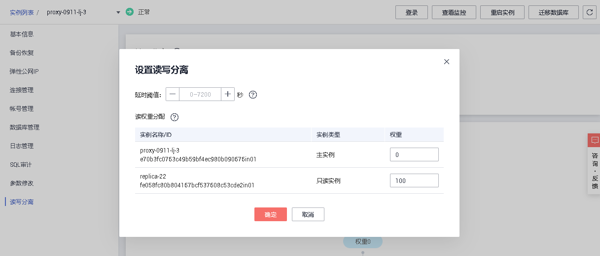

# 设置延时阀值和读权重分配

开通读写分离功能后，您可以根据需要设置读写分离的延迟阈值和读权重分配。

**表 1**  读写分离参数说明

<table><thead align="left"><tr id="zh-cn_topic_0200110322_row1080465516471"><th class="cellrowborder" valign="top" width="16.7%" id="mcps1.2.3.1.1">
参数

</th>
<th class="cellrowborder" valign="top" width="83.3%" id="mcps1.2.3.1.2">
说明

</th>
</tr>
</thead>
<tbody><tr id="zh-cn_topic_0200110322_row10804055114711"><td class="cellrowborder" valign="top" width="16.7%" headers="mcps1.2.3.1.1 ">
延时阀值

</td>
<td class="cellrowborder" valign="top" width="83.3%" headers="mcps1.2.3.1.2 ">
只读实例同步主实例数据时允许的最长延迟时间。为避免只读实例读取的数据长时间和主实例不一致，当一个只读实例的延迟时间超过设置的延迟阈值，则不论该只读实例的读权重是多少，读请求都不会转发至该只读实例。

读写分离功能成功开启后，延时阀值默认为30s，阀值默认范围为0~7200s，建议该阀值不小于30s，超出阀值的只读实例不分配流量。

</td>
</tr>
<tr id="zh-cn_topic_0200110322_row1804105517474"><td class="cellrowborder" valign="top" width="16.7%" headers="mcps1.2.3.1.1 ">
读权重分配

</td>
<td class="cellrowborder" valign="top" width="83.3%" headers="mcps1.2.3.1.2 ">
读写分离功能成功开启后，主实例的读权重默认为0，可以修改；只读实例可以设置读权重。

实例的读权重越高，处理的读请求越多。例如，假设主实例有4个只读实例，实例的读权重分别为0、100、200、500、300，则表示主实例不处理读请求（写请求仍然自动发往主实例），四个只读实例按照1：2：5：3的比例处理读请求。

开通读写分离功能后，系统将根据只读实例的规格默认分配权重，后续新增只读实例也将按照默认规则分配权重。具体分配规则请参见<a href="系统权重分配规则.md">系统权重分配规则</a>。

</td>
</tr>
</tbody>
</table>

## 操作步骤

1.  登录管理控制台。
2.  单击管理控制台左上角的，选择区域和项目。
3.  选择“数据库  \>  云数据库 RDS“。进入云数据库 RDS信息页面。
4.  在实例列表中，单击只读实例所在的主实例名称，进入主实例的“基本信息“页面。
5.  在左侧导航栏中，单击“读写分离“，在右侧“读写分离“页面单击“设置读写分离“。
6.  在“设置读写分离”弹出框中，设置延迟阀值、主实例和只读实例的权重。

    **图 1**  设置只读权重  
    

