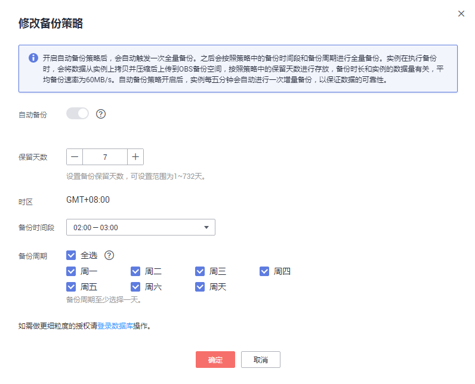
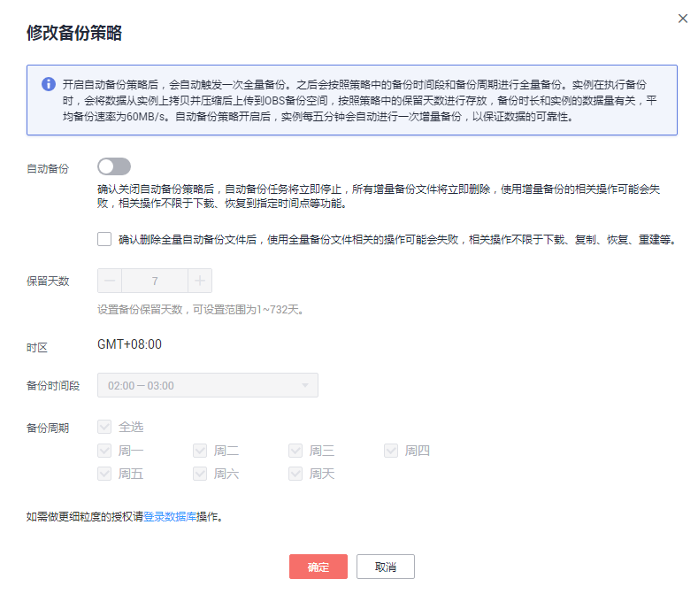

# 设置自动备份策略

## 操作场景

创建华为云关系型数据库实例时，系统默认开启自动备份策略，用户也可以关闭备份，但是对于生产环境，强烈推荐开启备份，因为恢复功能依赖备份的打开。实例创建成功后，您可根据业务需要设置自动备份策略。关系型数据库服务按照用户设置的自动备份策略对数据库进行备份。

华为云关系型数据库服务的备份操作是实例级的，而不是数据库级的。当数据库故障或数据损坏时，可以通过备份恢复数据库，从而保证数据可靠性。备份以压缩包的形式存储在对象存储服务上，以保证用户数据的机密性和持久性。由于开启备份会损耗数据库读写性能，建议您选择业务低峰时间段启动自动备份。

华为云关系型数据库默认开启的自动备份策略设置如下：

-   保留天数：默认为7天。
-   备份时间段：默认为24小时中，间隔一小时的随机的一个时间段 ，例如01:00～02:00，12:00～13:00等。备份时间段以UTC时区保存。如果碰到夏令时/冬令时切换，备份时间段会因时区变化而改变。
-   备份周期：默认为一周内的每一天。

## 开启或修改自动备份策略

1.  登录管理控制台。
2.  单击管理控制台左上角的，选择区域和项目。
3.  选择“数据库  \>  云数据库 RDS“。进入云数据库 RDS信息页面。
4.  在“实例管理“页面，选择指定的实例，单击实例名称。
5.  在左侧导航栏，单击“备份恢复“，单击“修改备份策略“，如需开启自动备份策略，单击。如[图1](#zh-cn_topic_0192954006_fig823433633919)所示进行修改备份策略。

    **图 1**  修改备份策略  
    

    -   保留天数是指自动备份可保留的时间，增加保留天数可提升数据可靠性，请根据需要设置。
    -   减少保留天数的情况下，该备份策略对已有备份文件同时生效，即超出备份保留天数的已有备份文件会被删除。
    -   保留天数为全量自动备份和增量备份的保留时长，范围为1～732天，需要延长保留时间请联系客服人员申请，备份时间段为间隔1小时，建议根据业务情况，选择业务低峰时段，备份周期默认全选，可修改，且至少选择一周中的1天。
    -   若实例的备份策略被开启，则会立即触发一个全量的自动备份，增量备份不需要用户设置，RDS系统会自动每隔5分钟进行一次，无论是全量备份还是增量备份，都存储在对象存储服务上的。

6.  单击“确定”，确认修改。

## 关闭自动备份策略

> **须知：**   
>自动备份包含全量备份和增量备份。确认关闭自动备份策略后，自动备份任务将立即停止，所有增量备份文件将立即删除，使用增量备份的相关操作可能会失败，相关操作不限于下载、恢复到指定时间点等功能。  

1.  登录管理控制台。
2.  单击管理控制台左上角的，选择区域和项目。
3.  选择“数据库  \>  云数据库 RDS“。进入云数据库 RDS信息页面。
4.  在“实例管理“页面，选择指定的实例，单击实例名称。
5.  在左侧导航栏中选择“备份恢复“，单击“修改备份策略“，单击，关闭自动备份策略。如[图2](#zh-cn_topic_0192954006_fig7385114574114)所示关闭备份策略。

    **图 2**  关闭备份策略  
    

    Microsoft SQL Server的主备实例，备份策略不可被关闭。

    选择是否删除指定时间段内的自动备份文件：

    -   不勾选，永久保存当前还在保留天数内的自动备份文件。
    -   勾选，删除当前还在保留天数内的自动备份文件。确认删除全量自动备份文件后，使用全量备份文件相关的操作可能会失败，相关操作不限于下载、复制、恢复、重建等。

6.  单击“确定”，确认关闭。

