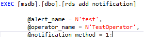

# 设置警报通知<a name="rds_09_0014"></a>

## 操作场景<a name="section69761816162012"></a>

使用存储过程设置警报通知。

## 前提条件<a name="section11945143132017"></a>

成功连接RDS for SQL Server实例。通过SQL Server客户端连接目标实例，具体操作请参见[通过公网连接SQL Server实例](https://support.huaweicloud.com/qs-rds/rds_03_0007.html)。

## 操作步骤<a name="section1334017544208"></a>

执行以下命令，设置警报通知。

**EXEC \[msdb\].\[dbo\].\[rds\_add\_notification\]**

**@alert\_name='alert'**

**@operator\_name='operator'**

**@notification\_method= notification\_method**

**表 1**  参数说明

<a name="table1816418573014"></a>
<table><thead align="left"><tr id="row816610514306"><th class="cellrowborder" valign="top" width="20.77%" id="mcps1.2.3.1.1"><p id="p35151612173010"><a name="p35151612173010"></a><a name="p35151612173010"></a>参数</p>
</th>
<th class="cellrowborder" valign="top" width="79.23%" id="mcps1.2.3.1.2"><p id="p1816611514309"><a name="p1816611514309"></a><a name="p1816611514309"></a>说明</p>
</th>
</tr>
</thead>
<tbody><tr id="row1016612593020"><td class="cellrowborder" valign="top" width="20.77%" headers="mcps1.2.3.1.1 "><p id="p1316615103012"><a name="p1316615103012"></a><a name="p1316615103012"></a>'alert'</p>
</td>
<td class="cellrowborder" valign="top" width="79.23%" headers="mcps1.2.3.1.2 "><p id="p1716635183012"><a name="p1716635183012"></a><a name="p1716635183012"></a>通知的警报。警报是sysname，无默认值。</p>
</td>
</tr>
<tr id="row151669515307"><td class="cellrowborder" valign="top" width="20.77%" headers="mcps1.2.3.1.1 "><p id="p816614573017"><a name="p816614573017"></a><a name="p816614573017"></a>'operator'</p>
</td>
<td class="cellrowborder" valign="top" width="79.23%" headers="mcps1.2.3.1.2 "><p id="p1016605113015"><a name="p1016605113015"></a><a name="p1016605113015"></a>当出现警报时通知的操作员。运算符是sysname，无默认值。</p>
</td>
</tr>
<tr id="row2016695153012"><td class="cellrowborder" valign="top" width="20.77%" headers="mcps1.2.3.1.1 "><p id="p18166145133020"><a name="p18166145133020"></a><a name="p18166145133020"></a>notification_method</p>
</td>
<td class="cellrowborder" valign="top" width="79.23%" headers="mcps1.2.3.1.2 "><p id="p716625143011"><a name="p716625143011"></a><a name="p716625143011"></a>依据通知操作员的方法。notification_method是tinyint，无默认值。notification_method可以是一个或多个值结合OR逻辑运算符。</p>
<a name="ul92951739143113"></a><a name="ul92951739143113"></a><ul id="ul92951739143113"><li>值为1，电子邮件。</li><li>值为2，寻呼程序。</li><li>值为4，net send。</li></ul>
</td>
</tr>
</tbody>
</table>

执行成功后，系统将会如下提示：

```
Commands completed successfully.
```

## 示例<a name="section23341852203318"></a>



回显结果如下：


