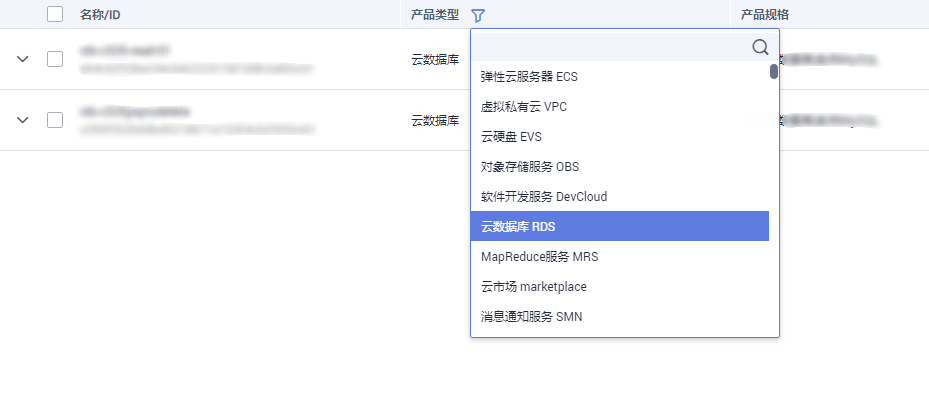
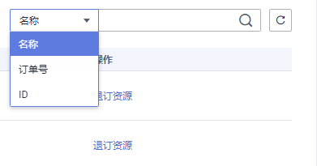

# 退订包周期实例

## 操作场景

对于“包年/包月”模式的数据库实例，您需要退订订单，从而删除数据库实例资源。

退订主实例订单时，会同步删除该主实例及其对应的只读实例。由于只读实例的为单独的订单，固只读实例的订单不会被同步删除，需要您手动退订，否则系统会继续收取费用。退订只读实例的操作方法同主实例。

对于“按需计费”模式的主实例或只读实例，您需要在关系型数据库的“实例管理“页面对其进行删除，更多操作请参见[删除按需实例](删除按需实例.md)。

## 方法一

您可在关系型数据库“实例管理“页面的实例列表中，退订包周期实例。

1.  [登录云数据库](https://support.huaweicloud.com/qs-rds/rds_login.html)。
2.  在关系型数据库“实例管理”页面，选择目标实例，单击“操作“列的“更多  \>  退订“。

    **图 1**  退订主实例  
    

    **图 2**  退订只读实例  
    

3.  在“退订资源”页面，确认待退订实例信息，并选择退订原因，单击“退订“。

    资源退订相关信息，请参考[退订规则说明](https://support.huaweicloud.com/usermanual-billing/zh-cn_topic_0083138805.html)。

4.  在弹出框中确认是否退订该资源，单击“是“，提交退订申请。

    > **注意：**   
    >1.  提交退订后，资源和数据将会被删除并无法找回。  
    >2.  请务必确认完成数据备份后再提交退订。  

5.  查看退订结果。数据库实例订单退订成功后，实例将会被删除，即关系型数据库“实例管理“页面，将不再显示该订单对应的数据库实例。

## 方法二

您可前往“费用中心“，退订包周期实例。

1.  [登录云数据库](https://support.huaweicloud.com/qs-rds/rds_login.html)。
2.  单击页面右上角的“费用“，进入费用中心页面。
3.  在左侧导航栏中选择“退订与变更  \>  退订管理“，进入“退订管理“页面。
4.  在“退订管理“页面，勾选需要退订的实例订单，单击“操作“列的“退订资源“。
    -   您可通过产品类型筛选出账号下所有的关系型数据库订单。

        **图 3**  筛选服务  
        

    -   您还可以在订单列表右上角，通过实例名称、订单号或实例ID搜索资源。

        **图 4**  搜索资源  
        

    -   单次操作允许最大退订资源数为20。

5.  在“退订资源”页面，确认待退订实例信息，并选择退订原因，单击“退订“。

    资源退订相关信息，请参考[退订规则说明](https://support.huaweicloud.com/usermanual-billing/zh-cn_topic_0083138805.html)。

6.  在弹出框中确认是否退订该资源，单击“是“，提交退订申请。

    > **注意：**   
    >1.  提交退订后，资源和数据将会被删除并无法找回。  
    >2.  请务必确认完成数据备份后再提交退订。  

7.  查看退订结果。数据库实例订单退订成功后，实例将会被删除，即关系型数据库“实例管理“页面，将不再显示该订单对应的数据库实例。

