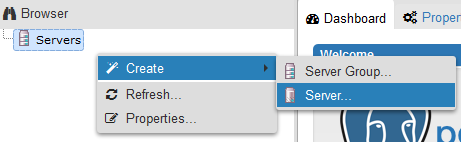
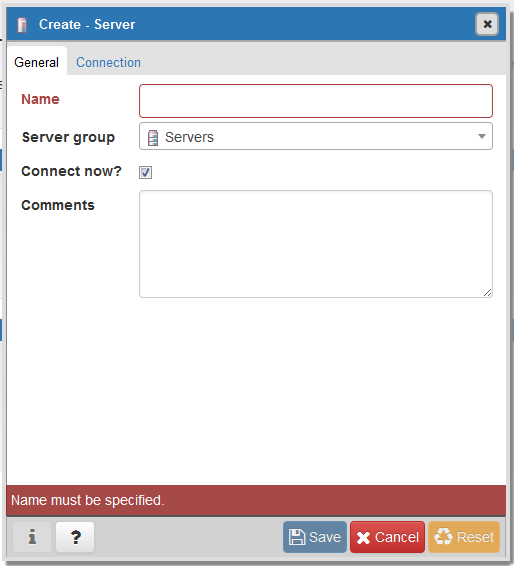
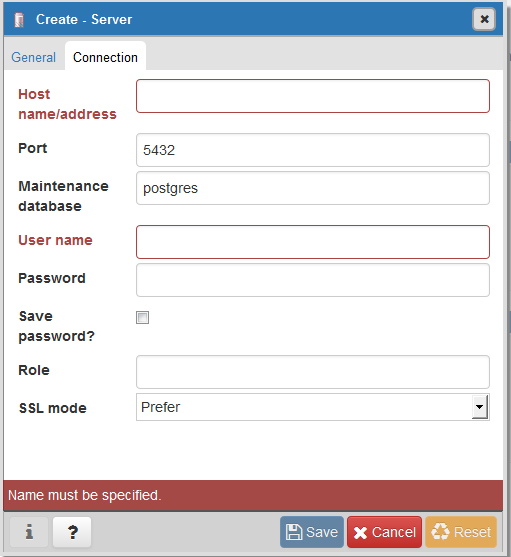

# 通过pgAdmin连接实例

您可通过pgAdmin客户端可视化操作，连接关系型数据库实例。

> **须知：**   
>-   pgAdmin仅支持通过公网地址连接。  
>-   请使用pgAdmin 4及其以上版本。  

## 准备工作

1.  准备可访问华为云关系型数据库实例的设备。

    通过公网地址连接华为云关系型数据库实例，需具备以下条件。

    1.  先对关系型数据库实例绑定公网地址，如何绑定公网地址，请参见[绑定和解绑弹性公网IP](绑定和解绑弹性公网IP（PostgreSQL）.md)。
    2.  保证本地设备可以访问华为云关系型数据库实例绑定的公网地址。

2.  在[1](#li345439671899)中的可访问华为云关系型数据库的设备上，安装pgAdmin客户端。

## 操作步骤

1.  启动pgAdmin客户端。
2.  在打开的登录信息窗口，单击并选择“Servers\>Create\>Server“。

    **图 1**  创建  
    

3.  在弹出框的“General“页签，输入“Name“，在“Connection“页签，输入要连接的关系型数据库实例信息，单击“Save“。

    **图 2**  General  
    

    **图 3**  连接信息  
    

    关键参数解释：

    -   Host name/address：目标实例的弹性公网IP地址。
    -   port：输入数据库端口，默认5432。
    -   User name：默认root。
    -   Password：要访问关系型数据库实例的User name所对应的密码。

4.  在打开登录信息窗口，若连接信息无误，即会成功连接实例。

