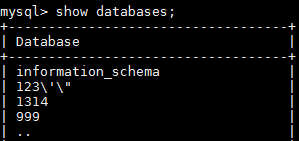

# 通过备份文件恢复数据\(MySQL\)

## 操作场景

您可根据业务需要，参考[下载全量备份文件](下载全量备份文件.md)，并通过备份文件进行本地存储备份或者恢复数据。本章节以CentOS 7.4 64bit，MySQL5.6为例演示如何恢复数据。

> **须知：**   
>备份文件不支持恢复到本地为Windows操作系统的数据库。  

## 前提条件

通过下载备份文件恢复数据到自建MySQL，请确保恢复目标MySQL版本不低于备份源RDS for MySQL版本。

恢复数据过程中，您可通过命令查看任务进程：

**ps -ef | grep mysql**

## 操作步骤

1.  下载qpress程序，并上传到ECS进行安装。

    在[网站](http://www.quicklz.com)下载文件“qpress-11-linux.x64.tar”, 并上传到ECS上。

    **tar -xvf** _qpress-11-linux-x64.tar_

    **mv** _qpress /usr/bin/_

2.  下载XtraBackup软件，并上传到ECS进行安装。

    > **须知：**   
    >请确保XtraBackup为2.4.9及其以上版本，否则后续步骤会报错。  

    在[网站](https://www.percona.com/downloads/Percona-XtraBackup-2.4/LATEST/)下载文件“percona-xtrabackup-24-2.4.9-1.el7.x86\_64.rpm”，并上传到ECS上。

    **rpm -ivh** _percona-xtrabackup-24-2.4.9-1.el7.x86\_64.rpm_ **--nodeps --force**

3.  在ECS上解压下载好的全备文件。
    1.  创建一个临时目录backupdir。

        **mkdir** _backupdir_

    2.  解压文件。

        **xbstream  -x -p 4 <** _./全备文件.qp_ **-C** _./backupdir/_

        **innobackupex --parallel 4 --decompress** _./backupdir_

        **find** _./backupdir/ _ **-name** _'\*.qp'_ **|** _xargs_ **rm -f**

4.  应用日志。

    **innobackupex --apply-log **_./backupdir_

5.  备份数据。
    1.  停止MySQL数据库服务。

        **service **_mysql_** stop**

        > **说明：**   
        >如果是MySQL5.7, 需执行如下命令停止MySQL数据库服务：  
        >**/bin/systemctl stop  mysqld.service**  

    2.  备份原来的数据库目录。

        **mv**  /var/lib/mysql/data  /var/lib/mysql_/data\_bak_

    3.  创建新的数据库目录并修改目录权限。

        **mkdir **_/var/lib/mysql/data_

        **chown** _mysql:mysql__ /var/lib/mysql/data_

6.  拷贝全备文件，并修改目录权限。

    **innobackupex --defaults-file=/etc/my.cnf --copy-back** _./backupdir_

    **chown -R** _mysql:mysql /var/lib/mysql/data_

7.  启动数据库。

    **service**_ mysql_ **start**

    > **说明：**   
    >如果是MySQL5.7, 需执行如下命令启动数据库：  
    >**/bin/systemctl start  mysqld.service**  

8.  登录数据库，查看数据恢复结果。

    **mysql -u root**

    **show databases**

    **图 1**  查看数据恢复结果  
    

