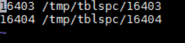

# 通过备份文件恢复数据\(PostgreSQL\)

您可根据业务需要，参考[下载备份文件](下载备份文件（PostgreSQL）.md)下载备份文件，并通过备份文件进行本地存储备份或者数据恢复。

## 前提条件

1.  需要在类unix系统上使用，系统上需要安装tar解压工具。
2.  使用python2.7或者python3均可执行。
3.  需要安装的三方包：lz4、gzip和shutil。

## 操作步骤

1.  准备一个本地存放表空间的目录。
2.  停止数据库服务器。
3.  保存本地目标数据库data目录下的三个配置文件（“postgresql.conf”、“pg\_hba.conf”和“recovery.done”）。
4.  清空本地数据库的data目录。
5.  下载[解压工具](https://dbs-download.obs.cn-north-1.myhuaweicloud.com/rds/pg_restore_file.zip)。
6.  使用提供的解压脚本，执行如下命令，将备份解压到一个临时目录下。

    **python restore\_obs\_file.py **_src\_file_** **_target\_dir_

    参数说明如下：

    “ src\_file“: pg全量备份文件的目录。

    “ target\_dir“：需要恢复到的目录，即[1](#li81101921125518)中准备的目录。注意：该目录必须是空目录，如果不存在该目录，则系统会创建该目录。

    解压后会在当前目录下产生以下目录：

    -   一个data目录，存放全量文件，其中“recovery.done”文件已被删除。
    -   一个xlog目录，增量文件目录。
    -   一个tblspc目录，表空间目录文件（如果原备份存在表空间文件）。

7.  将[6](#li1450424242419)中的文件拷贝到本地数据库指定目录下。
    1.  将解压出来的data目录下的文件，全部拷贝到本地数据库data目录，然后用[3](#li111172120554)中保存的配置文件，覆盖本地数据库data目录下的三个文件。
    2.  将解压出来的xlog目录下的文件，拷贝到本地数据库data下的pg\_xlog或pg\_wal文件夹中（数据库版本不同文件夹名称不同）。
    3.  将解压出来的tblspc下的表空间文件夹（如有），移动到[1](#li81101921125518)建立的表空间目录下，修改“data\\tablespace\_map“中对应的表空间软链接信息，如图所示：

        

8.  重新启动数据库，等待数据库恢复完成。

