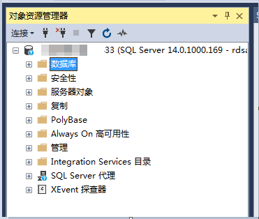
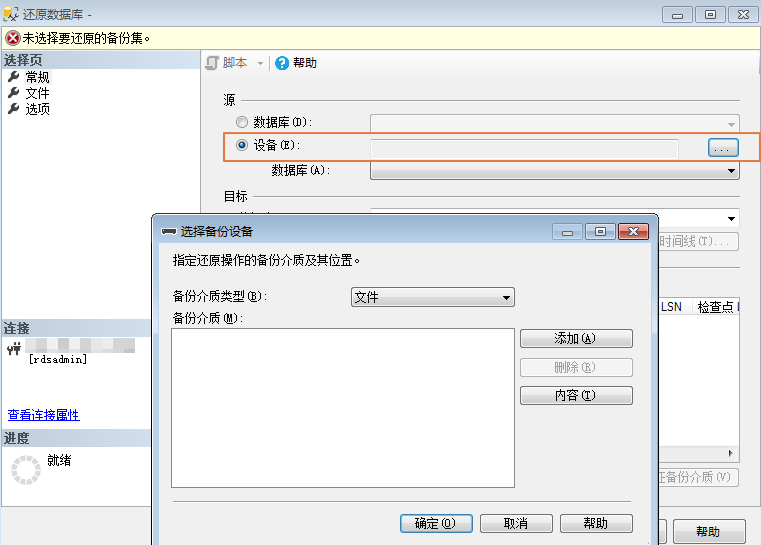

# 通过备份文件恢复数据\(SQL Server\)

您可根据业务需要，参考[下载备份文件](下载备份文件（SQL-Server）.md)，并通过备份文件进行本地存储备份或者数据恢复。可以使用SSMS连接ECS自建数据库或本地数据库进行恢复数据。本章以使用SSMS工具通过备份文件在用户本地数据库上恢复数据为例。

> **说明：**   
>-   在恢复数据之前，请确保ECS中已安装和备份文件对应的RDS SQL Server同版本或更高版本的数据库服务。  
>-   可以根据业务需要，下载自动差备文件，并通过自动差备文件和最近一次的数据备份文件进行数据恢复。请联系客服人员获取最近一次的数据备份文件。  

## 操作步骤

1.  下载SSMS客户端安装程序，并上传到ECS进行安装。

    在[网站](https://docs.microsoft.com/en-us/sql/ssms/download-sql-server-management-studio-ssms?view=sql-server-2017)下载文件“SSMS 18.0（GA）”, 并上传到ECS上。

2.  在ECS上解压已下载的RDS全量备份文件。
3.  启动SSMS客户端。
4.  在SSMS客户端上，登录本地数据库服务。
5.  在SSMS客户端的对象资源管理器中，选定数据库，单击右键选择“还原数据库”。

    

6.  在“还原数据库”弹出窗口中选择“设备”，在“选择备份设备“弹出框中，指定还原操作的备份介质及其位置，单击“确定”，完成数据还原。

    1.  设置“备份介质类型“为“文件“。
    2.  单击“添加“，添加已解压至本地的备份文件（.bak文件），根据需要设置相关选项。

    

