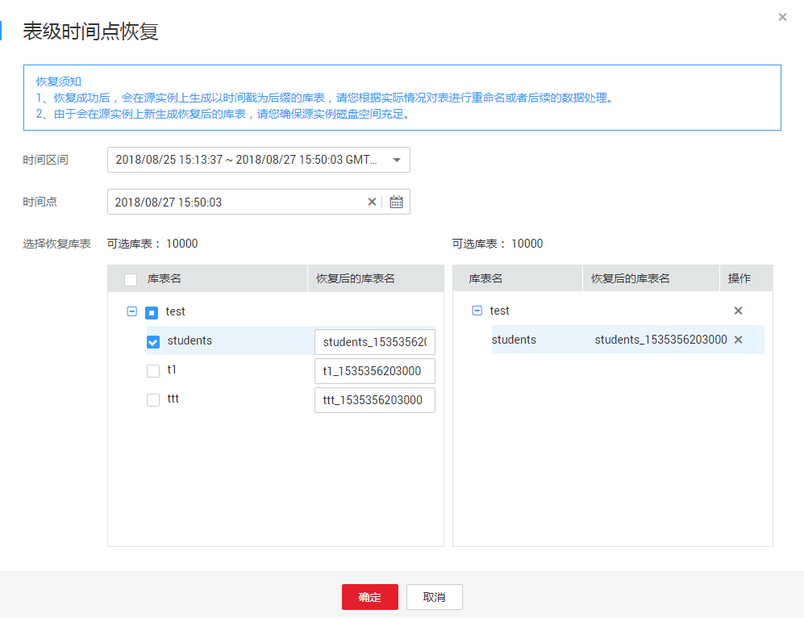

# 通过表级时间点恢复备份

> **说明：**   
>该功能目前仅支持MySQL引擎。  

## 操作场景

当用户在某个时间点删除了某个表，或者修改了某个表的一些记录时，用户需要只对该表进行恢复，而不需要将整个实例进行恢复。

通过表级时间点恢复备份，将不会导致实例数据被覆盖，您可以根据需要恢复库表。

## 前提条件

由于该操作会在源实例上新生成恢复后的库表，请确保您的源实例磁盘空间充足。

## 操作步骤

1.  [登录云数据库](https://support.huaweicloud.com/qs-rds/rds_login.html)。
2.  在“实例管理“页面，选择目标实例，单击实例名称，进入实例的“基本信息“页签。
3.  对于MySQL引擎，在左侧导航栏，单击“备份恢复“，在“全量备份“或“binlog备份“子页签下，单击“表级时间点恢复“。

    **图 1**  表级时间点恢复  
    

4.  在“表级时间点恢复“弹出框中，填选相关信息，单击“确定“。

    -   系统会自动生成以时间戳为后缀的库表名，如果需要，您也可以自定义恢复后的库表名。
    -   表名不能重复且满足：名称在4位到64位之间，必须以小写字母开头，以小写字母或数字结尾，可包含数字或下划线，不能包含其他特殊字符。

    **图 2**  选择恢复库表  
    

5.  在“实例管理“页面，可查看该实例状态为“恢复中“，恢复过程中实例仍可正常使用。

    同时，您可在“任务中心“页面，查看“表级时间点恢复”任务的执行进度及结果。

    恢复成功后，您可根据实际情况对表进行数据处理。

