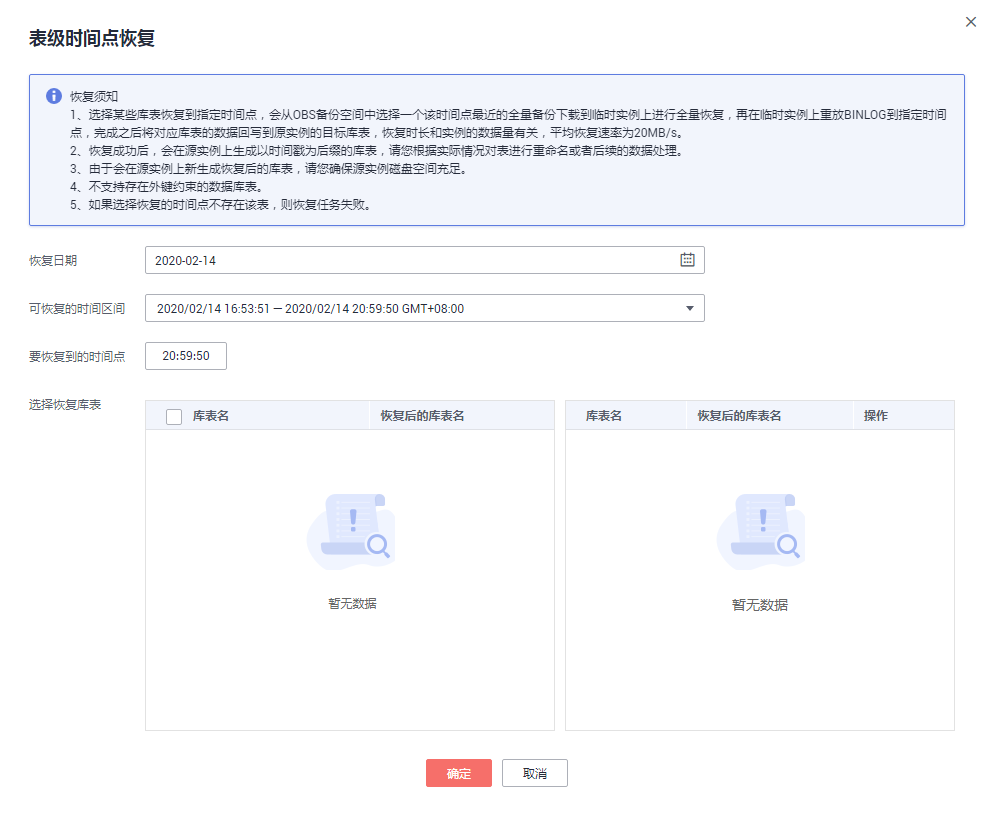

# 通过表级时间点恢复备份

> **说明：**   
>-   该功能目前仅支持MySQL引擎。  
>-   云数据库MySQL 金融版和MySQL 8.0版本的实例不支持表级时间点恢复恢复备份。  

## 操作场景

为了保证数据的完整性，以及降低对原实例的性能影响，在进行表级时间点恢复备份时，首先将选中时间点的全量数据和增量数据在后台恢复至一个临时实例，然后自动导出用户需要恢复的表，再将这些表恢复至原实例。由于需要对实例的所有数据进行备份及恢复操作，对于数据量较大的实例，所需时间较长，请耐心等待。通过表级时间点恢复备份，将不会导致实例数据被覆盖，您可以根据需要恢复库表。

## 前提条件

由于该操作会在源实例上新生成恢复后的库表，请确保您的源实例磁盘空间充足。

## 操作步骤

1.  登录管理控制台。
2.  单击管理控制台左上角的，选择区域和项目。
3.  选择“数据库  \>  云数据库 RDS“。进入云数据库 RDS信息页面。
4.  在“实例管理“页面，选择目标实例，单击实例名称，进入实例的“基本信息“页签。
5.  对于MySQL引擎，在左侧导航栏，单击“备份恢复“，在“全量备份“子页签下，单击“更多“，在下拉框中单击“表级时间点恢复“。在“binlog备份“子页签下，单击“表级时间点恢复“。

    **图 1**  表级时间点恢复  
    

6.  在“表级时间点恢复“弹出框中，填选相关信息，单击“确定“。
    -   系统会自动生成以时间戳为后缀的库表名，如果需要，您也可以自定义恢复后的库表名。
    -   表名不能重复且满足：名称长度在4\~64个字符之间，必须以字母开头，以字母或数字结尾，不区分大小写，可包含数字或下划线，不能包含其他特殊字符。

7.  若您已开启高危操作保护，在“身份验证”弹出框中单击“免费获取验证码“，正确输入验证码并单击“确定“，页面自动关闭。

    通过进行二次认证再次确认您的身份，进一步提高帐号安全性，有效保护您安全使用云产品。关于如何开启操作保护，具体请参考《统一身份认证服务用户指南》的内容。

8.  在“实例管理“页面，可查看该实例状态为“恢复中“，恢复过程中该实例业务不中断。

    同时，您可在“任务中心“页面，查看“表级时间点恢复”任务的执行进度及结果。

    恢复成功后，您可根据实际情况对表进行数据处理。

