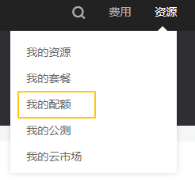

# 配额

## 操作场景

为防止资源滥用，平台限定了各服务资源的配额，不同的关系型数据库实例类型最多支持创建实例的数量可能不同。如果有需要，您可以申请扩大配额。

本节指导您如何查询指定区域下，关系型数据库各资源的使用情况，以及总配额。

## 查看配额

1.  登录管理控制台。
2.  单击管理控制台左上角的，选择区域和项目。
3.  选择“数据库  \>  云数据库 RDS“。进入云数据库 RDS信息页面。
4.  在页面右上角，选择“资源 \> 我的配额”，进入“服务配额”页面。

    **图 1**  我的配额  
    

5.  您可以在“服务配额”页面，查看关系型数据库各项资源的总配额，以及使用情况。
6.  如果当前配额不能满足业务要求，请单击“申请扩大配额”，根据指导进行调整。

## 申请扩大配额

1.  登录管理控制台。
2.  单击管理控制台左上角的，选择区域和项目。
3.  选择“数据库  \>  云数据库 RDS“。进入云数据库 RDS信息页面。
4.  在页面右上角，选择“资源 \> 我的配额”，进入“服务配额”页面。
5.  单击“申请扩大配额”。
6.  在“新建工单”页面，根据您的需求，填写相关参数。

    其中，“问题描述“项请填写需要调整的内容和申请原因。

7.  填写完毕后，勾选协议并单击“提交”。

