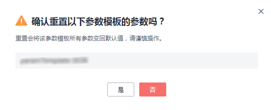

# 重置参数模板

## 操作场景

您可根据自己的业务需求，重置自己创建的参数模板对应的所有参数，使其恢复到默认值。

## 操作步骤

1.  登录管理控制台。
2.  单击管理控制台左上角的，选择区域和项目。
3.  选择“数据库  \>  云数据库 RDS“。进入云数据库 RDS信息页面。
4.  在“参数模板管理”页面的“自定义”页签，选择需要设置的参数模板，单击“更多 \> 重置“。
5.  单击“是”，重置所有参数为其默认值。

    **图 1**  确认重置参数模板  
    

    > **说明：**   
    >有关参数模板状态，请参见[状态](https://support.huaweicloud.com/productdesc-rds/zh-cn_topic_0032472291.html)中的参数模板状态内容。  
    >对于某些参数模板重置后，您需在实例列表中，查看状态，如果显示参数模板变更，等待重启，则需重启关联的实例使之生效。  
    >-   对于关联在主实例的参数模板（如果是主备实例，备实例的参数也会被同步重置），需重启主实例使之生效。  
    >-   对于关联在只读实例的参数模板，需重启该只读实例使之生效。  

