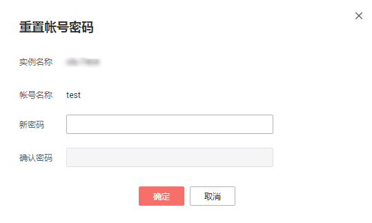

# 重置密码

## 操作场景

您可重置自己创建的数据库帐号密码，安全考虑，请定期（如三个月或六个月）修改密码，防止出现密码被暴力破解等安全风险。

## 操作步骤

1.  登录管理控制台。
2.  单击管理控制台左上角的，选择区域和项目。
3.  选择“数据库  \>  云数据库 RDS“。进入云数据库 RDS信息页面。
4.  在“实例管理“页面，选择目标实例，单击实例名称，进入实例的“基本信息“页。
5.  在左侧导航栏，单击“帐号管理“，选择目标帐号，单击操作列的“重置密码“。
6.  若您已开启高危操作保护，在弹出框单击“去验证“，跳转至验证页面，单击“免费获取验证码“，正确输入验证码并单击“认证“，页面自动关闭。

    通过进行二次认证再次确认您的身份，进一步提高帐号安全性，有效保护您安全使用云产品。关于如何开启操作保护，具体请参考《统一身份认证服务用户指南》的内容。

7.  在弹出框中输入新密码和确认密码，单击“确定“，提交修改。

    **图 1**  重置帐号密码  
    

    -   密码长度为8\~32个字符，至少包含大写字母、小写字母、数字、特殊字符三种字符的组合，其中允许输入\~!@\#%^\*-\_=+?,特殊字符。
    -   新密码和确认密码需相同。

