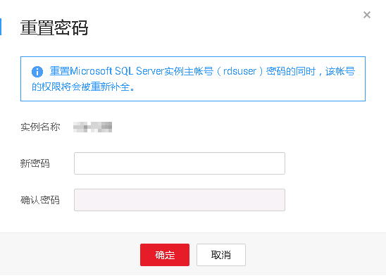

# 重置管理员密码和rdsuser帐号权限

## 操作场景

华为云关系型数据库服务仅支持通过主实例重置管理员密码。

在使用RDS过程中，如果忘记数据库帐号密码，可以重新设置密码。

如果rdsuser帐号自身出现问题，比如丢失或者删除，可以通过重置密码的方法恢复rdsuser帐号权限。

以下情况不可重置密码。

-   租户被冻结。
-   数据库端口变更中。
-   主实例状态为创建中、恢复中、重启中、端口修改中、异常、磁盘空间满。

> **说明：**   
>-   当您修改数据库主实例的密码时，如果该实例中存在备实例或只读实例，则会被同步修改。  
>-   重置密码生效时间取决于该主实例当前执行的业务数据量。  
>-   请定期（如三个月或六个月）修改用户密码，以提高系统安全性，防止出现密码被暴力破解等安全风险。  
>-   云数据库SQL Server实例的管理员密码重置的同时，该账号的权限将会进行重新补全。  

## 方式一

1.  登录管理控制台。
2.  单击管理控制台左上角的，选择区域和项目。
3.  选择“数据库  \>  云数据库 RDS“。进入云数据库 RDS信息页面。
4.  在“实例管理“页面，选择指定的实例，选择“更多 \> 重置密码”。
5.  若您已开启高危操作保护，在弹出框单击“去验证“，跳转至验证页面，单击“免费获取验证码“，正确输入验证码并单击“认证“，页面自动关闭。

    通过进行二次认证再次确认您的身份，进一步提高帐号安全性，有效保护您安全使用云产品。关于如何开启操作保护，具体请参考《统一身份认证服务用户指南》的内容。

6.  在“重置密码“弹框，输入新管理员密码及确认密码。

    **图 1**  重置密码和帐号权限  
    

    > **须知：**   
    >请妥善管理您的密码，因为系统将无法获取您的密码信息。  

    所设置的密码长度为8\~32个字符，至少包含大写字母、小写字母、数字、特殊字符三种字符的组合，其中允许输入\~!@\#%^\*-\_+?,特殊字符。请您输入高强度密码并定期修改，以提高安全性，防止出现密码被暴力破解等安全风险。

    -   单击“确定”，提交重置。
    -   单击“取消”，取消本次重置。

## 方式二

1.  登录管理控制台。
2.  单击管理控制台左上角的，选择区域和项目。
3.  选择“数据库  \>  云数据库 RDS“。进入云数据库 RDS信息页面。
4.  在“实例管理“页面，选择指定的实例，单击实例名称。
5.  在“基本信息”页签，在“数据库信息“模块的“管理员帐户名“处，单击“重置密码”，输入新管理员密码及确认密码。

    **图 2**  重置密码和帐号权限  
    

    > **须知：**   
    >请妥善管理您的密码，因为系统将无法获取您的密码信息。  

    所设置的密码长度为8\~32个字符，至少包含大写字母、小写字母、数字、特殊字符三种字符的组合，其中允许输入\~!@\#%^\*-\_+?,特殊字符。请您输入高强度密码并定期修改，以提高安全性，防止出现密码被暴力破解等安全风险。

    -   单击“确定”，提交重置。
    -   单击“取消”，取消本次重置。

